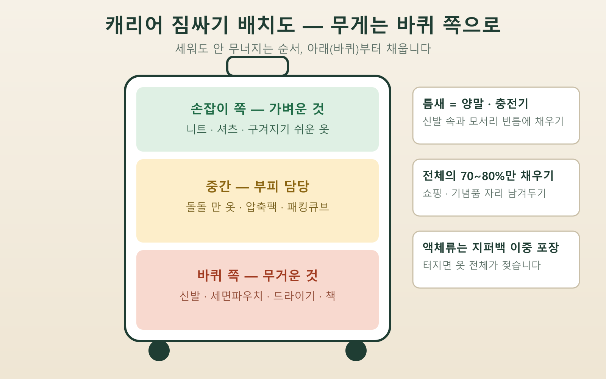

📌 3줄 요약
옷은 접지 말고 돌돌 말아서, 무거운 짐은 바퀴 쪽에 — 이 두 가지만 지켜도 공간과 정리 상태가 완전히 달라집니다.

캐리어는 전체의 70~80%만 채우고, 액체류는 지퍼백에 넣어 위탁으로, 보조배터리는 반드시 기내로 나눕니다.

짐은 갈 때가 아니라 돌아올 때까지 계획하는 것 — 기념품 자리와 입은 옷 정리법까지 미리 정해두면 귀국날 허둥댈 일이 없습니다.

**캐리어 짐싸는법**, 결론부터 말하면요. 좋은 캐리어나 비싼 파우치보다 넣는 순서와 배치가 훨씬 중요합니다. 저도 예전엔 출발 전날 밤에 옷을 쌓아놓고 위에서부터 눌러 담는 식이었는데, 이번에 상위 여행 가이드 열 편 가까이를 직접 열어 비교해 보니 잘 싸는 사람들의 공통 원칙이 놀랄 만큼 겹치더라고요. 이 글에서는 그 공통 원칙에 제가 표로 정리한 배치 요령을 더해, 옷 고르기부터 귀국 짐까지 순서대로 알려드릴게요.

## 짐싸기는 왜 옷을 다 꺼내는 것부터 시작하나요?

결론은 간단합니다. 캐리어에 뭘 넣을지보다 뭘 안 넣을지를 먼저 정해야 하기 때문이에요. 잘 싸는 사람들은 가방부터 열지 않고, 침대 위에 후보를 전부 펼쳐놓고 거기서 빼는 작업부터 합니다.

가장 확실한 기준은 날짜별 옷차림을 미리 그려보는 겁니다. 3박 4일이면 낮 옷 4벌, 잘 때 입을 옷 1~2벌 식으로 일정에 맞춰 세어보면, "혹시 몰라서" 챙기는 옷이 얼마나 많았는지 바로 보여요. 제가 일정 짜듯 옷도 날짜별로 배정해 보니, 평소 챙기던 짐의 3분의 1이 한 번도 안 입을 옷이었습니다.

그리고 캐리어는 처음부터 꽉 채우지 않습니다. 여러 가이드가 공통으로 말하는 기준이 전체 용량의 70~80%예요. 남은 20~30%는 여행지에서 산 기념품과 쇼핑, 그리고 돌아올 때 대충 구겨 넣게 되는 옷들의 자리입니다.

## 옷은 접는 것보다 마는 게 정말 나은가요?

네, 대부분의 경우 돌돌 마는 롤링이 낫습니다. 같은 옷을 접었을 때보다 부피가 눈에 띄게 줄고, 구김도 덜하며, 말아놓은 옷은 틈새에 세워 끼울 수 있어서 공간 활용이 훨씬 유연해져요. 티셔츠·바지·속옷·잠옷처럼 부드러운 소재는 전부 롤링 대상입니다.

말 때는 옷의 주름을 먼저 손으로 편 다음, 아래 끝을 한 뼘쯤 접어 봉투처럼 단을 만들고, 위에서부터 단단히 말아 내려와 그 단으로 감싸 고정하면 풀리지 않습니다. 반대로 셔츠나 재킷처럼 형태가 잡힌 옷은 말면 오히려 구겨지니 예외로 두고, 맨 위에 평평하게 눕히는 게 좋아요.

부피가 특히 큰 겨울옷이나 장기 여행이라면 도구의 도움을 받습니다. 저도 압축팩이 무조건 정답인 줄 알았거든요. 그런데 따져보니 둘의 용도가 다르더라고요. 표로 묶어보면 이렇습니다.

| 구분 | 압축팩 | 패킹큐브 |
| --- | --- | --- |
| 강점 | 부피를 절반 가까이 줄임 | 옷이 안 구겨지고 정리 유지 |
| 약점 | 옷이 심하게 구겨짐 | 부피 감소는 크지 않음 |
| 어울리는 짐 | 패딩·니트·수건 등 겨울 부피 짐 | 셔츠·일상복·속옷 분류 |
| 어울리는 여행 | 겨울 여행, 장기 여행 | 짧은 여행, 출장 |

💡 팁
둘 중 하나만 산다면 겨울 여행은 압축팩, 그 외에는 패킹큐브가 실패가 없습니다. 압축팩은 손으로 말아 공기를 빼는 타입이면 진공청소기 없이도 충분해요.

## 무거운 짐은 캐리어 어디에 넣어야 하나요?

무거운 것은 바퀴 쪽, 가벼운 것은 손잡이 쪽입니다. 이유는 무게중심 때문이에요. 무거운 짐이 위에 있으면 캐리어를 세울 때마다 안의 짐이 아래로 쏟아지면서 뒤섞이고, 끌 때도 캐리어가 자꾸 넘어지려고 합니다. 신발·세면 파우치·드라이기·책처럼 무거운 것부터 바퀴 쪽에 깔고, 중간에 말아놓은 옷을 채우고, 구겨지면 안 되는 가벼운 옷을 손잡이 쪽에 올리는 순서예요.

이 배치 하나로 도착해서 캐리어를 열었을 때의 상태가 달라집니다. 제가 동선 짜듯 캐리어도 구역을 나눠서 싸보니, 여행 내내 짐을 다시 정리할 일이 거의 없어졌어요.

## 신발과 틈새 공간은 어떻게 활용하나요?

신발 속은 비워두면 손해인 수납공간입니다. 양말·속옷·충전기·여행용 어댑터처럼 작고 형태가 자유로운 물건을 신발 안에 채워 넣으면, 공간도 아끼고 신발 모양도 잡아줘요. 단, 보조배터리 본체는 위탁 캐리어가 아니라 기내 가방에 넣어야 하니 여기엔 해당되지 않습니다. 신발 자체는 봉지나 샤워캡으로 밑창을 감싸면 옷에 흙이 닿지 않습니다.

말아놓은 옷 덩어리 사이, 캐리어 모서리, 손잡이 봉 사이의 움푹 팬 자리 같은 틈새에는 양말과 벨트, 충전 케이블을 끼웁니다. 틈새가 채워질수록 짐이 흔들리지 않아서 도착했을 때 안이 뒤섞이는 것도 막아줘요.

## 파우치는 몇 개로, 어떻게 나누나요?

정답은 카테고리별 3~5개입니다. 캐리어 안에서 물건을 찾는 시간은 대부분 "어디 넣었더라"에서 나오는데, 파우치로 구역을 정해두면 찾을 일 자체가 없어져요.

| 파우치 | 넣는 것 | 포인트 |
| --- | --- | --- |
| 세면·화장품 | 치약·스킨케어·선크림 | 액체는 지퍼백 이중 포장 |
| 전자기기 | 충전기·케이블·어댑터 | 케이블은 하나로 묶기 |
| 속옷·양말 | 속옷류 전부 | 신발 속 활용과 병행 |
| 상비약 | 소화제·진통제·밴드 | 기내 가방에 두는 게 안전 |

⚠️ 주의
샴푸·스킨처럼 새기 쉬운 액체는 뚜껑을 랩으로 감싼 뒤 지퍼백에 넣으세요. 기압 변화로 한 번 터지면 캐리어 안 옷 전체가 젖습니다.

## 기내 가방과 위탁 캐리어, 뭘 어디에 넣나요?

원칙은 한 줄입니다. 귀중품과 배터리는 기내로, 액체와 날카로운 것은 위탁으로 나눕니다. 여권·지갑·전자기기·상비약과 보조배터리는 기내 가방에 두고, 100ml가 넘는 화장품·세면도구와 가위 같은 물건은 위탁 캐리어에 넣어요. 특히 보조배터리는 위탁수하물에 넣으면 안 되는 품목이라 헷갈리면 기내로 두는 게 안전합니다. 항목별 세부 규정은 [비행기 기내 반입 금지 물품 총정리](/carry-on-prohibited-items/)에 따로 정리해 뒀으니 짐 나누기 전에 같이 보시면 좋아요.

기내 반입 액체는 국제선 기준 개별 용기 100ml 이하, 1인당 1L 투명 지퍼백 1개까지만 허용됩니다. 보안검색 규정과 공항 이용 안내는 [인천국제공항](https://www.airport.kr/) 공식 사이트에서 출발 전에 한 번 확인해 두면 검색대에서 멈출 일이 없어요.

## 무게 초과, 어떻게 미리 막나요?

방법은 집에서 무게를 재는 것뿐입니다. 공항 카운터에서 캐리어를 열어 짐을 빼는 상황은 대부분 저울 없이 감으로 싼 경우예요. 국제선 이코노미 무료 위탁수하물은 항공사와 노선에 따라 다르지만 대체로 23kg 안팎이고, 기내 수하물은 대한항공 기준 총 10kg 이내입니다. 저비용항공사는 이보다 빡빡한 경우가 많으니 2026년 8월 시점 기준으로도 반드시 본인 예약의 규정을 확인하세요.

집에 체중계가 있다면 캐리어를 들고 잰 값에서 몸무게를 빼면 되고, 1만 원대 휴대용 수하물 저울을 하나 사두면 돌아올 때 공항 호텔에서도 잴 수 있어 두고두고 씁니다. 무게가 애매하면 무거운 것부터 기내 가방으로 옮기는 게 요령이에요.

## 돌아올 때 짐까지 생각하고 있나요?

잘 싼 짐의 진짜 기준은 귀국날입니다. 갈 때 70~80%만 채우라는 것도 결국 돌아올 짐 때문이에요. 입은 옷을 담을 큰 비닐이나 접이식 보조가방을 하나 넣어가면, 귀국 짐싸기가 "빨 옷은 비닐로, 기념품은 빈자리로" 두 동작으로 끝납니다.

장기 여행이라면 중간에 한 번 빨래하는 것도 짐을 줄이는 방법입니다. 옷을 일수만큼 다 챙기는 대신 절반만 챙기고 현지 세탁을 쓰면 캐리어 한 칸이 통째로 비어요. 우기 여행처럼 옷이 젖기 쉬운 일정이라면 여벌 계획이 더 중요한데, 시기별 대비물은 [다낭 우기 여행, 시기와 비 올 때 대비법 총정리](/danang-rainy-season/)에서 자세히 다뤘습니다.

## 캐리어 짐싸는법 한눈에 정리

이거 하나만 기억하면 돼요. 빼는 것부터, 말아서, 무거운 건 바퀴 쪽으로.

| 순서 | 할 일 | 핵심 |
| --- | --- | --- |
| 1 | 옷 전부 펼치고 빼기 | 날짜별 옷차림으로 계산 |
| 2 | 부드러운 옷 롤링 | 겨울 짐은 압축팩 |
| 3 | 무거운 것 바퀴 쪽 | 가벼운 옷은 손잡이 쪽 |
| 4 | 신발 속·틈새 채우기 | 양말·충전기·벨트 |
| 5 | 파우치 3~5개 분류 | 액체는 지퍼백 이중 포장 |
| 6 | 기내·위탁 나누기 | 배터리 기내, 액체 위탁 |
| 7 | 무게 재기 | 70~80%만 채웠는지 확인 |

## 자주 묻는 질문

**Q. 옷을 말면 오히려 더 구겨지지 않나요?** 티셔츠·바지·니트 같은 부드러운 소재는 단단히 말면 접는 것보다 구김이 적습니다. 다만 셔츠·재킷처럼 형태가 잡힌 옷은 말면 구겨지니 접어서 맨 위에 평평하게 올리는 게 좋아요.

**Q. 압축팩과 패킹큐브 중 뭘 사야 하나요?** 겨울 여행이나 장기 여행처럼 부피가 문제면 압축팩, 옷 구김과 정리가 우선이면 패킹큐브입니다. 둘을 섞어 겨울 짐만 압축팩에 넣는 조합이 가장 실용적이에요.

**Q. 캐리어 무게는 몇 kg까지 괜찮은가요?** 항공사와 노선마다 달라서 단정할 수 없습니다. 국제선 이코노미 위탁은 대체로 23kg 안팎, 기내는 10kg 이내가 많지만, 저비용항공사는 더 적은 경우가 흔하니 본인 예약의 규정을 꼭 확인하세요.

**Q. 기내 가방에는 뭘 꼭 넣어야 하나요?** 여권·지갑·휴대폰과 충전기, 상비약, 그리고 보조배터리입니다. 배터리는 위탁이 안 되는 품목이라 기내가 유일한 자리예요. 품목별 세부 규정은 [기내 반입 금지 물품 정리 글](/carry-on-prohibited-items/)에서 확인하면 됩니다.

**Q. 신혼여행처럼 짐이 많을 땐 어떻게 하나요?** 원칙은 같고 도구를 늘립니다. 캐리어 두 개를 쓸 때는 한쪽을 위탁 전용, 한쪽을 기내 전용으로 정해 규정 품목부터 나누고, 겨울 짐·드레스류만 압축팩과 의류 커버로 따로 관리하면 헷갈리지 않아요.

짐싸기는 재능이 아니라 순서입니다. 다음 여행에서는 출발 전날 밤이 훨씬 짧아질 거예요.

---

**관련 키워드** — #캐리어짐싸는법 #여행짐싸기 #캐리어짐정리 #짐싸기꿀팁 #압축팩 #패킹큐브 #옷부피줄이기 #기내수하물 #위탁수하물무게 #캐리어배치
