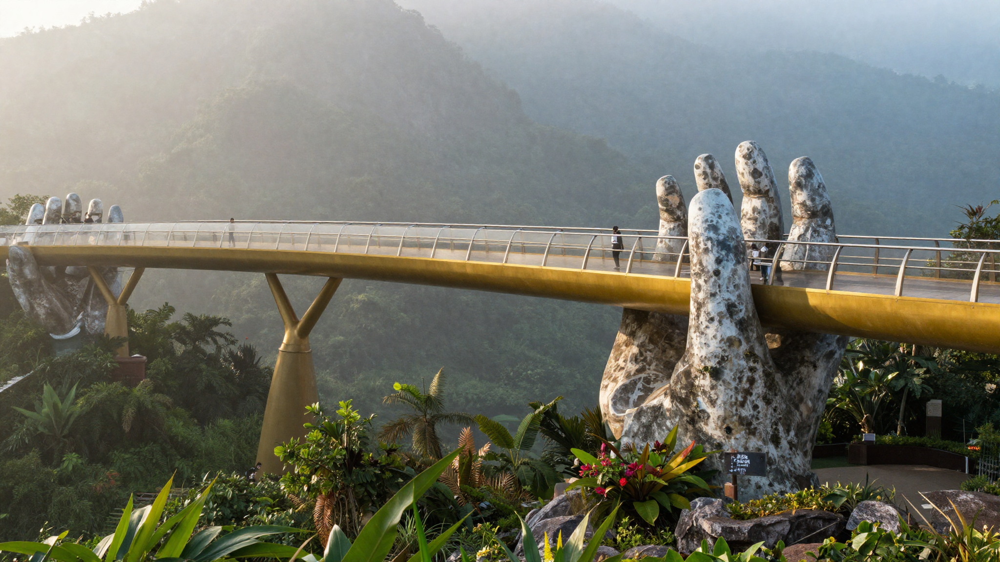

**다낭 여행 코스**를 짤 때 진짜 문제는 "어디를 가느냐"가 아니라 "무엇을 같은 날에 묶느냐"입니다. 결론부터 말하면요, 다낭은 **하루를 통째로 먹는 일정이 두 개**라서 그것만 분리하면 나머지는 알아서 풀립니다. 저도 처음엔 상위 글들의 3박 4일 표를 그대로 옮겨 적으려다 한참 헤맸어요. 그런데 여러 글을 나란히 놓고 비교해보니, **같은 3박 4일인데 어떤 글은 바나힐과 호이안을 같은 날에 넣고 어떤 글은 절대 그러지 말라고** 하더라고요. 그래서 이번엔 완성된 일정표를 던지는 대신, 내 일정 길이에 맞춰 직접 조립하는 원칙을 정리했습니다.

📌 3줄 요약

· 다낭에서 <strong>하루를 통째로 쓰는 건 바나힐 하나</strong>입니다. 여기에 다른 일정을 붙이면 무조건 무너져요.

· <strong>오행산은 다낭과 호이안 사이</strong>에 있으니 호이안 가는 날에 붙이고, 호이안은 <strong>등불이 켜지는 저녁</strong>까지 머무는 게 정석입니다.

· 경비가 글마다 40만 원대와 80만 원대로 갈리는 건 물가 차이가 아니라 <strong>항공·숙박 포함 여부</strong>가 달라서입니다.

## 왜 남의 3박 4일 템플릿을 그대로 쓰면 꼬일까

상위에 나오는 다낭 일정표들은 대체로 똑같은 뼈대를 씁니다. 1일차 시내, 2일차 바나힐, 3일차 호이안, 4일차 쇼핑과 귀국이죠. 이 구성 자체는 나쁘지 않아요. 문제는 **내 항공편이 그 표를 안 따라준다**는 겁니다.

다낭행 항공편은 밤늦게 도착하거나 새벽에 떠나는 편성이 흔합니다. 그러면 표의 1일차와 4일차는 사실상 반나절짜리가 되는데, 템플릿은 그걸 온전한 하루로 계산해두죠. 여기에 2박 3일이나 4박 5일처럼 길이가 다른 일정이면 표를 어디서 잘라야 할지도 안 알려줍니다.

제가 여러 글을 비교하다 가장 놀란 지점은 따로 있어요. **어떤 2박 3일 일정표는 바나힐과 호이안을 2일차 하루에 함께 넣어놨습니다.** 그런데 다른 글들과 바나힐 전문 안내에서는 두 곳을 같은 날에 몰면 안 된다고 못을 박아요. 같은 키워드로 검색하면 정반대 조언이 나란히 뜨는 셈입니다. 이런 건 템플릿을 베끼면 절대 안 보이고, 배치 원칙을 알아야 걸러집니다.

## 다낭 일정 배치의 3가지 원칙

원칙은 세 개뿐입니다. 이것만 지키면 며칠짜리든 조립이 됩니다.

**첫째, 하루를 통째로 먹는 일정은 하루에 하나만 넣습니다.** 다낭에서 여기 해당하는 건 바나힐입니다. 시내에서 차로 40분쯤 걸리고, 케이블카로 올라가 프렌치 빌리지와 골든브리지를 보고 내려오면 픽업부터 드롭까지 열 시간 안팎이 잡히는 일정이에요. 여기에 뭘 더 붙이겠다는 건 애초에 계산이 안 맞습니다.

**둘째, 방향이 같은 것끼리 묶습니다.** 다낭에서 호이안은 남쪽 방향인데, 오행산이 그 사이에 있어요. 그래서 오행산은 시내 일정에 끼우는 게 아니라 **호이안 가는 날 오전에 붙이는** 게 이동 낭비가 없습니다. 반대로 린응사가 있는 손짜반도는 북동쪽이라 해변 일정과 묶어야 하고요.

**셋째, 야간형 콘텐츠는 저녁으로 뺍니다.** 호이안 등불, 용다리 야간 조명, 응우옌후에식 보행자 거리 같은 곳은 낮에 가면 매력이 절반도 안 나옵니다. 특히 호이안은 해가 지고 등불이 켜지면 완전히 다른 도시가 되기 때문에, 낮에 도착해 저녁까지 머무는 구성이 정석이에요.

## 같은 날에 묶으면 안 되는 조합은 뭔가요

**바나힐과 호이안이 첫 번째 금지 조합입니다.** 바나힐만으로 하루가 차는데 거기에 왕복 한 시간 반짜리 호이안을 얹으면, 둘 다 수박 겉핥기가 되고 이동으로만 서너 시간을 씁니다. 굳이 하루에 둘 다 봐야 한다면 바나힐을 오전 일찍 끊고 나오는 수밖에 없는데, 그러면 바나힐에서 볼 걸 대부분 못 봅니다.

**바나힐과 오행산도 같은 날은 피하는 게 좋습니다.** 둘 다 계단과 오르내림이 많아 체력 소모가 큰 곳이에요. 오행산은 석회암 산 안의 동굴 사원을 도는 구조라 생각보다 다리를 많이 씁니다. 엘리베이터가 있긴 하지만 안쪽은 결국 걸어야 해요.

**호이안 낮 일정과 미케비치를 같은 날에 넣는 것도 애매합니다.** 둘 다 낮에 하는 활동인데 방향이 반대라 이동이 겹칩니다. 미케비치는 시내 숙소에서 도보나 짧은 차량 이동으로 닿으니, 차라리 **호이안 가기 전 오전이나 마지막 날 오전**에 짧게 붙이는 편이 낫습니다.

💡 헷갈릴 때 판단 기준

두 일정의 <b>왕복 이동 시간을 더해 두 시간이 넘으면</b> 같은 날에 넣지 마세요. 다낭에서 그 기준을 넘기는 조합이 바나힐과 호이안입니다.

## 구간별 이동 시간부터 알아야 동선이 잡힙니다

동선을 짜려면 결국 숫자가 필요합니다. 흩어져 있는 이동 정보를 표로 묶어봤어요. 그랩 요금은 시점·시간대에 따라 달라지니 범위로만 참고하세요.

| 구간 | 거리 | 소요 시간 | 그랩 편도(대략) |
| --- | --- | --- | --- |
| 공항 → 한시장 일대 | 가까움 | 15~20분 | 약 7~9만 동 |
| 공항 → 미케비치 | 가까움 | 15~20분 | 약 12~15만 동 |
| 시내 → 호이안 | 약 28~30km | 40~50분 | 약 30~40만 동 |
| 공항 → 호이안 | 약 30km | 45~50분 | 약 30~40만 동 |
| 시내 → 바나힐 | — | 약 40분 | 투어·셔틀 이용이 일반적 |

여기서 눈여겨볼 게 두 가지입니다. 하나는 **다낭 공항이 시내와 아주 가깝다**는 점이에요. 그래서 도착 당일 저녁에도 시내 일정 하나 정도는 충분히 넣을 수 있습니다. 다른 하나는 **호이안이 생각보다 멀지 않다**는 겁니다. 40~50분이면 서울에서 근교 나가는 수준이라, 부담 갖지 말고 반나절을 통으로 빼는 게 낫습니다.

호이안은 그랩 말고 선택지가 더 있습니다. 셔틀버스는 시간이 조금 더 걸리는 대신 요금이 훨씬 저렴하고, 인원이 많거나 짐이 많으면 픽업 차량이 편합니다. 다만 **오후 5시 이후에는 퇴근 시간과 겹쳐 그랩 요금이 오르는 구간**이 있으니, 호이안으로 넘어갈 거면 오후 이른 시간에 움직이는 게 유리해요.

## 2박 3일이면 뭘 버려야 하나요

**2박 3일이면 바나힐과 호이안 중 하나를 버려야 합니다.** 둘 다 넣으려는 순간 온전한 날 이틀을 다 쓰고, 정작 다낭 시내는 못 보게 됩니다. 밤 도착·새벽 출발 편성이면 실질 가용 시간은 더 줄어들고요.

| 유형 | 1일차 | 2일차 | 3일차 |
| --- | --- | --- | --- |
| 바나힐 우선 | 도착·미케비치·용다리 야경 | 바나힐 하루 | 한시장·마사지·귀국 |
| 호이안 우선 | 도착·시내 반나절 | 오행산 오전 → 호이안 저녁 등불 | 미케비치·귀국 |

저라면 **호이안 쪽을 고르겠습니다.** 오행산을 끼워 하루를 알차게 쓸 수 있고, 등불 야경이라는 다낭 시내에 없는 그림이 나오거든요. 반대로 아이와 함께라 놀이시설이 필요하면 바나힐 쪽이 맞습니다.

## 3박 4일은 어떻게 조립하나요

**3박 4일이 다낭에서 가장 무난한 길이입니다.** 온전한 날이 이틀 확보되니 바나힐과 호이안을 각각 하루씩 가져가고, 남는 반나절을 시내와 해변에 배분하면 됩니다.

| 일차 | 배치 | 이유 |
| --- | --- | --- |
| 1일차 | 도착 → 미케비치 산책 → 용다리 야간 | 공항이 가까워 도착 당일도 저녁 일정이 가능 |
| 2일차 | 바나힐 하루 | 하루를 통째로 쓰는 일정은 단독 배치 |
| 3일차 | 오행산 오전 → 호이안 오후·저녁 | 방향이 같아 이동 낭비 없음, 등불까지 |
| 4일차 | 한시장·마사지 → 귀국 | 체력 소모 적은 일정으로 마무리 |

주말 저녁에 다낭에 있다면 용다리 쪽 일정을 그날로 옮기는 걸 고려해보세요. 주말 밤에는 용 머리에서 불과 물을 뿜는 공연이 있는데, 시간은 변동되니 현지에서 다시 확인하는 게 안전합니다.

## 4박 5일이면 뭘 더 넣나요

**4박 5일이면 하루가 통으로 남으니, 그 하루는 이동을 줄이고 쉬는 쪽으로 쓰는 게 만족도가 높습니다.** 명소를 하나 더 욱여넣는 것보다 낫습니다.

추가할 만한 선택지는 세 가지예요. 첫째는 **손짜반도의 린응사**입니다. 바다를 등진 해수관음상이 있고 언덕 위라 다낭 해안선이 한눈에 들어옵니다. 해변 일정과 방향이 같아 묶기 좋아요. 둘째는 **호이안에서 하루 자는 것**입니다. 당일치기로 다녀오면 등불만 보고 나오게 되는데, 하루 묵으면 이른 아침의 조용한 고대도시와 안방비치까지 볼 수 있습니다. 셋째는 **아무것도 안 하는 반나절**이고요. 리조트 수영장이나 마사지로 하루를 비우는 것도 충분히 합리적인 선택입니다.

각 지점의 위치와 순서는 [다낭 여행 코스 지도](/danang-course/)에 코스별로 정리해뒀습니다. 지도에서 순서를 눌러보면 이동 거리가 훨씬 직관적으로 잡혀요. 호이안까지 이어 볼 계획이면 [호이안 코스 지도](/hoian-course/)도 같이 보시면 됩니다.

## 다낭 여행 경비는 왜 글마다 다를까

**경비가 40만 원대와 80만 원대로 갈리는 건 물가 차이가 아니라 포함 범위가 다르기 때문입니다.** 이걸 모르고 숫자만 비교하면 예산이 두 배로 어긋납니다.

| 표기 방식 | 대략 범위 | 무엇이 빠졌나 |
| --- | --- | --- |
| 항공·숙박 제외 | 1인 40~50만 원대 | 항공권과 숙박비가 통째로 빠짐 |
| 항공·숙박 포함 | 1인 70~80만 원대 | 쇼핑·고급 식당은 별도 |

항목별로 쪼개보면 항공권이 30~50만 원, 3박 숙박이 15~45만 원, 식비가 12~20만 원, 현지 교통이 5~8만 원, 입장권이 10~15만 원 선으로 제시되는 편입니다. 편차가 큰 건 숙소 등급 때문이에요. 시내 호텔과 리조트, 풀빌라는 가격대가 확연히 갈립니다.

⚠️ 경비 숫자를 볼 때

어떤 글의 경비든 <b>항공·숙박 포함 여부를 먼저 확인</b>하세요. 그리고 환율과 현지 물가는 계속 바뀌니 위 숫자는 시점 기준의 참고 범위로만 쓰시는 게 안전합니다.

## 다낭은 언제 가는 게 좋나요

**다낭의 건기는 1월부터 8월, 우기는 9월부터 12월입니다.** 여기서 많이들 헷갈리는데, 흔히 보이는 "11월부터 4월이 건기"라는 설명은 **호치민 같은 남부 기준**이에요. 다낭은 베트남 중부라 우기가 다르게 옵니다. 저도 처음엔 베트남이면 다 같은 줄 알았거든요.

목적별로 보면 이렇습니다. 날씨가 가장 쾌적한 건 **2월부터 5월**이고, 물에 들어갈 생각이면 덥지만 맑은 **6월부터 8월**이 낫습니다. 반대로 **9월 말부터 10월 말은 태풍이 집중되는 구간**이라 야외 일정 위주로 짰다면 피하는 게 좋아요. 10월은 연중 비가 가장 많은 달로 꼽힙니다.

비수기라 항공·숙박이 저렴해지는 장점도 있어서, 우기에 가는 게 무조건 손해는 아닙니다. 월별 강수량 차이와 비 올 때 대안까지는 [다낭 우기 여행 총정리](/danang-rainy-season/)에 따로 정리해뒀으니 그쪽을 참고하세요.

## 출발 전에 확인할 것

여권 유효기간과 입국 규정은 **출발 전에 공식 안내로 직접 확인**하는 게 원칙입니다. 무비자 체류 조건 같은 건 나라 사정에 따라 바뀔 수 있고, 블로그에 적힌 값이 언제 기준인지 알기 어렵거든요. 최신 정보는 [외교부 해외안전여행](https://www.0404.go.kr/)에서 국가별 안내를 보시면 됩니다.

현지에서 쓸 준비물은 크게 세 가지로 압축됩니다. **그랩 앱**은 출국 전에 깔고 결제수단까지 등록해두는 게 편하고, 데이터는 유심이나 이심 중 하나를 정해두면 됩니다. 그리고 다낭은 햇볕이 강하니 선크림과 모자는 계절과 무관하게 챙기는 게 좋아요. 빠진 게 없는지는 [베트남 여행 준비물 체크리스트](/vietnam-travel-checklist/)로 한 번 훑으면 됩니다.

## 한눈에 정리

| 일정 길이 | 핵심 선택 | 버리는 것 |
| --- | --- | --- |
| 2박 3일 | 바나힐 또는 호이안 중 하나 | 나머지 하나 |
| 3박 4일 | 바나힐 하루 + 오행산·호이안 하루 | 여유 시간 |
| 4박 5일 | 3박 4일 + 손짜반도 또는 호이안 1박 | 없음, 쉬는 날 확보 |

## 자주 묻는 질문

**Q. 다낭 여행 코스 몇 박이 적당한가요?** 3박 4일이 가장 무난합니다. 온전한 날이 이틀 확보돼 바나힐과 호이안을 각각 하루씩 가져갈 수 있어서예요. 2박 3일이면 둘 중 하나는 포기해야 하고, 4박 5일이면 하루를 쉬는 데 쓰는 편이 만족도가 높습니다.

**Q. 바나힐이랑 호이안 같은 날에 가도 되나요?** 권하지 않습니다. 바나힐은 이동과 케이블카를 포함하면 하루를 거의 다 쓰는 일정이고, 호이안은 왕복 한 시간 반이 추가로 듭니다. 둘 다 제대로 못 보고 이동에만 서너 시간을 쓰게 됩니다.

**Q. 다낭에서 호이안까지 얼마나 걸리나요?** 시내 기준 약 28~30km에 차로 40~50분 정도입니다. 그랩은 편도 30~40만 동 선이고, 셔틀버스를 쓰면 시간은 조금 더 걸리지만 요금은 크게 내려갑니다. 오후 5시 이후에는 요금이 오르는 구간이 있어 이른 오후 이동이 유리합니다.

**Q. 다낭 여행 경비 1인당 얼마나 잡아야 하나요?** 항공과 숙박을 뺀 현지 경비는 1인 40~50만 원대, 항공과 숙박까지 포함하면 70~80만 원대로 제시되는 경우가 많습니다. 글마다 숫자가 다른 건 포함 범위가 달라서이니, 경비 숫자를 볼 때는 무엇이 포함됐는지부터 확인하세요.

**Q. 다낭 여행 최적 시기는 언제인가요?** 날씨만 보면 2월부터 5월이 가장 쾌적하고, 해수욕이 목적이면 6월부터 8월이 낫습니다. 9월 말부터 10월 말은 태풍이 집중되는 시기라 야외 일정 위주라면 피하는 게 안전합니다. 다낭의 건기는 1~8월, 우기는 9~12월로 남부와 다릅니다.

---

이거 하나만 기억하면 돼요. **다낭 여행 코스는 명소를 고르는 게 아니라 하루를 나누는 일**입니다. 바나힐을 단독으로 빼고, 오행산과 호이안을 한 방향으로 묶고, 야간형은 저녁으로 옮기면 며칠짜리든 동선이 정리됩니다. 순서를 지도로 확인하고 싶으면 [다낭 코스 지도](/danang-course/)를, 먹을 걸 미리 골라두고 싶으면 [베트남 음식 총정리](/vietnam-street-food-noodles/)를 이어서 보세요.

---

**관련 키워드** — #다낭여행코스 #다낭3박4일 #다낭2박3일 #다낭자유여행 #다낭일정 #바나힐 #호이안 #다낭호이안이동 #다낭여행경비 #다낭여행시기 #오행산 #다낭그랩
