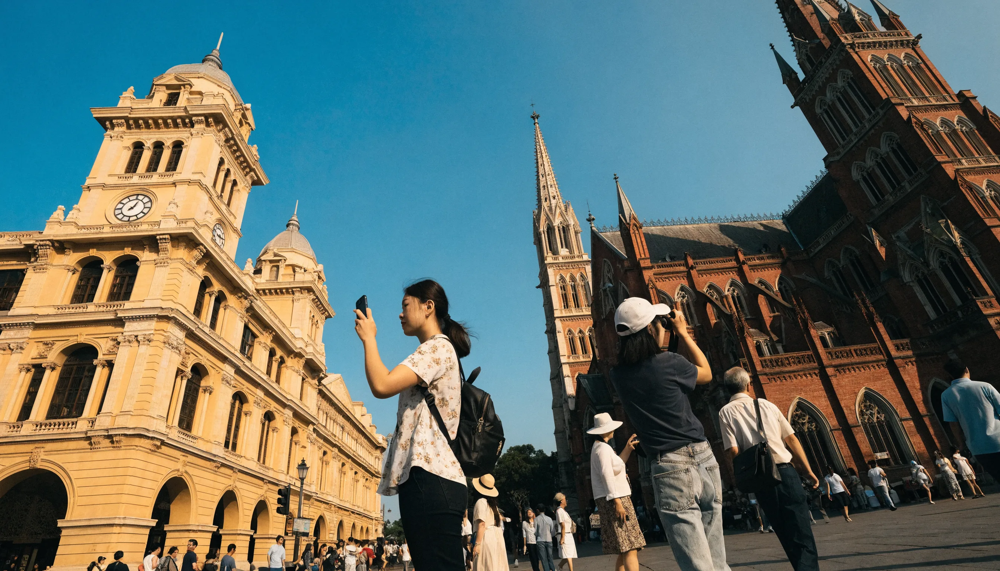

**호치민 지도**를 검색하면 대개 군(區)만 색칠된 행정지도가 나오는데, 막상 여행에 쓰려면 "그래서 어디부터 어떻게 돌지?"가 안 풀리죠. 저도 그게 답답해서 관광지 위치를 직접 지도에 찍어보다가 한 가지를 깨달았어요. 결론부터 말하면요, **호치민 관광은 대부분 1군(District 1)에 몰려 있고, 그 안은 걸어서 도는 게 정답**입니다. 그래서 이번엔 지도만 던지지 않고, 1군 핵심 명소를 잇는 도보 코스를 동선도에 그리고 사진 찍기 좋은 포토스팟까지 표시해봤습니다. 베트남 지도 속 호치민이 어디인지부터, 실제 구글 지도까지 이 한 편이면 됩니다.

📌 3줄 요약
호치민 관광의 90%는 <b>1군</b>에 모여 있습니다. 벤탄시장·노트르담 성당·중앙우체국·시청·부이비엔이 모두 도보권이에요.

추천 동선은 <b>벤탄시장 → 통일궁 → 노트르담 성당 → 중앙우체국 → 응우옌후에·카페 아파트먼트 → (저녁) 부이비엔</b> 순입니다.

포토스팟은 <b>중앙우체국·노트르담 성당·카페 아파트먼트·부이비엔 야경</b>. 참고로 중앙우체국은 흔히 알려진 것과 달리 에펠 작품이 아닙니다(아래 설명).

## 베트남 지도에서 호치민은 어디인가요?

호치민(옛 사이공)은 **베트남 최남단의 최대 도시**입니다. 남북으로 길쭉한 베트남에서 수도 하노이가 북쪽 끝, 다낭·호이안이 중부, 나트랑이 남중부라면, 호치민은 그 아래 남부 경제 중심지예요. 인천에서 직항으로 약 5시간 반 거리입니다.

<svg viewBox="0 0 460 560" xmlns="http://www.w3.org/2000/svg" role="img" aria-label="베트남 지도 속 주요 도시 위치 도식 - 하노이 다낭 나트랑 호치민 푸꾸옥" style="width:100%;height:auto;max-width:420px;display:block;margin:1.2rem auto;background:#f0f9f4;border-radius:14px;">
  <path d="M150 40 C120 90 150 150 190 200 C230 250 250 300 270 350 C290 400 260 450 200 500 C170 470 200 430 210 400 C180 350 150 300 130 250 C110 190 120 100 150 40 Z" fill="#cdeBD9" stroke="#16a34a" stroke-width="2.5"/>
  <circle cx="155" cy="80" r="7" fill="#166534"/><text x="170" y="85" font-size="17" fill="#111" font-weight="700">하노이 (북부)</text>
  <circle cx="215" cy="235" r="7" fill="#166534"/><text x="230" y="240" font-size="17" fill="#111" font-weight="700">다낭·호이안 (중부)</text>
  <circle cx="255" cy="330" r="7" fill="#166534"/><text x="270" y="335" font-size="17" fill="#111" font-weight="700">나트랑 (남중부)</text>
  <circle cx="205" cy="475" r="10" fill="#e11d48"/><text x="222" y="481" font-size="18" fill="#b91c1c" font-weight="800">호치민 (남부)</text>
  <circle cx="120" cy="490" r="6" fill="#166534"/><text x="30" y="515" font-size="15" fill="#111" font-weight="600">푸꾸옥섬</text>
</svg>

한국인 여행자에게 호치민은 도시 관광(프랑스풍 건축·시장·야시장·카페)이 강점이고, 해변 휴양은 다낭·나트랑·푸꾸옥으로 갈립니다. 그래서 "호치민 지도 = 1군 지도"라고 생각하고 접근하면 계획이 훨씬 쉬워져요.

## 호치민은 몇 군으로 나뉘고 어디를 가야 하나요?

호치민은 여러 군으로 나뉘지만, 여행자가 알아야 할 건 사실 네 곳뿐입니다. 흩어진 정보를 직접 표로 묶어봤어요.

| 군 | 성격 | 여행자에게 | 1군에서 |
| --- | --- | --- | --- |
| 1군 | 관광 중심지 | 벤탄시장·성당·우체국·부이비엔 다 여기. 첫 방문·뚜벅이 필수 | — |
| 2군(타오디엔) | 서양인 거주·감성 카페촌 | 브런치 카페·편집숍, "호치민 속 작은 유럽" | 차 15~20분 |
| 3군 | 로컬·핑크성당 | 떤딘성당(핑크성당)·전쟁박물관·로컬 맛집 | 차 10~15분 |
| 7군(푸미흥) | 한인타운·신도시 | 대형 쇼핑몰, 쾌적한 신도시, 한식 | 차 약 30분 |

포인트는 **처음이라면 1군에 숙소를 잡고 도보로 도는 것**입니다. 사진 찍는 감성 카페가 목적이면 2군 타오디엔, 한식·마트가 필요하면 7군 푸미흥으로 택시를 타면 돼요. 저도 첫 호치민 때 이 구분을 몰라 동선을 꼬았는데, 군 성격만 알면 숙소 위치부터 답이 나옵니다.

## 호치민 1군 도보 코스 — 지도에 그려봤습니다

1군 핵심 명소는 걸어서 반나절이면 도는 범위에 모여 있습니다. 실제 방문 순서로 동선도를 그려봤어요. 명소 사이 도보 시간도 함께 표시했습니다.

<svg viewBox="0 0 720 560" xmlns="http://www.w3.org/2000/svg" role="img" aria-label="호치민 1군 도보 여행 코스 동선도 - 벤탄시장 통일궁 노트르담성당 중앙우체국 응우옌후에 부이비엔" style="width:100%;height:auto;max-width:720px;display:block;margin:1.2rem auto;background:#f8fafc;border-radius:14px;font-family:sans-serif;">
  <text x="360" y="38" font-size="20" fill="#0f172a" font-weight="800" text-anchor="middle">호치민 1군 도보 코스 동선도</text>
  <polyline points="120,430 165,270 320,150 470,150 575,320 320,480" fill="none" stroke="#16a34a" stroke-width="4" stroke-dasharray="2 0" opacity="0.6"/>
  <!-- 도보시간 라벨 -->
  <text x="120" y="360" font-size="14" fill="#15803d" font-weight="700">약 10분</text>
  <text x="215" y="205" font-size="14" fill="#15803d" font-weight="700">약 8분</text>
  <text x="380" y="135" font-size="14" fill="#15803d" font-weight="700">1분(맞은편)</text>
  <text x="540" y="240" font-size="14" fill="#15803d" font-weight="700">약 7분</text>
  <text x="430" y="430" font-size="14" fill="#15803d" font-weight="700">저녁·택시</text>
  <!-- 정류장 -->
  <g font-size="16" font-weight="700" fill="#0f172a">
    <circle cx="120" cy="430" r="18" fill="#166534"/><text x="120" y="436" font-size="17" fill="#fff" text-anchor="middle">1</text><text x="145" y="436">벤탄시장</text>
    <circle cx="165" cy="270" r="18" fill="#166534"/><text x="165" y="276" font-size="17" fill="#fff" text-anchor="middle">2</text><text x="190" y="276">통일궁</text>
    <circle cx="320" cy="150" r="18" fill="#166534"/><text x="320" y="156" font-size="17" fill="#fff" text-anchor="middle">3</text><text x="345" y="150">노트르담 성당 📷</text>
    <circle cx="470" cy="150" r="18" fill="#166534"/><text x="470" y="156" font-size="17" fill="#fff" text-anchor="middle">4</text><text x="495" y="150">중앙우체국 📷</text>
    <circle cx="575" cy="320" r="18" fill="#166534"/><text x="575" y="326" font-size="17" fill="#fff" text-anchor="middle">5</text><text x="415" y="320">응우옌후에·카페 아파트먼트 📷</text>
    <circle cx="320" cy="480" r="18" fill="#e11d48"/><text x="320" y="486" font-size="17" fill="#fff" text-anchor="middle">6</text><text x="345" y="486">부이비엔 (야간) 📷</text>
  </g>
  <text x="30" y="540" font-size="13" fill="#64748b">📷 = 사진 찍기 좋은 포토스팟 · 도보 시간은 대략치(도식)</text>
</svg>

**1) 벤탄시장**(Bến Thành)에서 출발합니다. 1군 한복판, 레러이 거리의 최대 재래시장이라 위치 기준점으로 딱이에요. 라탄백·건망고·커피 같은 기념품을 사되, 부른 값의 절반부터 흥정하는 게 요령입니다. 통로가 좁고 더우니 선선한 오전이 낫습니다.

**2) 통일궁**(Independence Palace)은 옛 남베트남 대통령궁이자 통일이 선언된 역사 현장입니다. 벤탄시장에서 도보 약 10분이에요.

**3) 노트르담 대성당 → 4) 중앙우체국**은 **길 하나를 두고 마주 보고** 있어 세트로 봅니다. 붉은 벽돌 고딕 성당과 노란 우체국이 나란히라 사진 동선이 자연스러워요. (성당은 시기별로 보수 공사가 있으니 외관 위주로 보는 걸 권합니다.)

**5) 응우옌후에 거리·카페 아파트먼트**로 내려옵니다. 시청 앞 보행자 거리라 야간 조명·분수쇼가 예쁘고, 바로 옆 카페 아파트먼트가 핫플입니다. **6) 부이비엔** 여행자 거리는 해가 진 뒤가 제맛이라, 저녁 일정으로 빼서 택시로 이동하는 게 편해요.

## 놓치면 아까운 호치민 포토스팟

지도에 📷로 찍어둔 곳들을 조금 더 풀어볼게요. 사진 목적이라면 이 네 곳은 챙기세요.

**중앙우체국**(Bưu điện) — 여기서 반전 하나. 이 노란 건물은 흔히 "에펠탑의 그 에펠이 설계했다"고 알려져 있는데, 저도 그렇게 알고 있었거든요. 그런데 직접 찾아보니 **실제 설계자는 프랑스 건축가 알프레드 폴홍스(Alfred Foulhoux)**이고, 에펠 설이 통설처럼 굳어진 것이었어요. 1891년 완공된 고딕·르네상스 양식 내부의 옛 사이공 지도 벽화와 아치 천장이 진짜 포토존입니다.

**노트르담 대성당**은 맞은편에서 붉은 벽돌 외관을 담기 좋고, 옛 공중전화 부스 쪽에서 찍으면 사람은 피하면서 이국적인 분위기가 나옵니다. **카페 아파트먼트**(응우옌후에 42번지)는 1960년대 아파트를 층층이 카페로 개조한 곳으로, 건물 외관을 아래에서 올려 찍거나 발코니에서 응우옌후에 거리를 내려다보는 컷이 인기예요(엘리베이터 1인 약 3,000동). **부이비엔**은 밤 네온사인 거리 자체가 배경입니다.

💡 전망 사진은 여기서
시내 전경을 한 컷에 담고 싶다면 <b>비텍스코 타워 사이공 스카이덱</b>(1군 49층)이나 강 건너 <b>랜드마크81</b>(81층, 베트남 최고층) 전망대가 좋습니다. 일몰 시간대가 가장 예뻐요. 스카이덱은 1군 도보 코스에 바로 붙일 수 있습니다.

## 실제 구글 지도로 보기

동선을 머리에 넣었다면, 실제 지도에서 위치를 확인하고 저장해두면 현지에서 편합니다. 아래는 1군의 기준점 벤탄시장 주변 지도예요.

<iframe src="https://www.google.com/maps?q=Ben+Thanh+Market,+Ho+Chi+Minh+City&output=embed" width="100%" height="380" style="border:0;display:block;" loading="lazy" referrerpolicy="no-referrer-when-downgrade" title="호치민 1군 벤탄시장 구글 지도"></iframe>

구글 지도 앱에서는 위 명소들을 검색해 별표(저장)로 찍어두면, 현지에서 그랩을 부를 때 목적지 입력이 빨라집니다. 도보 이동은 지도 도보 안내가 대체로 정확한 편이에요.

## 이동 팁 — 메트로·그랩·더위

1군 안은 도보가 기본이지만, 군을 넘어갈 땐 이동수단이 필요합니다. **그랩(Grab)**이 가장 편하고 요금도 투명해요. 짧은 시내 이동은 보통 몇천 원 수준입니다. 2024년 말 개통한 **메트로 1호선**도 벤탄에서 출발하니, 노선과 역세권은 [베트남 지하철 총정리](/vietnam-metro-lines/)에서 노선도로 확인하세요.

⚠️ 낮 더위·소매치기 주의
호치민 낮 1~3시는 매우 덥습니다. 이 시간대엔 실내 카페·쇼핑몰 일정을 넣어 체력을 아끼세요. 부이비엔 등 번화가는 오토바이 통행과 소매치기·호객이 있으니 가방은 앞으로, 휴대폰은 손에 쥐지 말고 주머니에 넣는 게 안전합니다.

## 한눈에 정리 — 반나절 1군 코스

| 순서 | 명소 | 포인트 |
| --- | --- | --- |
| 1 | 벤탄시장 | 기준점·기념품, 오전 추천 |
| 2 | 통일궁 | 역사 현장, 도보 10분 |
| 3 | 노트르담 성당 📷 | 붉은 벽돌 고딕, 우체국과 세트 |
| 4 | 중앙우체국 📷 | 폴홍스 설계, 내부 지도 벽화 |
| 5 | 응우옌후에·카페 아파트먼트 📷 | 보행자 거리·핫플 카페 |
| 6 | 부이비엔 📷 | 야간 네온 거리, 저녁에 |

## 자주 묻는 질문(FAQ)

**Q. 호치민 여행은 어느 군을 가야 하나요?** 관광은 대부분 1군에 모여 있습니다. 벤탄시장·성당·우체국·부이비엔이 모두 1군 도보권이라, 첫 방문이면 1군에 숙소를 잡는 게 정답입니다. 감성 카페는 2군, 한식·마트는 7군입니다.

**Q. 호치민 1군 도보 코스 순서를 추천해줘.** 벤탄시장 → 통일궁 → 노트르담 성당 → 중앙우체국 → 응우옌후에·카페 아파트먼트 → (저녁) 부이비엔 순이 동선이 자연스럽습니다. 성당·우체국은 맞은편이라 세트로 보세요.

**Q. 호치민 포토스팟은 어디가 좋아요?** 중앙우체국(내부 옛 지도 벽화), 노트르담 성당 외관, 카페 아파트먼트(응우옌후에 42) 발코니, 부이비엔 야경이 대표적입니다. 전망 사진은 비텍스코 스카이덱이나 랜드마크81 전망대가 좋습니다.

**Q. 중앙우체국은 에펠이 설계한 게 맞나요?** 흔히 그렇게 알려져 있지만, 실제 설계자는 프랑스 건축가 알프레드 폴홍스(Alfred Foulhoux)입니다. 에펠 설계설은 통설로 굳어진 오해에 가깝습니다.

**Q. 호치민 시내 이동은 뭐가 편한가요?** 1군 안은 도보, 군을 넘어가면 그랩(Grab)이 가장 편하고 요금이 투명합니다. 벤탄에서 출발하는 메트로 1호선도 2024년 말 개통해 선택지가 늘었습니다.

자, 이거 하나만 기억하면 돼요. **호치민 지도는 1군만 이해하면 끝**이고, 벤탄시장을 기준점으로 성당·우체국·부이비엔을 도보로 잇는 게 정석입니다. 여행 준비물은 [처음 가는 해외여행 준비물 체크리스트](/overseas-travel-checklist-first-time/)에서, 지역 정보는 [베트남 관광청](https://www.vietnamtourism.com/ko)에서 더 챙기세요. 걷다 출출하면 근처 [베트남 음식 총정리](/vietnam-street-food-noodles/)로 뭘 먹을지도 미리 골라두면 좋습니다.

---

**관련 키워드** — #호치민지도 #베트남지도 #호치민여행코스 #호치민1군 #호치민가볼만한곳 #호치민포토스팟 #벤탄시장 #노트르담성당 #중앙우체국 #카페아파트먼트 #부이비엔 #호치민도보코스
