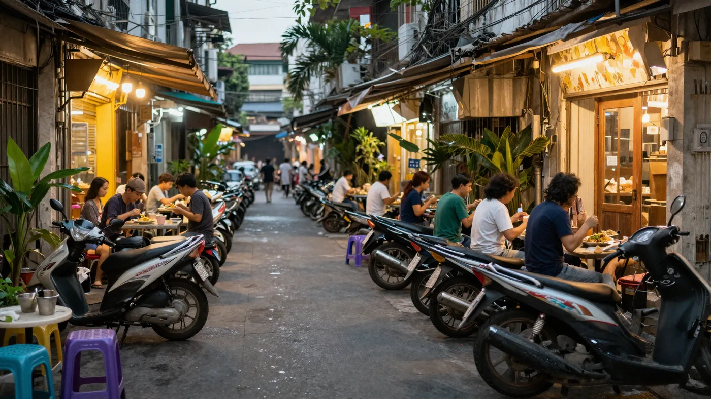

**호치민 맛집** 리스트는 넘치는데, 정작 "이 집이랑 저 집이 걸어서 갈 거리인가?"는 아무도 안 알려주죠. 저도 24곳을 한 표에 묶어보다가 알았어요. 결론부터 말하면요, 호치민 맛집은 이름이 아니라 **군과 시간대로 묶어야** 하루가 안 꼬입니다. 아래에 24곳을 대표 메뉴·구역·예산·시간대로 정리하고, 확인된 가격·영업시간까지 따로 표로 뽑아 하루 동선 3개로 엮었습니다.

📌 3줄 요약
24곳 중 <b>14곳이 1군</b>, 4곳이 타오디엔·안카인 일대, 2곳이 3군입니다(군 번호는 2025년 7월 폐지된 옛 명칭이지만 여행 정보에서 여전히 통용돼요). 구역을 먼저 나눠야 택시비와 시간이 줍니다.

미쉐린 <b>빕구르망</b>에 오른 집이 섞여 있어요. 2025 미쉐린 가이드 베트남 기준 빕구르망은 전국 63곳입니다.

로컬 한 끼는 대체로 <b>3만~9만동</b> 선이에요. 1만 동이 570원 안팎이니 한 끼 1,700~5,100원 감각으로 보면 됩니다(2026년 7월 시점 환율 기준).

## 호치민 맛집 24곳, 한 표로 먼저 보여드릴게요

**먼저 전체 목록입니다. 대표 메뉴·구역과 거리·예산 감각·추천 시간대까지 한 줄로 묶었어요.** 구역 칸은 여러 출처에서 교차 확인된 곳만 적었습니다. 끝까지 확인이 안 된 3곳은 억지로 채우지 않고 "지도앱 확인"으로 남겼어요. 호치민 맛집 글 중에는 군 표기가 틀린 경우가 은근히 많아서, 저는 확인된 것만 적는 쪽을 택했습니다. 예산은 개별 영수증이 아니라 **분류별로 통용되는 1인 범위**라 감각 잡는 용도로 보고, 실제 확인된 가격은 아래쪽 표를 참고하세요.

| 이름 | 대표 메뉴 | 구역·거리 | 예산 감각(1인) | 시간대 |
| --- | --- | --- | --- | --- |
| 시크릿 가든 | 베트남 가정식 한상 | 1군 파스퇴르 | 20만~40만동 | 점심·저녁 |
| 리틀 하노이 에그커피 | 에그커피·토스트 | 1군 예르생 거리 | 4만~8만동 | 오전·오후 |
| 카페 아파트먼트 | 층별 카페 골라 마시기 | 1군 42 응우옌후에 | 4만~8만동 | 오전 |
| 포 브엉 | 소고기 쌀국수 | 지도앱 확인 | 5만~10만동 | 아침·야식 |
| 밤밤 (BAM BAM) | 칵테일·위스키 | 1군 41 남끼코이응이아 | 20만~40만동 | 저녁 이후 |
| 반쎄오 46A | 대형 반쎄오 | 1군 46A 딘꽁짱 | 15만~25만동 | 점심·저녁 |
| 꾸안 넴 | 분짜·넴(스프링롤) | 1군 | 8만~15만동 | 점심·저녁 |
| 뤼진 (L'Usine) | 소품숍 겸 카페 | 1군 레러이·동커이·레탄똔 | 4만~10만동 | 오후 |
| 스모어스 사이공 | 루프탑 식물 카페 | 1군 1A 판똔(다카오) | 5만~9만동 | 오전·오후 |
| 포 퀸 | 소고기 쌀국수 | 1군 323 팜응우라오 | 8만~15만동 | 아침·야식 |
| 러닝 빈 | 대형 카페·브런치 | 1군 막티브어이·호뚱머우 | 5만~9만동 | 오전·오후 |
| 벱 메 인 | 베트남 가정식·그릴 | 1군 136 레탄똔 | 15만~30만동 | 점심·저녁 |
| 후인 호아 | 반미(파테 듬뿍) | 1군 26 레티리엥 | 5만~6만 5천동 | 오후·야식 |
| 소울 (SOUL) | 베트남 다이닝 | 지도앱 확인 | 15만~30만동 | 점심·저녁 |
| 반 (BAN) | 드립커피·2층 좌석 | 지도앱 확인 | 5만~9만동 | 오후 |
| 꾸안 웃웃 | 아메리칸 BBQ·크래프트맥주 | 타오디엔 중심(지점 다수) | 20만~40만동 | 저녁 |
| 끼에우 바오 | 로컬 분짜 | 1군 | 5만~9만동 | 점심 |
| 콩 카페 | 코코넛 커피 | 전 지역 지점 | 4만~8만동 | 오후 |
| 키친 바이 더 리버 | 호텔 뷔페(미아 사이공) | 안카인(강 건너·옛 2군) | 예약 시 확인 | 조식·저녁 |
| 스위트 앤 사워 베이커리 | 컵케이크·마카롱 | 타오디엔 꾸옥흐엉·응오꽝후이 | 3만~15만동 | 오후 |
| 꾸안 부이 가든 | 베트남 가정식 코스 | 타오디엔 55A 응오꽝후이 | 20만~40만동 | 점심·저녁 |
| 포 호아 파스퇴르 | 쌀국수(빕구르망) | 3군 260C 파스퇴르 | 9만~10만 5천동 | 아침 |
| 분 보 간 | 분보후에 | 1군 114 응우옌주 · 3군 110 리찐탕 | 5만~9만동 | 점심 |
| 카페 슬로우 | LP·책 있는 카페 | 3군 후인띤꾸어 골목 | 5만~9만동 | 오후 |

세어보면 1군 14곳, 타오디엔·안카인 4곳, 3군 2곳, 전 지역 체인 1곳, 미확인 3곳입니다. 이 표 하나면 "오늘 오전에 뭐, 점심에 뭐"를 바로 짤 수 있어요.

## 호치민 맛집은 왜 '군'부터 봐야 하나요?

**호치민은 군마다 성격이 완전히 달라서, 군을 안 나누고 리스트만 들고 가면 택시비로 반나절을 씁니다.** 1군은 벤탄시장·부이비엔 거리·응우옌후에 보행자거리가 모여 있는 도심이라 대부분 도보권이에요. 반면 타오디엔은 외국인 거주지 느낌의 카페·브런치 동네고, 3군은 로컬 색이 짙은 주거·노포 구역입니다.

이동 시간을 표로 묶어보면 감이 잡혀요. 아래는 여러 여행 매체가 공통으로 안내하는 대략적인 차량 이동 시간입니다. 교통 상황에 따라 늘어나니 러시아워는 넉넉히 잡으세요.

| 구역 | 성격 | 1군에서 이동(차량, 대략) | 이 글에 나온 곳 |
| --- | --- | --- | --- |
| 1군 | 도심·관광 중심, 도보권 | — | 14곳 |
| 타오디엔·안카인(옛 2군) | 카페·브런치·편집숍 | 15~20분 | 4곳 |
| 3군 | 로컬 주거·쌀국수 노포 | 10~15분 | 2곳 |
| 4군 | 해산물 거리 | 10분 안팎 | — |
| 7군 푸미흥 | 한인타운·신도시 | 30분 안팎 | — |

요금 감각도 같이 잡아두면 좋아요. 1군 안에서 짧게 움직이는 택시는 한화 2~3천 원 선으로 안내되는 자료가 많고, 3군·타오디엔처럼 10~20분 거리는 그보다 몇 배로 올라갑니다. 그랩은 타기 전에 요금이 먼저 뜨니 앱에서 확인하고 부르면 됩니다.

여기서 많이들 헷갈리는데, **포 호아 파스퇴르**를 1군으로 적어둔 글이 꽤 많습니다. 실제 주소는 260C Pasteur, P.8, 그러니까 **3군**입니다. 1군 도심에서 차로 10분 남짓이라 못 갈 거리는 아니지만, "1군 도보 코스"에 넣어두면 아침부터 동선이 꼬여요. 저도 지도에 핀을 찍어보고 나서야 알았습니다.

💡 '1군·2군'은 지금 공식 명칭이 아닙니다
변화가 두 번 있었어요. 2021년 1월 옛 2군·9군·투득군이 <b>투득시</b>로 통합됐고, 다시 <b>2025년 7월 1일</b> 베트남 전국이 2단계 행정체계로 개편되면서 <b>군 단위 자체가 폐지</b>됐습니다. 호치민의 22개 군은 방(phường)으로 재편돼 옛 1군은 사이공·벤탄·탄딘·꺼우옹란 등으로, 옛 3군은 반꼬·수언호아·니에우록 등으로 나뉘었고 투득시도 해체됐어요.

그래도 호텔·여행 가이드·블로그는 여전히 "1군"으로 부르고, 가게 주소에도 옛 표기가 많이 남아 있어 이 글도 관습 호칭을 그대로 씁니다. 다만 지도앱이나 그랩에서는 군 번호보다 <b>거리 이름</b>이나 <b>타오디엔</b> 같은 동네 이름을 쓰는 게 훨씬 정확합니다.

## 미쉐린 빕구르망에 오른 집은 어디인가요?

**24곳 중 미쉐린 가이드에 이름이 오른 집이 섞여 있습니다.** 미쉐린 가이드는 2023년부터 베트남을 다루기 시작했고, 하노이·호치민·다낭을 묶은 2025년 셀렉션은 1스타 9곳, 그린스타 2곳, 빕구르망 63곳을 포함해 총 181곳 규모로 발표됐습니다. 자세한 목록은 [미쉐린 가이드 베트남 공식 발표](https://guide.michelin.com/us/en/article/michelin-guide-ceremony/michelin-guide-vietnam-2025)에서 확인할 수 있어요.

빕구르망은 별이 아니라 합리적인 가격에 좋은 음식을 주는 집에 붙는 표시입니다. 그래서 한 그릇 10만 동 안쪽 로컬집이 많이 들어가요. 이 목록에서 미쉐린 가이드에 언급된 곳으로 확인된 집은 아래와 같습니다.

| 이름 | 미쉐린 표기 | 한 줄 |
| --- | --- | --- |
| 반쎄오 46A | 빕구르망 | 미쉐린 소개문 기준 70년 넘게 이어져 온 대형 반쎄오, 녹두·숙주·돼지고기·새우 속 |
| 포 호아 파스퇴르 | 빕구르망 | 1968년 문을 연 것으로 알려진 노포, 파스퇴르 연구소 건너편 2층 건물 |
| 벱 메 인 | 미쉐린 가이드 언급 | 2016년 레탄똔 골목에서 시작한 것으로 소개되는 베트남 가정식 |

💡 이렇게 쓰세요
일정이 짧으면 <b>빕구르망 1곳 + 로컬 노점 1곳</b>을 하루에 섞는 조합이 제일 안전합니다. 미쉐린 표시는 웨이팅을 부르기도 하니, 피크 시간을 30분만 비켜 가세요.

## 쌀국수와 면 요리는 어디서 먹나요?

**아침은 쌀국수, 점심은 분짜나 분보후에로 나누면 하루가 겹치지 않습니다.** 24곳 중 면 요리 계열은 포 호아 파스퇴르·포 퀸·포 브엉·분 보 간·끼에우 바오까지 다섯 곳이에요. 결이 다 다릅니다.

포 호아 파스퇴르는 3군 노포라 **아침 해장** 각도가 잘 맞습니다. 자료마다 아침 6시부터 밤 10시 반까지 여는 것으로 안내되니 첫 일정으로 넣기 좋아요. 반대로 포 퀸은 1군 323 팜응우라오, 그러니까 배낭여행자 거리 한복판이라 늦은 밤 야식으로 접근성이 좋습니다. 포 브엉은 끝까지 위치가 특정되지 않아 구역을 비워뒀습니다. 이름 그대로 검색해 가까운 지점을 확인하는 쪽이 정확해요.

분 보 간은 매콤한 국물의 분보후에 계열이라 포에 물렸을 때 좋은 전환점이 됩니다. 면이 굵고 선지·어묵 같은 토핑이 올라가서 포와는 아예 다른 음식처럼 느껴져요. 1군 114 응우옌주와 3군 110 리찐탕 두 곳이 대표 지점으로 안내되니 동선에 맞춰 고르면 됩니다.

분짜는 이 목록에 두 곳이 있어요. 꾸안 넴은 넴(스프링롤)을 숯불 화로에 얹어 내는 구성이 대표라 분짜와 넴을 함께 맛보는 쪽이고, 끼에우 바오는 분짜 한 그릇에 집중하는 로컬집입니다. 끼에우 바오는 1군에 있고 점심에 현지 손님이 몰리는 유형이에요. 후기 사진을 보면 소스를 양동이에 담아두고 국자로 덜어 쓰는 방식이라, 처음 보면 당황할 수 있는데 그게 로컬집 신호이기도 해요. 분짜만 따로 파고 싶다면 [호치민 1군 분짜 맛집 고르는 법](/ho-chi-minh-bun-cha/)에 기준을 정리해뒀고, 국수 종류가 헷갈리면 [베트남 쌀국수 종류](/vietnam-rice-noodle-types/)를 먼저 보면 메뉴판이 읽힙니다.

## 반미·반쎄오·가정식은 어디가 좋나요?

**면을 뺀 나머지 베트남 음식은 반미 1곳, 반쎄오 1곳, 가정식 4곳으로 정리됩니다.** 반미는 후인 호아가 가장 유명해요. 26 Lê Thị Riêng, 1군 벤탄 일대에 있고 35년 넘게 한 자리를 지켜온 것으로 소개되는 집입니다. 가격은 5만~6만 5천 동대, 영업은 아침 7시부터 밤 11시까지로 안내되는 자료가 많고 속 재료·크기에 따라 오르내립니다. 사이공에서 제일 비싼 반미라는 별명이 붙을 만큼 로컬 노점보다 확실히 비싼 편이에요.

반쎄오 46A는 1군 딘꽁짱 거리의 빕구르망 집인데, 이름 그대로 접시를 덮을 만큼 큰 반쎄오가 나옵니다. 야외 좌석 위주로 소개되는 집이라 더위가 걱정될 수 있지만, 양이 많아 두 명이 한 장을 나눠 먹었다는 후기가 흔해요. 채소 바구니에 싸 먹는 방식이라 한 장으로도 든든합니다.

가정식은 성격이 갈립니다. 시크릿 가든은 옥상 정원 분위기에 꼬치·쌀국수·샐러드를 한 상으로 내는 쪽이고, 벱 메 인은 골목 안 캐주얼한 로컬 감성에 그릴 치킨 같은 단품이 강합니다. 꾸안 부이 가든은 타오디엔 55A 응오꽝후이의 정갈한 코스형이라 스프링롤 세트·쌀국수·볶음밥처럼 한국인에게 익숙한 구성이 잡혀 있어요. 소울은 넴꾸온과 새우칩을 곁들인 요리를 내는 다이닝 쪽인데, 이름이 흔해 위치가 특정되지 않아 구역을 비워뒀습니다. 메뉴 이름이 막막하면 [베트남 음식 이름 정리](/vietnam-food-names/)를 옆에 켜두세요.

### 이 24곳에 없는 호치민 시그니처 두 가지

**껌땀과 후띠우는 이 목록에 없지만, 호치민에 왔다면 한 번은 챙길 만합니다.** 껌땀(cơm tấm)은 부서진 쌀에 숯불 돼지갈비·계란프라이·짜(고기전)를 얹어 느억맘 소스와 먹는 남부 대표 한 끼예요. 사이공 사람들이 아침에도 먹는 음식이라 로컬 색이 가장 짙습니다. 껌땀 바기엔(Cơm Tấm Ba Ghiền)처럼 미쉐린 소개 이후 손님이 늘었다고 보도된 집도 있어요.

후띠우(hủ tiếu)는 포와 다른 남부식 국수입니다. 면이 쫄깃하고 국물이 맑거나 아예 국물 없이 비벼 나오는 형태(hủ tiếu khô)도 있어서, 포에 물렸을 때 선택지가 됩니다. 두 음식 다 이 글의 24곳에는 없으니, 하루 여유가 있다면 별도로 검색해 넣어보세요. 국수 계열 구분은 [베트남 길거리 국수](/vietnam-street-food-noodles/)에 정리해뒀습니다.

## 호치민 카페는 어디부터 가야 하나요?

**24곳 중 8곳이 카페입니다. 호치민은 사실상 카페 도시라고 봐도 돼요.** 성격이 겹치지 않게 묶으면 이렇습니다.

| 카페 | 성격 | 이럴 때 |
| --- | --- | --- |
| 카페 아파트먼트 | 낡은 아파트 한 동에 카페가 층층이 입점 | 사진·구경 위주 |
| 리틀 하노이 에그커피 | 하노이식 에그커피 시그니처, 노란 벽 외관 | 진한 단맛이 당길 때 |
| 스모어스 사이공 | 1층부터 옥상까지 뚫린 중정 구조, 루프탑 좌석 | 조용히 앉아 있고 싶을 때 |
| 러닝 빈 | 커피 겸 브런치, 1군에 지점 여럿 | 일행이 많거나 아침을 겸할 때 |
| 반 (BAN) | 골목 안 2층 구조, 아래는 대화·위는 작업 | 노트북 작업 |
| 콩 카페 | 코코넛 커피로 알려진 베트남 전국 체인 | 어디서든 무난하게 |
| 카페 슬로우 | 턴테이블과 LP를 갖춘 3군 골목 카페 | 음악 좋아할 때 |
| 스위트 앤 사워 베이커리 | 타오디엔 컵케이크·마카롱, 홀케이크 주문 가능 | 디저트 포장 |

여기에 소품숍 겸 카페인 뤼진을 더하면 오후 시간이 채워집니다. 카페·리테일·갤러리를 한 공간에 묶은 브랜드라 커피 한 잔 마시면서 기념품을 해결할 수 있고, 1군 레러이·동커이·레탄똔에 지점이 나뉘어 있어 동선에 맞춰 고르면 돼요.

카페 아파트먼트는 42 Nguyễn Huệ, 1군에 있습니다. 여기서 하나 짚고 갈 게 있어요. **엘리베이터** 이야기가 출처마다 다릅니다. 1인당 3천~5천 동을 받고 음료 영수증으로 돌려준다는 안내가 있는가 하면, 엘리베이터 없이 계단으로 올라간다고 적은 곳도 있어요. 저도 자료를 맞춰보다 결국 못 좁혔습니다. 그러니 잔돈을 조금 챙겨가되 계단을 각오하는 쪽이 마음 편합니다. 붐비기 전 오전이 사진도 사람도 유리하다는 조언은 공통이에요.

## 술과 야식은 어디로 가나요?

**저녁 이후는 밤밤과 꾸안 웃웃 두 갈래로 나뉩니다.** 밤밤은 1군 41 남끼코이응이아의 바 겸 라운지로, 저녁 7시부터 문을 여는 것으로 안내됩니다. 위스키·꼬냑까지 갖춘 주류 라인업에 음악을 크게 트는 클럽 성격이 섞여 있어서, 조용한 대화보다는 술과 분위기를 즐기러 가는 자리예요. 요일별 이벤트가 있어 붐빌 때는 예약이 필요하다는 안내도 흔합니다.

꾸안 웃웃은 성격이 정반대예요. 폭립·소갈비 같은 아메리칸 BBQ에 자체 크래프트 맥주를 파는 집이라, 베트남 음식이 슬슬 물릴 때 리셋용으로 잘 맞습니다. 타오디엔 쪽이 중심이지만 지점이 여러 곳이라 숙소에서 가까운 곳을 고르면 돼요.

호텔 다이닝을 넣고 싶다면 키친 바이 더 리버가 있습니다. 사이공강 건너 안카인의 부티크 호텔 **미아 사이공** 안에 있는 레스토랑으로, 조식과 저녁을 같은 공간에서 운영하고 주말 브런치 뷔페도 엽니다. 며칠 연속 로컬 음식을 먹고 지쳤을 때 완충재가 돼요. 가격은 예약 시점·요일에 따라 달라지니 미리 확인하세요.

야식 각도로는 반미와 쌀국수가 강합니다. 후인 호아는 밤 11시까지 여는 것으로 안내되고, 포 퀸도 여행자 거리라 늦게까지 돌아갑니다. 지역별 맥주 차이는 [베트남 맥주 종류](/vietnam-beer/)에 정리해뒀어요.

## 하루 동선 3가지 — 첫 방문·로컬·카페 투어

**24곳을 다 갈 수는 없으니, 성격별로 하루치 코스 3개로 압축했습니다.** 아래 코스는 위 표의 구역 정보를 그대로 이어 붙인 것이라 이동이 최소로 나옵니다.

| 코스 | 오전 | 점심 | 오후 | 저녁 | 1인 총예산 감각 |
| --- | --- | --- | --- | --- | --- |
| ① 첫 방문형(1군 도보) | 카페 아파트먼트 | 반쎄오 46A | 리틀 하노이 에그커피 | 시크릿 가든 | 43만~81만동(약 2.5만~4.6만원) |
| ② 로컬 집중형 | 포 호아 파스퇴르(3군) | 끼에우 바오 | 후인 호아 반미 포장 | 포 퀸 야식 | 27만~41만동(약 1.5만~2.3만원) |
| ③ 카페·휴식형 | 스모어스 사이공 | 벱 메 인 | 카페 슬로우 | 꾸안 웃웃 | 45만~88만동(약 2.6만~5만원) |

총예산은 마스터 표의 예산 감각 칸을 네 곳 더한 값이라, 음료 추가나 팁에 따라 오르내립니다. ①은 1군 안에서 거의 걸어 다닐 수 있는 조합이라 첫 호치민 여행에 무난합니다. ②는 아침에 3군으로 한 번 나갔다가 1군으로 돌아오는 구조라 그랩 두 번이면 끝나고, 총예산도 중간값 기준으로 보면 셋 중 절반 수준이라 가장 가볍습니다. ③은 카페 위주라 더위를 피하기 좋고, 저녁에 타오디엔으로 넘어가면 분위기가 확 달라져요. 참고로 타오디엔에는 꾸안 부이 가든·스위트 앤 사워 베이커리도 걸어서 갈 만한 거리에 함께 있어 하루를 그쪽에서 통째로 보내는 것도 방법입니다.

관광지까지 함께 엮고 싶다면 [호치민 지도·여행 코스](/ho-chi-minh-map-travel-course/)에 도심 이동을 따로 정리해뒀으니 겹쳐 보세요.

## 호치민 맛집, 가격과 영업시간은 어떻게 되나요?

**여러 출처에서 실제로 확인된 값만 모으면 아래와 같습니다.** 나머지는 통용 범위라 위쪽 마스터 표의 예산 감각 칸을 참고하세요.

| 이름 | 확인된 가격 | 확인된 영업시간 |
| --- | --- | --- |
| 포 호아 파스퇴르 | 보통 9만동 · 큰 그릇 10만 5천동 | 06:00~22:30 |
| 후인 호아 | 반미 1개 5만~6만 5천동 | 07:00~23:00 |
| 스모어스 사이공 | — | 08:00~22:00 |
| 러닝 빈 | — | 07:30~22:00 |
| 스위트 앤 사워 베이커리 | — | 08:00~19:00 |
| 밤밤 | — | 19:00 이후 |
| 카페 아파트먼트 | 엘리베이터 3천~5천동(출처 충돌) | 08:00~24:00 안팎(점포별 상이) |

원화 감각은 간단해요. **0 하나 떼고 절반**으로 나누면 대략 맞습니다. 5만 동이면 0을 떼서 5,000, 반으로 나눠 약 2,500원이에요. 다만 2026년 7월 시점 환율은 1만 동에 570원 안팎이라 실제로는 약 2,850원, 그러니까 이 요령이 **12%쯤 낮게** 잡힙니다. 예산은 보수적으로 잡는 편이 안전하니 그대로 써도 되고, 정확한 값이 필요하면 출발 전 환율을 한 번 확인하세요.

| 유형 | 1인 기준(시점 기준) | 원화 근사 |
| --- | --- | --- |
| 로컬 쌀국수·분짜 한 그릇 | 3만~9만 동 | 약 1,700~5,100원 |
| 반미 1개 | 2만~7만 동 | 약 1,100~4,000원 |
| 관광 동선 식당 1인 | 15만~30만 동 | 약 8,500~17,000원 |
| 카페 음료 1잔 | 4만~8만 동 | 약 2,300~4,600원 |

⚠️ 이건 주의
가격·운영시간·지점 위치는 자주 바뀝니다. 특히 유명 집은 지점을 늘리거나 옮기는 경우가 있어 <b>방문 전 지도앱에서 영업 여부를 다시 확인</b>하세요. 메뉴판에 가격이 없는 집은 주문 전에 값을 물어보고, 로컬 노점은 카드가 안 되는 곳이 많으니 소액 현금을 챙기는 게 안전합니다.

실패를 줄이는 신호는 단순합니다. 현지어 리뷰가 있는지, 점심에 현지 손님이 붐비는지 두 가지만 보면 됩니다. 이 판별법은 [베트남 맛집 찾는 법](/vietnam-restaurant-finding/)에 3단계로 풀어뒀어요.

## 한눈에 정리

| 항목 | 핵심 |
| --- | --- |
| 군 분포 | 1군 14곳, 타오디엔·안카인 4곳, 3군 2곳, 체인 1곳, 미확인 3곳(군 번호는 2025년 7월 폐지된 옛 명칭) |
| 빠진 시그니처 | 껌땀·후띠우는 24곳에 없으니 따로 챙기기 |
| 미쉐린 | 반쎄오 46A·포 호아 파스퇴르 빕구르망, 벱 메 인 가이드 언급 |
| 예산 | 로컬 한 끼 3만~9만 동, 카페 4만~8만 동(시점 기준) |
| 환산 요령 | 0 하나 떼고 절반 = 실제보다 약 12% 낮게 잡히는 보수적 근사 |
| 코스 | 첫 방문 1군 도보 / 로컬 3군+1군 / 카페·휴식형 |
| 고르는 법 | 현지어 리뷰 + 점심 현지 손님 |

## 자주 묻는 질문 (FAQ)

**Q. 호치민 맛집은 1군에만 몰려 있나요?** 이 목록 기준으로 24곳 중 14곳이 1군이니 절반 이상은 맞습니다. 다만 타오디엔 같은 카페·브런치 동네는 옛 2군 쪽이고, 포 호아 파스퇴르나 카페 슬로우처럼 3군에 있는 곳도 있어요. 참고로 군 번호는 2025년 7월 행정개편으로 폐지된 옛 명칭인데 여행 정보에서는 여전히 통용됩니다. 1군 도보 코스 하나에 다른 구역 한두 곳만 얹으면 하루가 알차게 채워집니다.

**Q. 호치민에서 하루에 맛집 몇 곳을 도는 게 현실적인가요?** 식사 2끼에 카페 1~2곳, 그러니까 하루 3~4곳이 무리 없는 선입니다. 낮 더위가 강해서 이동을 많이 넣으면 오후에 체력이 꺾여요. 오전 카페, 점심 로컬, 늦은 오후 카페, 저녁 식당 순서로 짜면 실내에 머무는 시간이 자연스럽게 늘어납니다.

**Q. 호치민 맛집 중 미쉐린 빕구르망은 어디인가요?** 이 목록 기준으로는 반쎄오 46A와 포 호아 파스퇴르가 빕구르망으로 확인됩니다. 벱 메 인도 미쉐린 가이드에 이름이 오른 집이에요. 빕구르망은 별이 아니라 가격 대비 만족도가 높은 곳에 붙는 표시라, 고급 레스토랑이 아니라 로컬 식당인 경우가 많습니다.

**Q. 예약 없이 그냥 가도 되나요?** 로컬 식당과 카페는 대체로 예약 없이 갑니다. 다만 미쉐린에 이름이 오른 집이나 저녁 시간대 가정식 레스토랑은 대기가 생길 수 있어요. 밤밤 같은 바는 이벤트가 있는 요일에 예약 안내가 붙기도 합니다. 12시·19시 정각 피크를 30분만 비켜 가면 대부분 해결되고, 호텔 뷔페처럼 인원이 정해진 곳은 미리 문의하는 편이 안전합니다.

**Q. 로컬 식당에서 카드 결제가 되나요?** 되는 곳도 있지만 안 되는 곳이 더 많다고 보는 편이 안전합니다. 노점이나 골목 로컬집은 현금 위주로 돌아가고, 일부는 외화를 안 받는다고 안내하기도 해요. 소액권 동을 미리 준비하고, 큰 지폐만 들고 가면 거스름돈에서 곤란해질 수 있습니다.

**Q. 가게 위치를 찾을 때 뭘로 검색해야 정확한가요?** 군 번호보다 **가게 이름 원문과 거리 이름**으로 검색하는 게 정확합니다. 행정구역 개편으로 군 번호 표기가 흔들리는 데다, 러닝 빈이나 뤼진처럼 같은 이름의 지점이 여러 개인 곳도 많아 번호만으로는 헷갈려요. 입구가 국수 노점이나 인파에 가려 안 보이는 집도 있으니 도착해서 한 번 더 둘러보세요.

**Q. 채식이나 고기를 못 먹는 일행이 있으면 어떻게 하나요?** 베트남에는 짜이(chay)라 불리는 채식 식문화가 있어서 "đồ chay"로 검색하면 채식 전문점이 나옵니다. 이 목록의 카페·베이커리는 문제가 없고, 가정식 레스토랑도 두부·채소 볶음 같은 단품이 대체로 있어요. 다만 국물에 피시소스나 육수가 들어가는 경우가 많으니 완전 채식이라면 주문 전에 확인하는 편이 안전합니다. 참고로 베트남은 팁이 의무가 아니고, 고급 식당은 계산서에 봉사료가 이미 붙는 경우가 있습니다.

**Q. 고수가 부담스러운데 주문할 때 어떻게 말하나요?** 향채소는 대부분 따로 담겨 나오니 안 넣으면 그만입니다. 미리 빼달라고 하고 싶으면 "không rau mùi"라고 말하거나 메뉴를 가리키며 손사래를 치면 대체로 통해요. 현지에서 쓸 표현은 [여행 베트남어 표현](/travel-vietnamese-phrases/)에 정리해뒀습니다.

호치민 맛집은 결국 이거 하나만 기억하면 돼요. 이름 목록이 아니라 **군과 시간대로 묶는 것.** 그 순서만 지키면 24곳 중 어느 조합을 골라도 하루가 꼬이지 않습니다. 떠나기 전 준비물은 [베트남 여행 준비물 체크리스트](/vietnam-travel-checklist/)에서 한 번 훑어보세요.

#호치민맛집 #호치민1군맛집 #호치민맛집추천 #호치민로컬맛집 #호치민쌀국수맛집 #호치민반미 #호치민카페추천 #호치민미쉐린 #호치민3군맛집 #호치민맛집코스 #베트남호치민맛집 #호치민야식
