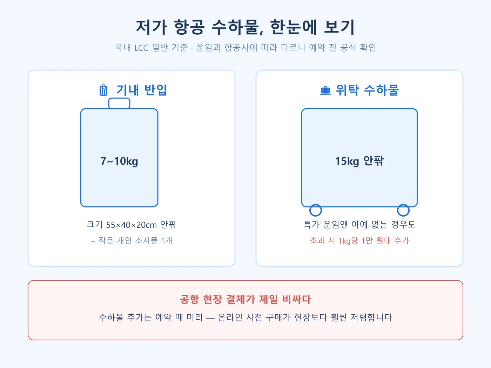

솔직히 저도 "다낭 왕복 9만 원" 특가에 들어갔다가 최종 결제액이 두 배가 된 걸 보고 놀란 적이 있어요. **저가 항공 이용 시 주의할 점**은 결국 이 한 문장으로 요약됩니다. 결론부터 말하면요, **LCC의 특가는 "몸만 타는 가격"이고, 나머지는 전부 옵션**입니다. 이 구조만 이해하면 바가지 쓸 일이 없어요. 그래서 제가 국내외 LCC 규정과 실제 사례들을 직접 찾아 비교해서, 예약 전에 확인할 것들을 순서대로 정리해 봤습니다.

📌 3줄 요약
LCC 특가 운임은 <b>위탁 수하물·좌석 지정·기내식이 빠진 기본가</b>입니다. 총비용으로 비교해야 대형 항공사와의 진짜 차이가 보입니다.

수하물은 <b>예약 때 온라인으로 미리 추가</b>하는 게 공항 현장 결제보다 훨씬 쌉니다. 항공사에 따라 현장 요금이 사전 구매의 2배까지 벌어집니다.

해외 LCC는 기내 수하물 기준이 더 엄격하고(7kg대·크기 실측), 온라인 체크인을 안 하면 수수료를 무는 곳도 있습니다.

## LCC는 왜 싼가 — 구조를 알면 함정이 보인다

저비용 항공사(LCC)가 싼 건 마법이 아니라 뺄셈입니다. 기내식·수하물·좌석 지정처럼 예전엔 당연히 포함이던 것들을 전부 유료 옵션으로 떼어내고, 같은 기종만 운영해 정비·운영비를 줄이고, 비행기를 최대한 쉬지 않고 돌리는 구조예요. 그래서 아무 옵션도 안 붙이면 정말 싸고, 옵션을 다 붙이면 대형 항공사(FSC)와 가격 차이가 확 줄어듭니다.

이 구조를 알고 나면 판단 기준이 명확해집니다. **"짐이 적고 몸만 가는 여행"일수록 LCC가 유리하고, "짐 많고 좌석·시간이 중요한 여행"일수록 총비용을 꼭 계산**해 봐야 한다는 거죠.

## 주의점 1 — 특가 운임엔 위탁 수하물이 없다

가장 많은 분들이 당하는 지점입니다. 국내 LCC의 최저가 운임(예를 들어 일부 항공사의 특가 등급)은 **위탁 수하물이 아예 포함되지 않는 경우**가 있어요. 특가만 보고 결제했다가 캐리어를 부치려는 순간 추가 요금이 붙는 겁니다. 예약 화면에서 운임 등급별 포함 내역을 반드시 펼쳐 보고, 최종 결제 직전 화면에서 "수하물 포함 여부"를 한 번 더 확인하세요.

비교 검색은 [스카이스캐너](https://www.skyscanner.co.kr/) 같은 메타서치로 하되, 표시된 최저가가 어느 운임 등급인지까지 봐야 정확합니다. 항공권 자체를 싸게 잡는 요령은 [항공권 싸게 사는 법 — 특가 찾는 기준 7가지](/cheap-flight-tickets-tips/)에 따로 정리해 뒀어요.

## 주의점 2 — 수하물 규정, 숫자로 기억하자

제가 국내 LCC 규정을 표로 묶어보면 이렇습니다(검색 시점 기준 일반 기준이고, 항공사·운임마다 다르니 예약 전 공식 페이지 확인은 필수예요).

| 구분 | 일반적 기준 | 주의 |
|---|---|---|
| 기내 반입 | 55×40×20cm 안팎 · 7~10kg | 항공사마다 7kg(이스타 등)·10kg(진에어·에어부산 등)로 갈림 |
| 위탁 수하물 | 15kg 안팎 (운임에 포함 시) | 특가 운임은 미포함인 경우 있음 |
| 무게 초과 | 1kg당 1만 원대 추가 | 현장 결제가 가장 비쌈 |

절약 포인트는 하나입니다. **수하물 추가는 예약 단계에서 온라인으로.** 공항 카운터에서 초과분을 결제하는 게 제일 비싸고, 항공사에 따라 사전 구매 대비 2배까지 벌어진다고 안내됩니다. 출발 전 집 체중계로 캐리어 무게를 재 보고, 초과가 예상되면 미리 옵션을 사 두는 게 남는 장사예요. 참고로 귀국편 공항 검사가 출국 때보다 깐깐한 경우가 많다는 후기도 흔하니, 쇼핑으로 짐이 불어나는 것까지 계산에 넣으세요.

## 주의점 3 — 해외 LCC는 한 단계 더 엄격하다

동남아·유럽 노선에서 해외 LCC를 탈 때는 기준이 더 빡빡해집니다. 직접 찾아보니 차이가 꽤 크더라고요.

| 항공사(예시) | 기내 수하물 | 특징 |
|---|---|---|
| 에어아시아 | 56×36×23cm · 7kg | 위탁은 기본 미포함, 사전 구매제 |
| 세부퍼시픽 | 56×36×23cm · 7kg | 공항 구매 시 사전 구매의 2배 이상 |
| 피치항공 | 55×40×25cm · 7kg | 무게를 엄격하게 실측 |
| 라이언에어(유럽) | 40×20×25cm 소지품만 기본 | 기내 캐리어도 유료 옵션 |

공통점이 보이시죠. **기내 7kg**이 사실상 동남아 LCC의 표준이고, 유럽 초저가 항공은 아예 "좌석 밑에 들어가는 가방 하나"만 기본입니다. 여기에 액체류는 어느 항공사든 병당 100ml·총 1L 규정이 적용되니, 기내 반입이 헷갈리는 물건은 [기내 반입 금지 물품 총정리](/carry-on-prohibited-items/)에서 미리 확인하세요.

## 주의점 4 — 체크인·게이트 마감, 생각보다 빡빡하다

LCC는 지상 인력도 최소로 운영합니다. 그래서 몇 가지가 대형 항공사와 달라요. 일부 해외 LCC는 **온라인 체크인을 안 하고 공항에 가면 체크인 수수료**를 물립니다. 탑승 게이트도 출발 15~30분 전에 닫는 곳이 많아서, 면세점 구경하다 뛰는 일이 생기죠. 좌석 지정을 안 하면 일행과 떨어져 앉을 수 있는데, 이게 싫으면 좌석 지정료를 내는 것이고, 감수할 수 있으면 그만큼 아끼는 겁니다. 저라면 단거리 노선은 좌석 지정 없이 타고, 그 돈으로 현지에서 쌀국수를 한 그릇 더 먹겠습니다.

## 주의점 5 — 지연·결항 대응 여력은 약한 편이다

구조적으로 알아 둘 부분입니다. LCC는 비행기를 빽빽한 스케줄로 돌리기 때문에 앞 항공편이 늦어지면 뒤가 연쇄적으로 밀리기 쉽고, 대체편 여력도 대형사보다 적습니다. 국내 언론 보도(2025년 기준)에 따르면 국내 LCC 소속 정비사는 업계 전체의 27% 수준이고, 권고 기준을 충족하는 회사가 많지 않다는 지적도 있었어요. 또 2026년 들어 일부 신생 LCC의 재무 어려움이 보도되기도 했습니다. 겁먹을 필요는 없지만, **일정이 절대 밀리면 안 되는 여행(환승 연결·행사 참석)이라면 시간 여유를 넉넉히 잡거나 FSC를 고려**하는 게 합리적입니다. 지연·결항 시 보상 기준은 항공사 약관과 소비자분쟁해결기준을 따르니, 예약 확인 메일과 지연 안내 문자는 지우지 말고 보관하세요.

## 주의점 6 — 도착 공항이 어디인지 확인하라

유럽 초저가 항공에서 특히 흔한 함정인데, "파리행"이라고 팔면서 실제로는 도심에서 수십 km 떨어진 보조 공항에 내려주는 경우가 있습니다. 공항에서 시내까지 가는 버스비와 시간을 더하면 특가의 의미가 줄어들죠. 동남아 노선은 대부분 주요 공항을 쓰지만, 유럽·미주 LCC를 탈 땐 공항 코드를 꼭 확인하세요.

## 그래도 LCC를 타는 이유 — 규칙을 알면 탄탄한 가성비

여기까지 읽으면 LCC가 나쁜 것처럼 보이지만, 전혀 아닙니다. 규칙을 아는 사람에게 LCC는 여전히 손꼽히는 가성비 수단이고, 최근엔 프리미엄 좌석을 도입하는 LCC가 나올 만큼 서비스도 진화하고 있어요. 핵심은 딱 하나, **내 여행 스타일과 총비용으로 판단하는 것**입니다.

✅ 예약 전 30초 체크리스트
① 운임 등급에 <b>위탁 수하물 포함 여부</b> 확인 → ② 수하물 필요하면 <b>예약 때 미리 추가</b> → ③ 기내 캐리어 <b>무게·크기</b> 확인(해외는 7kg 기준) → ④ <b>온라인 체크인</b> 미리 → ⑤ 도착 <b>공항 코드</b> 확인 → ⑥ 최종 결제액으로 FSC와 비교.

## 자주 묻는 질문 (FAQ)

**Q. 저가 항공 기내 수하물은 몇 kg까지 되나요?** 국내 LCC는 대체로 7~10kg(55×40×20cm 안팎)이고, 동남아 LCC는 7kg 기준이 일반적입니다. 항공사·운임마다 다르니 예약 전 공식 규정을 확인하세요.

**Q. 위탁 수하물은 기본으로 포함되나요?** 운임 등급에 따라 다릅니다. 최저가 특가 운임에는 위탁 수하물이 빠져 있는 경우가 있어서, 포함 내역을 확인하고 필요하면 예약 단계에서 추가하는 게 가장 쌉니다.

**Q. 수하물 무게를 초과하면 얼마나 내나요?** 국내 LCC 기준 1kg당 1만 원대 수준으로 안내되며, 공항 현장 결제가 사전 구매보다 훨씬 비쌉니다. 요금은 항공사·노선·시점에 따라 바뀌니 공식 요금표를 확인하세요.

**Q. 저가 항공은 위험하지 않나요?** LCC도 동일한 항공 안전 규제를 받으므로 "저가=위험"은 아닙니다. 다만 빡빡한 스케줄 탓에 지연 대응 여력이 약한 편이라, 일정이 중요한 여행이라면 시간 여유를 두는 것을 추천합니다.

## 이미지 출처

- 대표 이미지 — 저가 항공 여객기, 사진 ⓒ 정찬송, CC BY 2.0 KR (Wikimedia Commons)
- 본문 이미지 — 수하물 규정 다이어그램, 클릭고트래블링 자체 제작

---

마지막으로 이거 하나만 기억하면 돼요. **LCC 특가는 "몸만 타는 가격"이니, 수하물·좌석·체크인을 예약 단계에서 미리 정리하고 최종 결제액으로 비교하자.** 이 원칙 하나면 저가 항공은 함정이 아니라 무기가 됩니다. 항공권 자체를 더 싸게 잡고 싶다면 [항공권 싸게 사는 법](/cheap-flight-tickets-tips/)을 이어서 읽어 보세요.

**관련 키워드** — #저가항공 #저가항공주의사항 #LCC #저가항공수하물 #기내수하물규정 #위탁수하물 #저가항공특가 #항공권예약팁 #에어아시아수하물 #온라인체크인 #저가항공좌석지정
