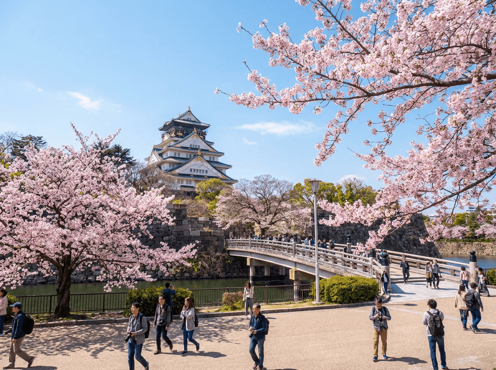

**오사카 여행 코스 3박 4일**을 검색하면 글이 쏟아지는데, 막상 열어 보면 어떤 글은 교토를 넣고 어떤 글은 빼고, 유니버설 스튜디오 위치도 제각각이라 더 헷갈리죠. 저도 이 글을 쓰려고 상위 코스 글을 열 개 넘게 직접 열어 비교해봤는데, 뼈대를 이해하고 나니 오히려 단순하더라고요. 결론부터 말하면요, 3박 4일은 **시내 이틀 + 하루는 유니버설 스튜디오나 교토 중 택1 + 마지막 날 쇼핑**이 표준 구조이고, 그 '택1'만 내 여행 유형에 맞게 고르면 끝입니다. 이 글은 그 선택 기준까지 표로 정리해 드릴게요.

📌 3줄 요약
3박 4일 표준 뼈대는 <b>1일차 난바·도톤보리 → 2일차 오사카성·우메다 → 3일차 유니버설 스튜디오 또는 교토 택1 → 4일차 쇼핑·귀국</b>입니다.

공항에서 시내는 난카이 라피트로 난바까지 약 40분, 시내 이동은 지하철 중심이라 숙소는 <b>난바 근처</b>가 동선상 가장 편합니다.

경비는 항공·숙박 시세에 따라 크게 달라지므로 아래 <b>항목별 표</b>에서 내 스타일대로 조립해 보세요(2026년 기준, 변동 큼).

## 오사카 여행 코스, 큰 그림부터 잡읍시다

여기서 많이들 헷갈리는데, 오사카 3박 4일의 핵심은 "어디를 가느냐"보다 **"하루를 어디에 쓰느냐"**입니다. 오사카 시내의 필수 코스(도톤보리·오사카성·우메다)는 알차게 돌아도 이틀이면 충분해요. 그래서 남는 하루를 유니버설 스튜디오에 쓸지, 교토 당일치기에 쓸지가 이 여행의 가장 큰 갈림길이 됩니다.

비행시간이 짧아 도착 당일부터 일정이 가능한 것도 오사카의 장점이에요. 오후에 도착해도 저녁 도톤보리 야경은 무리 없이 챙길 수 있습니다. 제가 지도에 1~4일차 동선을 하나씩 얹어보니, 숙소를 난바 쪽에 잡으면 1·2·4일차 일정이 전부 도보·지하철 몇 정거장 안에서 해결돼 이동 낭비가 거의 없었습니다.

숙소 권역(난바 vs 우메다) 비교나 교통패스 종류 같은 준비 단계 정보는 [오사카 자유여행 입문 가이드](/osaka-free-travel-guide/)에서 자세히 다뤘으니, 이 글은 일자별 코스와 선택 기준에 집중하겠습니다.

## 1일차 — 난바 도착, 도톤보리 야경으로 시작

간사이공항에서 난바까지는 난카이 전철 특급 **라피트**가 약 40분으로 가장 깔끔합니다. 숙소에 짐을 풀면 대개 늦은 오후일 테니, 1일차는 욕심내지 말고 난바 권역만 도는 게 정답이에요.

저녁 코스는 걸어서 이어집니다. **도톤보리** 운하의 네온사인과 글리코상 간판에서 시작해, **신사이바시스지** 상점가를 따라 올라가며 구경하고, 저녁은 도톤보리 골목의 타코야키·오코노미야키·쿠시카츠 같은 오사카 대표 먹거리로 해결하는 흐름이에요. 시간과 체력이 남으면 운하를 도는 리버크루즈나 돈키호테 관람차 같은 소소한 옵션도 있습니다.

💡 팁
도톤보리는 저녁~밤이 하이라이트입니다. 낮에 도착했다면 근처 구로몬 시장이나 덴덴타운을 먼저 보고, 해 질 무렵부터 도톤보리로 이동하는 순서가 사진도 분위기도 훨씬 좋아요.

## 2일차 — 오사카성과 우메다, 시내 핵심을 하루에

2일차는 오사카 시내의 상징을 도는 날입니다. 오전에 **오사카성**을 먼저 가세요. 공원이 넓어 산책만으로도 좋고, 천수각 전망대(입장 유료)에 오르면 시내가 한눈에 들어옵니다. 아침 개장 시간에 맞춰 가면 단체 관광객을 피해서 훨씬 쾌적하다는 게 상위 후기들의 공통 조언이었어요.

점심 이후에는 **신세카이**로 이동해 츠텐카쿠 주변의 레트로 분위기와 쿠시카츠 골목을 즐기고, 저녁에는 **우메다**로 올라가 스카이빌딩 공중정원이나 백화점 지하 식품관으로 마무리하는 동선이 무난합니다. 오사카성→신세카이→우메다가 전부 지하철로 이어져서 이동 부담이 적어요.

전망대·관람차 같은 유료 시설을 하루에 몰아서 돌 계획이면 **오사카 어메이징 패스**(예전 이름 '주유패스')를 이날 쓰는 게 효율적입니다. 저도 처음엔 여행 첫날부터 패스를 켜두는 게 정석인 줄 알았거든요. 요금 구조를 따져보니 유료 시설을 3곳 이상 도는 날에만 본전이 나오는 방식이라, 2일차처럼 시설을 몰아 도는 날 하루권으로 쓰는 게 가장 알뜰했습니다. 가격·포함 시설은 자주 바뀌니 구매 전 공식 안내에서 확인하세요.

## 3일차 — 유니버설 스튜디오냐, 교토 당일치기냐

이 여행의 갈림길입니다. **유니버설 스튜디오 재팬**은 2001년 문을 연, 미국 밖 최초의 유니버설 테마파크예요. 해리포터·닌텐도 구역 등 볼거리가 많아 제대로 즐기려면 하루를 통째로 써야 합니다. 티켓은 날짜별 변동 가격제라 8천 엔대부터 시작하고, 인기 시즌엔 더 비싸지니 공식 사이트에서 방문일 가격을 확인하고 미리 사두는 게 안전해요.

USJ로 정했다면 공략의 핵심은 **아침**입니다. 개장 30분 전에는 게이트에 도착해서, 입장하자마자 가장 가고 싶은 인기 구역(닌텐도 월드·해리포터)부터 직행하세요. 닌텐도 월드는 혼잡일에 입장 정리권이 필요할 수 있으니 공식 앱을 미리 깔아두는 게 안전합니다. 혼자거나 둘이라면 대기줄을 크게 줄여주는 싱글라이더 운영 여부도 앱에서 확인해볼 만해요.

**교토 당일치기**는 후시미이나리(천 개의 주홍 도리이)와 기요미즈데라를 축으로 잡는 게 정석입니다. 동선도 정리해 드릴게요. 오사카역에서 JR로 교토 방면으로 이동한 뒤, 나라선으로 갈아타 이나리역에 내리면 **후시미이나리**가 바로 앞입니다(오전 일찍 가야 사람이 적어요). 도리이 산책 후 기요미즈고조 쪽으로 이동해 **기요미즈데라**를 보고, 내려오는 길에 **산넨자카·니넨자카** 골목을 걸어 **기온** 거리에서 마무리하는 흐름이 반나절~하루 코스예요. 오사카에서 편도 1시간 안팎이라 당일치기가 충분히 가능하지만, 하루 2만 보 가까이 걷는 날이라 체력 배분은 필수입니다.

표로 묶어보면 이렇습니다.

| 여행 유형 | 3일차 추천 | 이유 |
| --- | --- | --- |
| 아이 동반 가족 | 유니버설 스튜디오 | 아이 만족도가 압도적, 교토는 걷는 양이 많아 힘듦 |
| 부모님 동반 | 교토 | 사찰·정원 취향 적중, 테마파크 줄서기 부담 없음 |
| 커플·친구 | 취향 택1 | 놀이기구 좋아하면 USJ, 사진·정취면 교토 |
| 오사카 재방문자 | 교토 또는 나라 | 시내는 이미 봤으니 근교로 반경 확장 |

⚠️ 주의
USJ와 교토를 하루에 다 넣는 건 무리입니다. 상위 코스 글들도 전부 둘 중 하나만 권해요. 둘 다 포기 못 하겠으면 3박 4일이 아니라 4박 5일로 늘리는 게 맞습니다.

## 4일차 — 구로몬 시장 브런치와 마지막 쇼핑

마지막 날은 비행기 시간에 맞춰 가볍게 마무리합니다. 오전에 **구로몬 시장**에서 해산물 브런치를 먹고, 난바 주변에서 못 산 기념품·간식 쇼핑을 채우는 정도가 적당해요. 저가항공 오후 편이라면 공항 가는 길에 린쿠 프리미엄 아울렛을 들르는 변형도 가능합니다(캐리어 보관함 이용).

공항에는 출발 2시간 전 도착이 기본이고, 성수기·연휴에는 보안 검색 줄이 길어질 수 있으니 여유를 더 두세요. 면세 수속이나 기내 반입 규정이 헷갈리면 떠나기 전에 짐 정리 기준부터 잡아두는 게 편합니다.

## 3박 4일 경비, 항목별로 뜯어봤습니다

경비는 "총 얼마"로 단정하기 어렵습니다. 항공권과 숙소가 시즌에 따라 두 배 가까이 출렁이기 때문이에요. 그래서 항목별로 뜯어서 범위로 정리했습니다(1인 기준, 2026년 시세 감각, 실제 가격은 예약 시점에 확인).

| 항목 | 대략 범위 | 메모 |
| --- | --- | --- |
| 왕복 항공권 | 20만~60만 원대 | LCC 특가 vs 성수기 대형사 차이가 큼 |
| 숙소 3박 | 1박 7만~20만 원대 | 난바 비즈니스호텔 기준, 주말·벚꽃철 급등 |
| 시내 교통 | 하루 1만 원 안팎 | 지하철 중심, 패스는 몰아 쓰는 날만 |
| 식비 | 하루 3만~6만 원 | 시장·체인 활용하면 아래쪽, 오마카세면 위쪽 |
| USJ(선택) | 8천 엔대~ | 날짜별 변동 가격제, 공식 사이트 확인 |
| 교토 왕복(선택) | 왕복 8백~2천 엔대 | 한큐·케이한·JR 등 노선·특급 여부에 따라 다름 |

넉넉잡아 항공·숙박 포함 **1인 70만~120만 원대**가 흔한 범위인데, 특가 항공에 게스트하우스라면 50만 원대도 가능하고 성수기 가족 여행이면 그 이상도 나옵니다. 환전 방식을 비교해보니 요즘은 트래블카드류가 수수료 면에서 유리하고, 현금은 시장·소액 결제용으로만 조금 챙기면 된다는 결론이었어요. 일본 여행 일반 정보와 최신 입국 안내는 [일본정부관광국(JNTO)](https://www.japan.travel/ko/kr/)에서 확인할 수 있습니다.

## 일정이 다르다면 — 2박 3일·4박 5일 변형

**2박 3일**이면 3일차 택1을 포기하고 시내 이틀 + 반나절 쇼핑으로 압축하세요. 도톤보리·오사카성·우메다만으로도 오사카 첫 여행의 만족도는 충분합니다. 욕심내서 교토를 끼워 넣으면 전부 스치듯 보게 돼요.

**4박 5일**이면 USJ와 교토를 둘 다 넣을 수 있고, 하루를 나라(사슴공원·도다이지)나 고베(항구 야경·고베규)에 쓰는 것도 좋습니다. 근교가 전철 30분~1시간 반경이라 오사카를 베이스캠프 삼아 매일 다른 도시를 찍고 오는 구조가 가능해요. 이게 오사카 여행 코스가 도쿄보다 짜기 쉽다고 하는 이유입니다.

## 자주 묻는 질문 (FAQ)

**Q. 오사카 3박 4일이면 교토랑 유니버설 스튜디오 둘 다 갈 수 있나요?** 둘 다 하루를 통째로 쓰는 일정이라 3박 4일엔 하나만 고르는 게 정석이고, 둘 다 원하면 4박 5일로 늘리는 걸 권합니다.

**Q. 오사카 여행 숙소는 난바와 우메다 중 어디가 좋나요?** 첫 여행이라면 도톤보리·공항 접근이 좋은 난바 쪽이 동선상 유리하고, 백화점 쇼핑 중심이면 우메다도 괜찮습니다.

**Q. 오사카 3박 4일 경비는 총 얼마나 드나요?** 항공·숙박 포함 1인 70만~120만 원대가 흔한 범위지만, 특가 항공과 시즌에 따라 50만 원대부터 그 이상까지 크게 달라집니다.

**Q. 오사카 어메이징 패스(구 주유패스)는 꼭 사야 하나요?** 필수는 아니고, 전망대 같은 유료 시설을 하루에 3곳 이상 몰아 도는 날에만 본전이 나오는 구조라 일정을 먼저 짜고 결정하는 게 좋습니다.

마지막으로 4일 뼈대를 한눈에 정리하면 이렇습니다.

| 일차 | 권역 | 핵심 일정 |
| --- | --- | --- |
| 1일차 | 난바 | 라피트 이동 → 도톤보리 야경·먹거리 |
| 2일차 | 시내 일주 | 오사카성(오전) → 신세카이 → 우메다 야경 |
| 3일차 | 택1 | 유니버설 스튜디오 또는 교토 당일치기 |
| 4일차 | 난바·귀국 | 구로몬 브런치 → 쇼핑 → 공항 |

정리할게요. 이거 하나만 기억하면 돼요 — **시내 이틀, 택1 하루, 쇼핑 반나절.** 이 뼈대에 위 표에서 내 유형의 3일차만 끼우면 오사카 3박 4일 코스는 완성입니다. 항공권 싸게 잡는 법이나 준비물 체크리스트까지 챙기고 싶다면 [오사카 자유여행 입문 가이드](/osaka-free-travel-guide/)와 함께 읽어보세요. 첫 오사카도 베테랑처럼 다닐 수 있을 겁니다.

---

**관련 키워드** — #오사카여행코스 #오사카3박4일 #오사카3박4일일정 #오사카여행경비 #오사카자유여행코스 #오사카어메이징패스 #오사카주유패스 #교토당일치기 #유니버설스튜디오재팬 #오사카가볼만한곳 #도톤보리 #오사카2박3일
