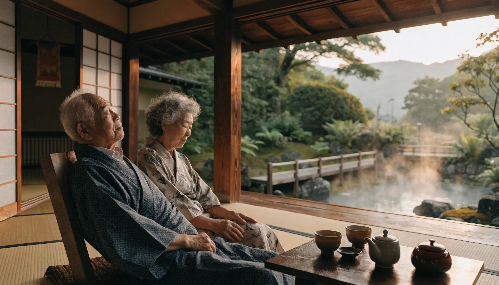

부모님 일본 여행 코스는 "어디를 가느냐"보다 "하루를 어떻게 짜느냐"에서 성패가 갈립니다. 일정을 직접 짜보니 젊은 사람 기준으로 하루에 대여섯 곳을 욱여넣으면 부모님은 둘째 날부터 무릎과 허리가 먼저 신호를 보내더라고요. 그래서 이 글은 명소 나열 대신, 어르신 체력에 맞춘 동선 원칙부터 후쿠오카·오사카·온천 3박 4일 실전 코스, 숙소와 식사 고르는 법, 지역별 경비, 다른 글이 잘 안 짚는 건강·응급 준비까지 순서대로 풀어드립니다.

📌 3줄 요약
핵심 원칙은 <b>하루 2~3곳·평지 위주·저녁 6시 마무리·온천 숙소</b>입니다.

처음이면 비행 1시간대 <b>후쿠오카</b>, 미식·교통이면 <b>오사카</b>, 쉬는 게 목적이면 <b>벳부·유후인 온천</b>이 무난합니다.

3박 4일 1인 경비는 후쿠오카가 대략 80~90만 원대로 가장 가볍습니다(항공·환율·시즌 따라 변동).

## 부모님 일본 여행 코스, 이 네 가지 원칙부터

실패하는 효도여행은 대개 욕심에서 옵니다. 좋다는 곳을 다 넣으면 정작 부모님은 사진 찍을 기운도 없이 호텔로 돌아오시죠. 다음 네 가지만 지켜도 만족도가 확 달라집니다.

첫째, 하루 2~3곳입니다. 명소 사이 이동·휴식·식사 시간을 빼면 어르신이 온전히 즐길 수 있는 건 하루 두세 곳입니다. 둘째, 평지와 좌식 위주입니다. 계단·언덕보다 평탄한 길, 서서 오래 보는 곳보다 앉아서 감상하는 정원·전망대를 고릅니다.

셋째, 저녁 6시 마무리입니다. 보통 오전 9~10시에 시작하면 6시 저녁 무렵이 체력의 한계라, 야경 욕심은 여행 중 하루만 잡으세요. 넷째, 온천 숙소입니다. 하루의 피로를 온천으로 풀면 다음 날이 확실히 가뿐합니다.

## 어디로 갈까 — 부모님께 좋은 일본 여행지

처음 모시고 간다면 비행이 짧은 곳부터 고르는 게 안전합니다. 지역별로 비행시간을 직접 찾아보니, 출발 당일 장시간 비행은 그 자체로 어르신께 부담이라 첫 여행일수록 짧은 노선이 확실히 유리하더라고요.

| 지역 | 추천 이유 | 비행(인천 기준) |
| --- | --- | --- |
| 후쿠오카 | 비행이 짧고 유후인·벳부 온천이 가까움. 첫 효도여행 최적 | 약 1시간 20~30분 |
| 오사카·교토 | 미식·대중교통, 교토 정원의 좌식 관람 | 약 1시간 40분 |
| 벳부·유후인 | 온천·료칸 중심의 쉬는 여행 | 후쿠오카 경유 |
| 도쿄 | 평지 신사(메이지신궁)·도쿄도청 무료 전망대 | 약 2시간 20분 |
| 홋카이도 | 자연경관 만족도가 높아 어르신 선호 | 약 2시간 40분 |

이 가운데 가장 무난한 첫 선택은 후쿠오카입니다. 비행이 짧고 온천 지역까지 묶기 좋아, 이동 부담을 줄이면서 푹 쉬는 두 마리 토끼를 잡을 수 있습니다.

## 후쿠오카 3박 4일 효도 코스

온천을 끼고 도는 가장 인기 있는 동선입니다. 이동이 길어지는 둘째 날만 전세차량이나 택시를 한 번 쓰면 부모님 피로가 확 줄어듭니다.

1일차는 오후에 도착해 하카타 시내 호텔에 짐을 풀고, 캐널시티 주변을 가볍게 산책한 뒤 근처 식당에서 이른 저녁을 드시는 정도로 여유 있게 잡습니다. 2일차는 평탄한 참배길로 걷기 편한 다자이후텐만구를 오전에 둘러보고, 점심 뒤 유후인으로 이동해 료칸에서 온천과 가이세키 저녁으로 하루를 마무리합니다.

3일차는 유후인 긴린코 호수와 상점가를 천천히 걷고, 오후에 벳부로 넘어가(유후인에서 벳부까지 버스로 약 1시간) 지옥온천 순례를 차량으로 돕니다. 4일차는 텐진에서 면세 쇼핑을 한 뒤 공항으로 향합니다. 료칸은 보통 1박 2식(조식·석식 포함)이라 식당을 따로 찾는 수고가 없어 어르신 동반에 특히 잘 맞습니다.

## 오사카·교토 3박 4일 코스

미식과 대중교통이 강점인 코스로, 교토의 좌식 관람을 곁들이면 부모님 만족도가 높습니다.

1일차는 간사이공항에서 난바의 역세권 숙소(역 도보 3분 이내)에 들어가, 저녁에 도톤보리를 가볍게 산책합니다. 2일차는 엘리베이터로 천수각까지 오를 수 있는 오사카성을 오전에 보고, 점심 뒤 호텔에서 한 시간쯤 쉰 다음 우메다 전망대에서 저녁 전 시내를 내려다봅니다.

3일차는 교토 당일로, 앉아서 말차와 정원을 감상하는 호센인 같은 사찰을 중심으로 돌고 기요미즈데라는 초입까지만 본 뒤 저녁 전에 돌아옵니다. 4일차는 신사이바시에서 쇼핑하고 출국합니다. 오사카가 처음이라면 공항 이동과 교통패스를 정리한 [오사카 자유여행 입문 가이드](/osaka-free-travel-guide/)를 먼저 보시면 동선이 한결 수월합니다.

## 온천 중심 4박 5일 — 쉬는 게 목적일 때

명소를 줄이고 온천 료칸 두 곳을 거점으로 삼는 코스입니다. 후쿠오카로 들어가 유후인 1박, 벳부 2박, 마지막 후쿠오카 시내 1박 식으로 잡고, 가운데 하루는 통째로 료칸에서 쉬도록 일정을 비워둡니다.

처음엔 저도 일정을 빡빡하게 채워야 알찬 줄 알았는데, 여러 코스를 비교해보니 이 코스의 핵심은 "안 움직이는 날"을 일부러 만드는 것이더라고요. 온천 료칸은 1박 2식 포함을 고르면 식사 동선이 사라져 부모님이 훨씬 편하게 쉬실 수 있고, 료칸 안 온천을 시간대만 바꿔 두세 번 즐기는 것만으로도 하루가 충분히 알찹니다.

료칸 비용은 1인 1박 2식 기준 대략 2~4만 엔대가 흔하고, 객실에 개인 온천이 딸린 고급 료칸은 더 올라갑니다. 시즌과 객실 등급에 따라 차이가 크니 한 곳은 좋은 료칸으로, 한 곳은 합리적인 곳으로 섞으면 만족도와 예산을 같이 잡을 수 있습니다.

## 동선·체력 배려, 이것만은 챙기세요

부모님 여행의 디테일은 결국 몸이 편한가에 달려 있습니다. 명소 앞까지 데려다주는 전세버스·택시나 버스투어 구간을 적절히 섞으면 걷는 부담이 크게 줄어듭니다.

무릎이 불편하시면 평탄한 길과 엘리베이터가 있는 곳을 우선합니다. 도쿄라면 평지 신사인 메이지신궁이나 무료로 오르는 도쿄도청 전망대, 오사카라면 엘리베이터로 오르는 오사카성과 우메다 전망대가 좋은 예입니다.

또 하루 일정 중간에 카페나 호텔에서 한 시간 쉬는 시간을 미리 박아두면, 오후에 지쳐 일정이 통째로 무너지는 일을 막을 수 있습니다. 휠체어나 보행이 걱정이라면 평지 명소 위주로만 짜고, 계단이 많은 신사·사찰은 초입까지만 보는 것으로 타협하세요.

## 숙소·식사 고르는 법

상위 후기들이 공통으로 강조하는 게 식사 대기입니다. 부모님은 아무리 유명한 맛집이라도 길게 줄 서는 걸 못 견디시는 경우가 많기 때문입니다.

숙소는 4성급 이상에 온천이 있고, 역에서 도보 5분 이내, 조식 포함을 기본 공식으로 잡으면 실패가 적습니다. 식사는 료칸 2식을 활용하거나, 숙소 근처 식당을 미리 정해두고 인기 있는 곳은 예약을 걸어둡니다.

교토라면 다다미방 료칸, 도쿄·오사카라면 깔끔한 시내 호텔이 무난합니다. 도미인 같은 온천 딸린 비즈니스호텔 체인도 가성비와 편의가 좋아 부모님 동반에 자주 추천됩니다.

## 부모님 일본 여행 경비는 얼마나

지역별 경비를 표로 묶어보면 이렇습니다. 아래는 3박 4일 1인 기준의 대략적인 눈높이인데, 항공·환율·시즌에 따라 크게 달라지니 단정하지 말고 범위로만 참고하세요.

| 지역 | 1인 경비(3박 4일) |
| --- | --- |
| 후쿠오카 | 약 80~90만 원 |
| 오사카 | 약 100~120만 원 |
| 벳부·유후인 온천(후쿠오카 경유) | 약 90~110만 원 |

성수기와 연휴는 항공권이 크게 뛰니 따로 잡고 봐야 합니다.

💡 경비 팁
전체 예상 경비의 30% 정도만 현금으로 환전하고 나머지는 수수료 혜택이 있는 트래블 카드로 쓰면 환전 손해가 적습니다. 항공권은 <a href="/cheap-flight-tickets-tips/">항공권 싸게 사는 법</a>으로 특가를 먼저 잡으세요.

## 출국 전 준비 — 입국·건강·응급

한국인은 일본 관광 시 90일 무비자라 여권만 있으면 됩니다. 다만 입국 절차를 빠르게 하려면 출국 전 Visit Japan Web에 입국심사·세관 정보를 등록해 QR코드를 미리 받아두는 걸 권합니다. 부모님은 앱이 익숙지 않으실 수 있으니, 자녀가 부모님 몫까지 미리 등록해 캡처해 드리면 공항에서 헤매지 않습니다.

고령 부모님일수록 건강 준비가 진짜 중요합니다. 평소 드시는 약은 넉넉히 챙기고, 약 이름이나 영문 처방전 메모를 함께 두면 현지에서 도움이 됩니다. 여행자보험은 고령일수록 나이 상한과 보장 한도 조건이 달라지니 가입 전 꼭 확인하세요.

자료를 직접 정리하다 보니 이 부분을 빼먹는 글이 의외로 많더라고요. 현지 응급 시 일본은 구급·화재가 119, 경찰이 110입니다. 숙소 주소를 일본어로 캡처해 두면 택시나 구급 호출 때 빠릅니다. 한국어 도움이 필요하면 외교부 영사콜센터(해외에서 +82-2-3210-0404)로 연락할 수 있고, 안전 정보는 [외교부 해외안전여행](https://www.0404.go.kr/)에서 확인하세요. 관광·교통 같은 최신 여행 정보는 [일본정부관광국(JNTO) 공식 사이트](https://www.japan.travel/ko/kr/)가 정확하고, 출국 전 준비물은 [해외여행 체크리스트](/overseas-travel-checklist-first-time/)로 한 번 점검하시길 권합니다.

## 자주 묻는 질문 (FAQ)

**Q. 부모님 일본 여행, 패키지와 자유여행 중 뭐가 나을까요?** 거동이 불편하시거나 일본이 처음이면 이동을 다 해결해 주는 패키지가 편하고, 체력이 괜찮고 천천히 쉬고 싶으시면 온천 거점 자유여행이 만족도가 높습니다.

**Q. 부모님 일본 여행 며칠 일정이 적당한가요?** 후쿠오카·오사카는 3박 4일이 무난하고, 온천 위주로 푹 쉬는 여행이면 4박 5일을 추천합니다.

**Q. 부모님과 일본 첫 여행지로 어디가 좋나요?** 비행이 1시간대로 짧고 온천 지역이 가까운 후쿠오카를 가장 많이 추천합니다.

**Q. 부모님 일본 온천여행은 어디가 좋나요?** 지옥온천 순례로 유명한 벳부와 료칸·긴린코 호수가 있는 유후인이 어르신께 인기가 높습니다.

**Q. 어르신과 다닐 때 하루 동선은 어느 정도가 적당한가요?** 하루 2~3곳, 저녁 6시 마무리, 중간에 한 시간 휴식을 기본으로 잡으면 무리가 없습니다.

---

**관련 키워드** — #부모님일본여행코스 #효도여행 #부모님효도일본여행 #부모님모시고일본여행 #어르신일본여행 #부모님일본온천여행 #후쿠오카효도여행 #오사카효도여행 #부모님일본여행경비 #부모님일본여행일정 #일본효도여행지 #벳부유후인온천여행
