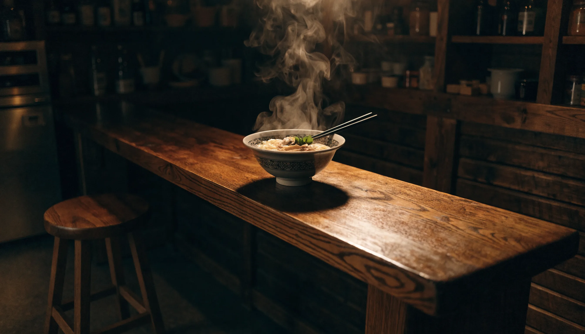

처음 혼자 떠나는 해외여행지로 일본만큼 만만한 곳도 드뭅니다. 도시별 동선을 직접 찾아보니 비행시간이 짧고 치안이 좋은 데다, 1인 손님을 위한 식당과 숙소 문화가 잘 갖춰져 있더라고요. 이 글에서는 혼자 일본 여행 코스를 도시 선택부터 3박4일 동선, 숙소·식당·경비·안전까지 실전 위주로 정리했습니다.

📌 3줄 요약
혼행 입문은 <b>후쿠오카</b>, 볼거리는 <b>오사카+교토</b>, 트렌드·쇼핑은 <b>도쿄</b>가 정석입니다.

숙소는 역세권 <b>비즈니스 호텔 싱글룸</b>(1박 7–10만 원)이 캡슐보다 편합니다.

경비는 도시에 따라 3박4일 <b>70–110만 원</b> 선이면 충분합니다.

## 혼자라도 일본이 편한 이유

일본은 혼자 여행의 진입장벽이 낮은 나라입니다. 인천에서 후쿠오카는 약 1시간, 도쿄·오사카도 2시간대로 가깝고, 밤에 혼자 다녀도 부담이 적을 만큼 치안이 안정적이에요. 무엇보다 라멘집·규동집처럼 **1인 손님이 기본인 식당**이 흔해서, 혼밥이 전혀 어색하지 않습니다.

교통도 친절합니다. 지하철 노선도가 한국어로 안내되는 곳이 많고, 역마다 코인락커가 있어 짐을 들고 헤맬 일이 적어요. 이런 인프라 덕분에 첫 해외 혼행지로 일본을 고르는 분이 많습니다.

## 코스의 시작은 '도시 선택' — 난이도별 추천

혼자 일본 여행 코스는 일정보다 **도시를 먼저 정하는 것**이 핵심입니다. 처음엔 저도 일정부터 짜려다 한참 헤맸는데, 도시마다 난이도와 분위기가 달라서 본인 성향에 맞는 곳을 먼저 골라야 동선이 편해지더라고요.

| 도시 | 난이도 | 특징 | 경비(3박4일) |
| --- | --- | --- | --- |
| 후쿠오카 | 입문 | 콤팩트·도보 위주, 1인 식당 천국 | 70–80만 원 |
| 오사카+교토 | 초중급 | 볼거리 풍부, 교토 당일치기 | 80–90만 원 |
| 도쿄 | 중급 | 트렌드·쇼핑, 노선 복잡 | 90–110만 원 |
| 삿포로 | 중급 | 자연·힐링, 먹거리 | 90–100만 원 |

처음이라면 **후쿠오카**, 볼거리를 알차게 원하면 **오사카**, 쇼핑과 트렌드를 노린다면 **도쿄**를 추천합니다.

## 후쿠오카 — 혼행 입문에 가장 쉬운 코스

후쿠오카는 시내가 콤팩트해 도보와 버스만으로도 충분히 돌 수 있습니다. 1일차는 하카타·텐진에서 시내를 익히고, 2일차는 오호리 공원과 다자이후, 3일차는 모모치 해변과 쇼핑으로 묶으면 무리 없는 동선이 됩니다.

식도락 도시답게 라멘·모츠나베·야타이(포장마차) 모두 혼자 즐기기 좋아요. 비행시간이 가장 짧아 첫 혼행의 부담을 가장 덜어주는 도시입니다.

## 오사카(+교토) — 볼거리와 당일치기 조합

오사카는 난바·도톤보리의 활기와 유니버설 스튜디오까지 볼거리가 많아 혼자서도 심심할 틈이 없습니다. 1–2일차는 오사카 시내와 USJ, 하루는 전철로 **교토 당일치기**(아라시야마 대나무숲·후시미 이나리)를 다녀오는 코스가 정석입니다.

간사이는 노선이 다소 복잡하지만, 난바나 우메다에서 출발하는 교토행 노선만 익히면 어렵지 않습니다. 먹거리와 야경, 역사까지 골고루 챙기고 싶은 분에게 잘 맞아요.

## 도쿄 — 트렌드·쇼핑, 서·동으로 나눠 돌기

도쿄는 볼거리가 워낙 넓게 퍼져 있어 **서쪽과 동쪽을 나눠 공략**하는 게 효율적입니다. 신주쿠·시부야·하라주쿠(서부)를 하루, 아사쿠사·우에노·긴자(동부)를 하루로 묶으면 이동 낭비가 줄어듭니다.

지하철 노선이 많아 처음엔 복잡해 보여도, 구글지도와 IC카드만 있으면 금방 익숙해집니다. 쇼핑과 최신 트렌드, 미식 다양성을 원한다면 도쿄가 답이에요.

## 숙소 — 역세권 비즈니스 호텔 싱글룸이 정답

숙소 옵션을 비교해보니 혼자라면 **주요 역 근처 비즈니스 호텔 싱글룸**이 가장 무난합니다. 1박 7–10만 원대로, 캡슐호텔보다 프라이버시와 짐 보관이 편하고 늦은 시간 이동도 안전합니다.

예약할 때는 역에서 도보 5분 이내, 욕실 분리 여부, 체크인 시간을 확인하세요. 동선의 중심이 되는 역(하카타·난바·신주쿠 등) 근처를 잡으면 매일 이동이 훨씬 가벼워집니다.

## 혼밥 천국 — 1인 식당 200% 활용

일본은 혼밥 인프라가 세계 최고 수준입니다. 이치란처럼 **칸막이 1인석**이 있는 라멘집, 카운터 자리가 기본인 규동·텐동집, 회전초밥까지 혼자 들어가도 전혀 눈치 볼 일이 없어요.

식권 자판기로 주문하는 가게가 많아 말이 서툴러도 편합니다. 가게 앞 줄이 길면 1인은 카운터로 먼저 안내되는 경우도 많으니, 혼자라는 점이 오히려 장점이 됩니다.

## 경비·교통·짐 — IC카드와 코인락커

도시별로 경비를 정리해보니 3박4일 70–110만 원이면 항공·숙박·식비·교통을 무리 없이 충당할 수 있습니다. 교통은 **IC카드**(스이카·이코카)를 충전해 지하철·버스·편의점까지 한 장으로 해결하는 게 편해요. 광역 이동이 많다면 JR패스를 비교해 보세요.

짐은 역마다 있는 **코인락커**를 적극 활용하세요. 체크인 전이나 귀국 당일, 캐리어를 맡기고 가볍게 마지막 일정을 즐길 수 있습니다. 일본 여행이 처음이라면 [처음 가는 해외여행 준비물 체크리스트](/overseas-travel-checklist-first-time/)도 함께 보면 좋습니다.

## 혼자라서 더 챙기는 안전·실전 팁

혼행 후기를 여러 편 찾아보니 결국 마지막에 갈리는 건 안전 습관이더라고요. 치안이 좋아도 기본은 지켜야 합니다. 늦은 밤 인적 드문 골목은 피하고, 숙소 주소와 비상연락처는 따로 저장해 두세요. 데이터는 유심이나 이심, 포켓와이파이 중 하나를 꼭 준비해 길 찾기와 번역을 대비합니다.

💡 혼행 꿀팁
식당·관광지 대기 줄에서 1인은 빨리 안내되는 경우가 많습니다. 또 사진이 필요하면 직원이나 다른 여행객에게 부탁하기보다 <b>삼각대·셀카봉</b>을 챙기면 마음 편하게 인생샷을 남길 수 있어요.

여행 정보는 [일본정부관광국(JNTO) 공식](https://www.japan.travel/ko/kr/) 사이트에서 최신 교통·축제 일정을 확인할 수 있습니다. 가족과 함께라면 동선이 달라지니 [부모님 일본 여행 코스](/parents-japan-travel-course/)도 참고하세요.

## 자주 묻는 질문 (FAQ)

**Q. 일본 혼자 여행 초보는 어느 도시가 좋나요?** 후쿠오카가 가장 쉽습니다. 비행시간이 1시간대로 짧고 시내가 콤팩트해 도보·버스만으로 충분하며, 1인 식당이 많아 혼밥 부담도 적습니다.

**Q. 혼자 일본 여행 3박4일 경비는 얼마인가요?** 도시에 따라 70–110만 원 선입니다. 후쿠오카가 70–80만 원으로 저렴하고, 도쿄는 90–110만 원 정도로 보면 됩니다. 항공·숙박·식비·교통 포함 기준입니다.

**Q. 혼자면 캡슐호텔이 나을까요?** 단기·저예산이면 캡슐도 괜찮지만, 프라이버시와 짐 보관·안전을 생각하면 역세권 비즈니스 호텔 싱글룸이 더 편합니다. 1박 7–10만 원대로 가성비도 좋습니다.

**Q. 일본은 혼자 밥 먹기 정말 괜찮나요?** 네, 혼밥 인프라가 잘 갖춰져 있습니다. 칸막이 1인석 라멘집, 카운터 위주의 규동·텐동집이 흔해 혼자 들어가도 전혀 어색하지 않습니다.

**Q. 일본 혼자 여행 안전한가요?** 치안은 좋은 편이지만 기본 수칙은 지키세요. 늦은 밤 인적 드문 골목은 피하고, 숙소 주소·비상연락처를 저장하고, 데이터(유심·이심·와이파이)를 준비해 길 찾기에 대비하면 안전합니다.

---

**관련 키워드** — #혼자일본여행코스 #일본혼자여행 #일본혼자여행추천도시 #후쿠오카혼자여행 #도쿄혼자여행 #오사카혼자여행 #일본혼자여행경비 #일본혼자여행숙소 #일본뚜벅이여행 #일본혼행안전 #일본3박4일 #혼행
