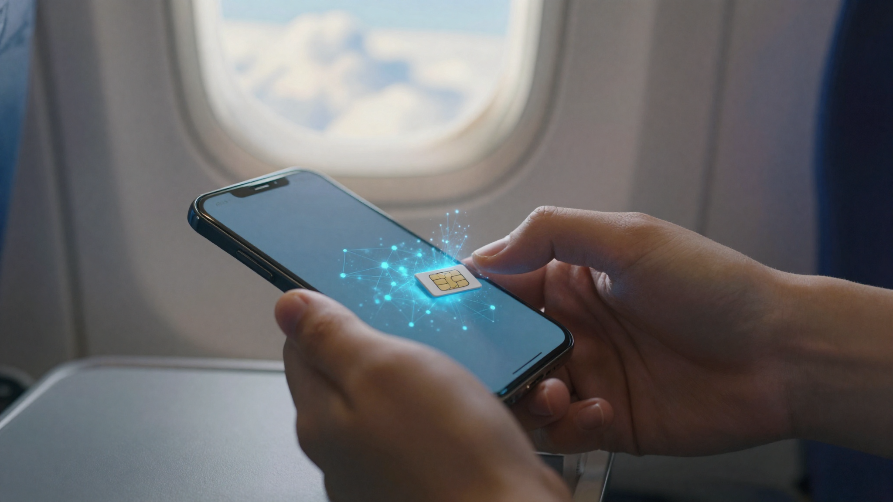

해외여행 유심 이심 차이, 결론부터 말하면요. 최신 폰으로 짧게 다녀올 거면 이심, 오래 머물거나 구형 폰이면 현지 유심이 대체로 편합니다. 저도 처음엔 유심과 이심이 뭐가 다른지, 로밍과는 또 어떻게 갈리는지 검색할수록 더 헷갈렸어요. 그래서 통신사·판매처마다 흩어진 설명을 직접 다 열어 표로 묶어봤습니다. 이 글 하나면 다시는 안 헷갈릴 거예요.

📌 3줄 요약
<b>유심</b>은 폰에 끼우는 물리 카드, <b>이심</b>은 폰에 내장된 디지털 심이라 QR로 바로 설치합니다.

이심의 최대 강점은 <b>한국 번호를 그대로 살린 채</b> 해외 데이터를 추가로 쓰는 것 — 카톡·인증 문자를 그대로 받습니다.

최신 폰이면 이심, 구형·안드로이드거나 길게 머물면 현지 유심, 짧게 여럿이 나눠 쓰면 포켓 와이파이가 무난합니다.

## 유심과 이심, 딱 한 줄 차이부터

유심과 이심의 차이는 "실물 카드냐, 폰 안에 든 디지털이냐"입니다. 유심은 손톱만 한 물리 카드를 꺼내 끼우는 방식이고, 이심은 폰에 이미 들어 있는 칩에 통신 정보를 QR코드로 내려받는 방식이에요. 여기서 많이들 헷갈리는데, 둘 다 결국 "현지 통신망에 연결해 데이터를 쓰는 심"이라는 목적은 똑같습니다. 방식만 다른 거죠.

이 하나의 차이에서 나머지 장단점이 전부 갈립니다. 실물이 없으니 이심은 잃어버릴 걱정이 없고, 카드를 뺐다 끼웠다 할 필요가 없어요. 대신 폰 안의 칩을 쓰는 방식이라 **지원되는 기종이 정해져 있습니다**. 유심은 반대예요. 거의 모든 폰에서 되지만, 원래 쓰던 한국 유심을 빼서 보관해야 하고 분실 위험이 있습니다.

표로 묶어보면 이렇습니다.

| 구분 | 유심(USIM) | 이심(eSIM) |
| --- | --- | --- |
| 형태 | 실물 카드 삽입 | 폰 내장, QR로 설치 |
| 설치 | 카드 교체(핀 필요) | 설정에서 QR 스캔 즉시 |
| 한국 번호 | 유심 빼면 사용 불가 | 그대로 유지(듀얼) |
| 분실 위험 | 있음(작은 카드) | 없음 |
| 지원 기종 | 대부분 | 최신 기종 위주 |

## 이심이 뜨는 진짜 이유 — 한국 번호를 그대로 쓴다

이심의 가장 큰 장점은 요금이 아니라 **한국 번호를 살린 채 해외 데이터를 더한다**는 점입니다. 이심은 기존 한국 유심을 그대로 둔 상태에서 해외용 회선을 하나 더 얹는 "듀얼심"으로 작동해요. 그래서 여행 중에도 한국 번호로 오는 카카오톡, 은행·택배 인증 문자, 지인 전화를 그대로 받을 수 있습니다.

저도 이 부분을 처음엔 오해했어요. 해외 심을 쓰면 무조건 한국 번호가 끊기는 줄 알았거든요. 그런데 이심은 데이터는 저렴한 해외 회선으로 쓰고, 전화·문자는 한국 번호로 받도록 나눠 설정할 수 있습니다. 실물 유심을 빼면 그 순간 한국 번호를 못 쓰는 유심 방식과 여기서 결정적으로 갈리죠.

설치도 QR 한 번이면 끝이라, 공항에 내리자마자 비행기 모드만 풀면 바로 연결됩니다. 카드를 꺼내 끼우다 떨어뜨릴 일도, 원래 유심을 지퍼백에 보관하다 잃어버릴 일도 없어요. 이 편리함 때문에, 여러 조사와 후기를 보면 20·30대를 중심으로 이심을 찾는 사람이 꾸준히 늘고 있습니다.

## 그럼 유심은 언제 유리할까

유심이 유리한 상황은 분명합니다. **내 폰이 이심을 지원하지 않거나, 한 곳에 오래 머무는 경우**예요. 이심은 최신 기종에서만 되기 때문에, 몇 년 지난 폰이나 이심 미지원 안드로이드라면 선택지가 유심밖에 없습니다. 이럴 땐 고민할 것 없이 현지 유심이 답이에요.

가격과 품질 면에서도 현지 유심은 강점이 있습니다. 그 나라 통신사 회선을 직접 쓰는 방식이라 데이터가 안정적이고, 대용량·장기 상품이 저렴한 편이에요. 한 달 살기나 유학처럼 길게 머물면서 현지 번호로 통화·문자까지 해야 한다면, 현지에서 유심을 개통하는 게 가장 실속 있습니다.

💡 이렇게 고르면 편해요
<b>최신 폰 + 짧은 여행</b>이면 이심, <b>구형 폰이거나 한 달 이상 장기</b>면 현지 유심. 폰이 이심이 되는지부터 확인하면 절반은 정해집니다.

## 내 폰은 이심 되나요?

이심 지원 여부는 기종으로 갈립니다. **아이폰은 XS·XR(2018년) 이후 전 모델**이 이심을 지원해요. 그 이후 나온 아이폰이라면 거의 다 된다고 보면 됩니다. 반면 갤럭시는 국내 출시 기준으로 대체로 **Z 폴드4·플립4, S23 시리즈 이후**의 상위 라인업에서 지원되고, 이후 일부 모델로 확대돼 왔습니다. 다만 갤럭시는 같은 이름이라도 지역·통신사에 따라 이심 지원이 다르니, 구매·개통 전에 [삼성 갤럭시 eSIM 지원 모델 안내](https://www.samsungsvc.co.kr/solution/1314583) 같은 공식 페이지로 내 모델을 확인하는 게 확실합니다.

가장 빠른 확인법은 두 가지예요. 통화 앱에서 **`*#06#`을 눌러 EID라는 번호가 뜨면** 이심을 지원하는 폰입니다. 또는 설정에서 "eSIM 추가"나 "요금제 추가" 메뉴가 보이는지 확인하면 돼요. 둘 중 하나라도 되면 이심을 쓸 수 있습니다.

여기서 주의할 게 있어요. 통신사에서 약정으로 산 폰 중 일부는 **기기 잠금**이 걸려 해외 심이 안 잡힐 수 있습니다. 자급제이거나 약정이 끝난 폰은 대부분 괜찮지만, 불안하면 출발 전에 통신사에 "해외 유심·이심 사용 가능한지" 한 번 물어보세요.

## 이심 설치는 어떻게 하나요?

이심 설치는 QR코드 스캔 한 번으로 끝나는, 3단계면 되는 작업입니다. 순서만 알면 공항에서 5분이면 됩니다.

1. **상품 구매** — 여행 국가·기간·데이터량에 맞는 이심을 온라인으로 삽니다. 결제하면 QR코드가 메일이나 화면으로 옵니다.
2. **QR 스캔** — 폰 설정에서 아이폰은 "셀룰러 → eSIM 추가", 갤럭시는 "SIM 관리자 → eSIM 추가"로 들어가 QR을 찍습니다. 회선이 폰에 등록돼요.
3. **데이터 회선 지정** — 현지에 도착해 방금 넣은 이심을 데이터용으로 켜고, 데이터 로밍을 허용하면 연결됩니다.

⚠️ QR은 출발 전, 활성화는 도착 후
QR 등록은 <b>와이파이가 되는 출발 전 집에서</b> 미리 해두는 게 안전합니다. 다만 유효기간이 있는 상품은 도착 후 활성화해야 하니, 구매처 안내대로 <b>켜는 시점</b>만 확인하세요. QR은 보통 한 번만 스캔되니 사진으로 백업해두면 좋아요.

## 로밍·포켓와이파이까지, 4가지 한눈 비교

해외 데이터 방법은 유심·이심만 있는 게 아니라 로밍, 포켓 와이파이까지 4가지예요. 유심 이심 로밍 차이가 헷갈린다면 아래 표 하나로 정리됩니다. 제가 전화번호 유지·공유 여부·설치 편의를 기준으로 묶어봤어요.

| 방식 | 한국 번호 | 여럿이 공유 | 설치 편의 | 가격대 |
| --- | --- | --- | --- | --- |
| 로밍 | 유지 | 불가 | 매우 쉬움 | 비쌈 |
| 유심 | 불가 | 불가 | 보통(교체) | 저렴 |
| 이심 | 유지 | 불가 | 매우 쉬움 | 저렴 |
| 포켓 와이파이 | 불가 | 최대 5대 | 보통(대여) | 중간 |

로밍은 아무 설정 없이 도착하면 바로 되고 한국 번호로 통화·문자가 자유로운 대신 요금이 가장 비쌉니다. 포켓 와이파이는 기기 하나로 여러 명이 나눠 쓸 수 있어 가족·단체엔 경제적이지만, 매일 들고 다니며 충전하고 대여·반납해야 하는 번거로움이 있어요. 결국 혼자 또는 둘이 짧게 다녀오면 이심, 여럿이 함께면 포켓 와이파이가 무난한 그림입니다.

## 요금은 얼마나 차이날까

데이터 요금만 놓고 보면 유심·이심이 로밍보다 크게 쌉니다. 한 비교 기준으로 일본에서 5일간 매일 3GB를 쓸 경우, 유심·이심은 대략 1만1,000~1만3,000원인 반면 로밍은 4만~6만 원대로 안내됩니다. 같은 데이터를 쓰는데 방식만 바꿔도 몇 배가 차이 나는 거예요. 그래서 통화가 꼭 필요한 게 아니라면, 데이터는 유심·이심으로 챙기는 사람이 많습니다.

물론 가격은 나라·기간·데이터량, 그리고 판매처 프로모션에 따라 계속 바뀝니다. 정확한 금액은 구매 시점에 확인해야 하고, "상시 얼마"라고 단정하긴 어려워요. 다만 "데이터 위주라면 유심·이심이 저렴하고, 한국 번호 통화가 중요하면 로밍"이라는 큰 틀은 잘 바뀌지 않습니다.

데이터량은 이렇게 잡으면 무난해요. 지도·메신저 위주의 가벼운 사용은 하루 500MB, 일반적인 여행 사진·검색은 3박 4일 기준 2~3GB, 영상 시청이나 SNS 업로드가 잦으면 하루 1~3GB를 봅니다. 애매하면 조금 넉넉한 쪽을 고르고, 숙소·카페 와이파이에서 큰 업로드를 몰아 하면 데이터가 확 줄어듭니다.

## 상황별 추천 — 나는 뭘 골라야 할까

정리하면 선택은 세 가지 질문으로 끝납니다. 내 폰이 이심이 되는가, 며칠이나 머무는가, 한국 번호 통화가 필요한가. 이 순서로 짚으면 답이 나와요.

- **최신 폰 + 2~7일 여행**이면 이심. 설치 간편, 한국 번호 유지, 요금 저렴까지 다 잡습니다.
- **구형 폰·이심 미지원**이면 현지 유심. 선택지가 이거 하나라 고민할 필요가 없어요.
- **한 달 이상 장기·현지 통화 필요**면 현지 유심 개통이 실속 있습니다.
- **가족·단체가 함께**면 포켓 와이파이로 한 대에 붙어 나눠 쓰는 게 경제적입니다.
- **한국 번호로 통화·문자를 자유롭게** 써야 하는 출장이면 로밍이 가장 마음 편합니다.

출발 전 통신 말고도 챙길 게 많죠. 여권·환전·기내 반입 규정까지 한 번에 훑고 싶다면 [처음 가는 해외여행 준비물 체크리스트](/overseas-travel-checklist-first-time/)를 함께 보면 빠뜨리는 게 없습니다.

## 유심·이심 쓸 때 자주 하는 실수

가장 흔한 실수는 **도착해서야 폰이 이심을 지원하는지 확인하는 것**입니다. 공항에서 QR을 받아놓고 폰이 안 되면 방법이 없어요. 지원 기종·기기 잠금은 반드시 출발 전에 확인하세요. 두 번째는 원래 쓰던 한국 유심을 빼서 아무 데나 두는 것 — 작은 카드라 정말 잘 잃어버립니다. 유심 케이스나 지퍼백에 라벨을 붙여 보관하세요.

🚫 이것만은 피하세요
이심을 폰에서 <b>삭제(회선 제거)하면 같은 QR로 다시 못 넣는 상품이 많습니다.</b> 여행이 끝나기 전엔 함부로 지우지 마세요. 또 이심은 국가·통신망 지원 목록을 꼭 확인하고, 환불·고객지원 정책이 있는 판매처에서 사는 게 안전합니다.

세 번째는 데이터 로밍 스위치예요. 이심을 넣고도 "데이터 로밍 허용"을 안 켜서 연결이 안 된다고 오해하는 경우가 많습니다. 해외용 회선은 데이터 로밍을 켜야 정상 작동하니, 연결이 안 되면 이 설정부터 확인하세요. 반대로 한국 유심 회선은 로밍을 꺼둬야 요금 폭탄을 피합니다.

## 자주 묻는 질문

**Q. 유심이랑 이심 중 뭐가 더 싸요?** 데이터만 쓸 거라면 둘 다 비슷하게 저렴하고, 로밍보다 몇 배 쌉니다. 일본 5일·하루 3GB 기준 유심·이심이 1만 원대, 로밍이 4만~6만 원대로 안내됩니다. 가격은 나라·기간·시점에 따라 바뀌니 구매 전 확인하세요.

**Q. 이심 쓰면 카카오톡이랑 한국 전화 그대로 받을 수 있나요?** 네, 받을 수 있습니다. 이심은 기존 한국 유심을 살린 채 해외 데이터 회선을 추가하는 듀얼심이라, 한국 번호로 오는 카톡·인증 문자·전화를 그대로 받으면서 데이터만 저렴한 해외 회선으로 씁니다.

**Q. 내 폰이 이심을 지원하는지 어떻게 확인하나요?** 통화 앱에서 `*#06#`을 눌러 EID가 뜨거나, 설정에 "eSIM 추가" 메뉴가 있으면 지원하는 폰입니다. 아이폰은 XS·XR 이후 전 모델, 갤럭시는 국내 기준 Z 폴드4·플립4·S23 시리즈 이후가 대체로 지원합니다.

**Q. 유심 이심 로밍 중에 뭘 골라야 하나요?** 데이터 위주면 이심(최신 폰)이나 유심(구형·장기), 한국 번호 통화가 중요하면 로밍입니다. 여럿이 나눠 쓰면 포켓 와이파이가 경제적이에요. 폰이 이심을 지원하는지부터 확인하면 선택이 반은 정해집니다.

**Q. 이심은 한 번 지우면 다시 못 쓰나요?** 상품에 따라 다르지만, 같은 QR로 재설치가 안 되는 경우가 많습니다. 여행이 끝나기 전까지는 이심 회선을 삭제하지 말고, 필요하면 잠깐 꺼두기만 하세요.

**Q. 안드로이드 구형 폰은 이심을 아예 못 쓰나요?** 이심 미지원 기종이면 이심은 쓸 수 없고, 이때는 현지 유심이 정답입니다. 유심은 거의 모든 폰에서 되니, 폰이 이심이 안 되면 고민 없이 현지 유심을 고르면 됩니다.

이거 하나만 기억하면 돼요. **내 폰이 이심이 되면 이심, 안 되면 유심, 여럿이면 포켓 와이파이.** 이 순서로 고르면 해외여행 유심 이심 차이 때문에 공항에서 헤맬 일은 없습니다. 다음 여행 준비도 미리 훑어두면 훨씬 수월해요.

---

**관련 키워드** — #유심이심차이 #해외여행유심 #이심추천 #eSIM설치방법 #이심지원기종 #유심vs이심 #해외로밍비교 #포켓와이파이 #해외데이터 #아이폰이심 #갤럭시이심 #이심듀얼심
