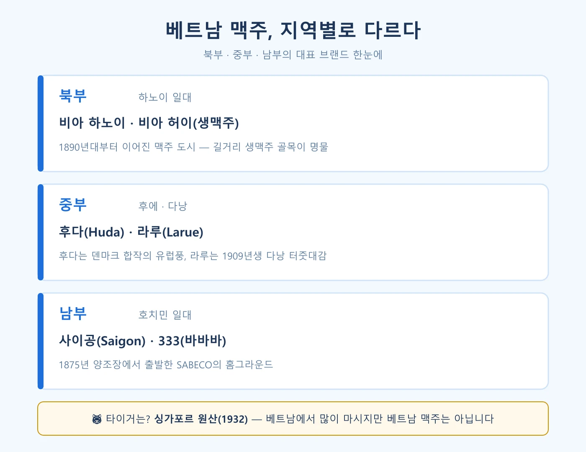

결론부터 바로 답할게요. **타이거 맥주 원산지는 싱가포르입니다.** 1932년 싱가포르에서 태어났고, 하이네켄 아시아 퍼시픽이 만드는 맥주예요. 베트남 맥주가 아닙니다. 저도 오랫동안 타이거가 베트남 맥주인 줄 알았어요. 현지 식당마다 타이거가 깔려 있으니 그럴 만도 하죠. 그런데 진짜 베트남 맥주는 지역마다 따로 있습니다. 북부는 하노이, 중부는 후다와 라루, 남부는 사이공과 333. 이 지도를 알고 가면 여행지에서 뭘 시켜야 할지 고민이 사라져요. 그래서 제가 브랜드별 원산지와 도수, 가격까지 자료를 뒤져 한 편으로 묶어봤습니다.

📌 3줄 요약
<b>타이거 맥주는 베트남이 아니라 싱가포르 원산</b>(1932년, 하이네켄 합작)입니다. 베트남을 포함한 아시아 여러 나라에서 위탁 양조돼 현지 맥주처럼 보일 뿐이에요.

진짜 로컬 브랜드는 지역제입니다. <b>북부 하노이 · 중부 후다/라루 · 남부 사이공/333</b> — 여행지에 맞는 로컬 맥주를 시키는 게 정석입니다.

하노이의 <b>비아허이</b>는 세계에서 가장 싼 축에 드는 생맥주(한 잔 몇백 원 수준)로, 현지 맥주 문화의 하이라이트입니다.

## 타이거 맥주 원산지는 어느 나라인가요?

**타이거 맥주의 원산지는 싱가포르입니다.** 1932년 싱가포르에서 처음 양조됐고, 네덜란드 하이네켄과 싱가포르 프레이저 앤드 니브의 합작으로 출발한 하이네켄 아시아 퍼시픽(옛 아시아 퍼시픽 브루어리)이 만듭니다. 베트남 맥주가 아니며, 태국·말레이시아 맥주도 아닙니다.

그런데 왜 다들 베트남 맥주로 알고 있을까요? 이유는 두 가지예요. 첫째, 타이거는 싱가포르 본사 외에 **베트남·말레이시아·태국·중국 등 아시아 여러 나라 양조장에서 위탁 생산**됩니다. 베트남 안에도 하이네켄 베트남 양조장이 있어서 현지에서 마시는 타이거는 실제로 베트남산 병일 수 있어요. 둘째, 베트남 식당·마트 어디에나 타이거가 깔려 있을 만큼 마케팅이 강합니다. 저도 다낭 식당에서 타이거 병을 돌려 라벨 뒷면을 확인해 보고서야 "아, 이거 싱가포르 브랜드였지" 하고 새삼 실감했을 정도니까요. 한국 수입 제품의 생산국 표기가 제각각인 것도 같은 위탁 생산 구조 때문입니다.

그러니까 "베트남까지 가서 타이거만 마시고 오는 것"은, 비유하자면 한국에 온 외국인이 편의점에서 버드와이저만 마시고 가는 셈입니다. 아래 진짜 로컬들을 만나 보세요.

## 타이거 vs 베트남 로컬 맥주 — 원산지·도수·가격 비교표 (2026)

헷갈리기 쉬운 브랜드들을 한 표로 정리했습니다. 가격은 2026년 기준 현지 편의점·마트 자료를 종합한 것으로, 지역·매장·환율에 따라 오르내리니 감각 잡는 용도로 봐 주세요.

| 브랜드 | 원산지 | 도수 | 현지 편의점·마트 가격(330ml 기준) |
|---|---|---|---|
| 타이거(Tiger) | **싱가포르** (1932, 하이네켄 아시아 퍼시픽) | 5.0% | 약 16,000~20,000동(약 850~1,100원) — 로컬보다 비싼 편 |
| 333(바바바) | 베트남 호치민 (SABECO) | 5.3% | 약 10,000~15,000동(약 550~800원) |
| 사이공 라거 | 베트남 호치민 (SABECO) | 4.3% | 약 11,000~14,000동(약 600~750원) |
| 비아 하노이 | 베트남 하노이 (HABECO) | 4.6% | 약 10,000~13,000동(약 550~700원) |
| 후다(Huda) | 베트남 후에 (칼스버그 베트남) | 4.7% | 약 12,000동 안팎(약 650원) |
| 라루(Larue) | 베트남 다낭 (하이네켄 베트남) | 4.2% | 약 11,000동 안팎(약 600원) |

표를 보면 감이 오죠. **타이거는 현지에서도 "수입 브랜드 프리미엄"이 붙어 로컬보다 한 단계 비쌉니다.** 같은 돈이면 그 동네 로컬 맥주가 더 신선하고 더 싸요.

## 베트남 맥주 지도 — 북부·중부·남부가 다르다

베트남은 국토가 남북으로 길어서 맥주도 철저히 지역제로 발달했습니다. 제가 자료를 지역별로 묶어보니 이렇게 정리되더라고요.

| 지역 | 대표 맥주 | 특징 (자료 종합) |
|---|---|---|
| 북부(하노이) | 비아 하노이 | 1890년대부터 이어진 유서 깊은 브랜드, 가볍고 깔끔한 맛 |
| 중부(후에) | 후다(Huda) | 덴마크 칼스버그 합작, 유럽풍 풍미 — 국제 대회 수상 이력이 소개될 정도 |
| 중부(다낭) | 라루(Larue) | 1909년 설립, 가볍고 산뜻한 라거 |
| 남부(호치민) | 사이공(Saigon) | SABECO의 국민 맥주, 라거·스페셜·엑스포트 라인 |
| 남부·전국 | 333(바바바) | 프랑스 식민기 '33'에서 출발, 베트남 최초 캔맥주 |

다낭·호이안 여행이면 라루, 후에면 후다, 하노이면 하노이 맥주 — **그 동네 맥주가 가장 신선하고 가장 쌉니다.** 유통이 지역 중심이라 다른 지역에선 구하기 어려운 경우도 있으니, 보이면 그때 마셔 두는 게 요령이에요.

## 남부의 자존심 — 사이공과 333

호치민에 간다면 이 두 형제를 기억하세요. **사이공 맥주**를 만드는 [SABECO](https://www.sabeco.com.vn/)는 1875년 프랑스인이 세운 양조장에서 출발한, "베트남 맥주의 역사" 그 자체인 회사입니다. 기본인 사이공 라거부터 스페셜·엑스포트, 2021년 호주 국제맥주대회 라거 부문 금메달을 받은 골드 라인까지 스펙트럼이 넓어요. 자료에 따라 시장 점유율이 40%대로 언급될 만큼 남부에선 절대 강자입니다.

**333**은 읽는 법부터 재미있죠. 베트남어로 3이 "바(ba)"라서 현지에선 "바바바"라고 부릅니다. 식민지 시절 '33 Export'로 시작해 이름이 333이 됐고, 베트남 최초의 캔맥주로도 알려져 있어요. 로컬 상점에서 가장 저렴한 축이라 연배 있는 현지분들의 소울 맥주로 통합니다. 도수는 5%대로 현지 라거 중엔 묵직한 편이에요.

## 비아허이 — 세계에서 가장 싼 생맥주 골목

현지 맥주 문화의 하이라이트는 병맥주가 아니라 **비아허이**(bia hơi)입니다. 매일 아침 배달되는 저도수 생맥주를 목욕탕 의자 같은 플라스틱 의자에 앉아 마시는 하노이 명물이죠. 가격이 한 잔에 몇백 원 수준이라 "세계에서 가장 싼 생맥주"로 불립니다. 도수도 4% 미만으로 순해서 더운 낮에 물처럼 마시는 술이에요. 하노이 구시가지 타히엔 거리 일대의 맥주 골목이 유명한데, 저녁이면 골목 전체가 노천 술집으로 변하는 풍경 자체가 볼거리입니다.

💡 비아허이 주문 요령
자리에 앉아 손가락으로 잔 수만 표시해도 통합니다. 잔이 비면 계속 채워 주는 집이 많으니 <b>그만 마실 땐 잔 위에 손을 얹거나 계산을 요청</b>하세요. 계산은 테이블 위 빈 잔 개수로 하는 곳이 많아 잔을 치우지 않는 게 요령입니다.

거리 노점이 어떻게 돌아가는지 궁금하다면 [베트남 직업 총정리](/vietnam-jobs/)에서 그 생태계를 미리 보고 가면 재미가 배가 됩니다.

## 얼음 넣은 맥주 — 문화지만 위생은 체크

베트남에서는 맥주잔에 얼음을 채워 마시는 게 기본 문화입니다. 더운 기후에 냉장 유통이 완벽하지 않던 시절의 습관이 이어진 건데, 미지근한 맥주도 시원해지고 도수도 부드러워져서 현지식으로는 꽤 합리적이에요. 저도 처음엔 "맥주에 얼음이라니, 밍밍해서 어떻게 마시나" 싶었는데, 한낮 더위에 얼음 잔에 부어 마신 라루는 오히려 그 연한 맛 덕에 물처럼 술술 넘어가더라고요. 현지 기후에서 마셔 보면 이 문화가 왜 생겼는지 몸으로 이해됩니다.

⚠️ 얼음, 이것만 주의
노점의 얼음은 위생 상태를 확인하기 어렵습니다. <b>장이 예민한 분은 얼음 없이(không đá·콩 다 — 얼음 빼달라는 뜻으로 통합니다) 마시거나, 병·캔째</b> 마시는 게 안전해요. 공장 얼음(구멍 뚫린 원통형)이 상대적으로 낫다는 요령도 현지에서 통용됩니다.

## 여행자를 위한 실전 팁 — 가격과 주문

가격 감각부터 잡아 드릴게요. 편의점·마트 기준 캔맥주(330ml)가 대체로 **600~900원대**(검색 시점 환산 기준)로 한국의 3분의 1 수준입니다. 식당에서도 병맥주가 부담 없는 가격이라, 물 대신 맥주를 시키는 여행자가 많을 정도예요. 베트남이 동남아 손꼽히는 맥주 소비국(주류 소비의 약 90%가 맥주라는 통계가 있을 정도)인 데는 이 가격이 한몫합니다.

주문은 간단합니다. 지역 맥주 이름만 말하면 되고, 여러 명이면 병으로 시켜 나눠 마시는 게 현지식이에요. 맥주엔 안주가 빠질 수 없죠. 반쎄오·짜조 같은 길거리 음식이나 자작한 쌀국수가 궁합이 좋은데, 뭘 시킬지는 [베트남 음식 총정리 — 쌀국수 계통부터 길거리 음식까지](/vietnam-street-food-noodles/)에서 계통별로 골라 보세요. 다만 음주 후 오토바이·그랩 바이크 탑승은 한국과 똑같이 음주운전이니, 마신 날은 4륜 그랩을 부르세요. 여행 준비물 전반은 [처음 가는 해외여행 준비물 체크리스트](/overseas-travel-checklist-first-time/)에서 챙기면 됩니다.

## 한눈에 정리

| 항목 | 내용 |
|---|---|
| 타이거 원산지 | 싱가포르 (1932, 하이네켄 아시아 퍼시픽) — 베트남 맥주 아님 |
| 북부 대표 | 비아 하노이 · 비아허이(생맥주) |
| 중부 대표 | 후다(후에) · 라루(다낭) |
| 남부 대표 | 사이공 · 333 (SABECO, 1875년 기원) |
| 가격대 | 캔 330ml 기준 수백 원대 (시점·지역 따라 변동) |
| 문화 | 얼음 넣어 마시기 · 비아허이 골목 |

## 자주 묻는 질문 (FAQ)

**Q. 타이거 맥주는 어느 나라 맥주인가요?** 싱가포르 원산입니다. 1932년 싱가포르에서 처음 양조됐고 하이네켄 아시아 퍼시픽(옛 아시아 퍼시픽 브루어리)이 만듭니다. 베트남을 포함한 아시아 여러 나라에서 위탁 양조되기 때문에 베트남 맥주로 오해하기 쉽습니다.

**Q. 베트남 편의점에서도 타이거 맥주를 파나요? 가격은요?** 네, 세븐일레븐·서클K 등 편의점과 마트 어디서나 팝니다. 330ml 캔 기준 대략 16,000~20,000동(약 850~1,100원, 자료 기준)으로 로컬 맥주보다 한 단계 비싼 편입니다. 도수는 5.0%입니다.

**Q. 타이거 맥주와 333 맥주 중 뭐가 더 독한가요?** 333이 5.3%로 타이거(5.0%)보다 약간 높습니다. 베트남 로컬 라거 중에선 333이 묵직한 축이고, 사이공 라거(4.3%)나 라루(4.2%)는 순한 편입니다.

**Q. 베트남에서 꼭 마셔봐야 할 맥주는 뭔가요?** 여행 지역의 로컬 맥주입니다. 하노이면 비아 하노이와 비아허이, 다낭·호이안이면 라루, 후에면 후다, 호치민이면 사이공과 333이 정석입니다.

**Q. 비아허이는 얼마인가요?** 한 잔에 몇백 원 수준으로, 세계에서 가장 싼 축에 드는 생맥주로 불립니다. 가격은 가게·시점에 따라 다르니 참고 수준으로 봐 주세요.

**Q. 맥주에 얼음을 넣어 마셔도 괜찮나요?** 현지에선 일반적인 문화입니다. 다만 노점 얼음은 위생 편차가 있으니 장이 예민하다면 얼음 없이 마시는 게 안전합니다.

## 이미지 출처

- 대표 이미지 — 하노이 비아허이 골목, 사진 ⓒ Ssuri, CC BY-SA 3.0 (Wikimedia Commons)
- 본문 이미지 — 지역별 맥주 지도 다이어그램, 클릭고트래블링 자체 제작

---

마지막으로 이거 하나만 기억하면 돼요. **타이거는 싱가포르, 진짜 베트남 맥주는 "그 동네 맥주"다.** 하노이에선 하노이를, 다낭에선 라루를, 호치민에선 사이공을 — 이 원칙 하나면 어느 도시에서든 가장 신선하고 가장 싼 베트남 맥주를 마시게 됩니다.

**관련 키워드** — #베트남맥주 #타이거맥주원산지 #사이공맥주 #333맥주 #비아허이 #하노이맥주 #후다맥주 #라루맥주 #베트남맥주가격 #베트남여행 #맥주골목
