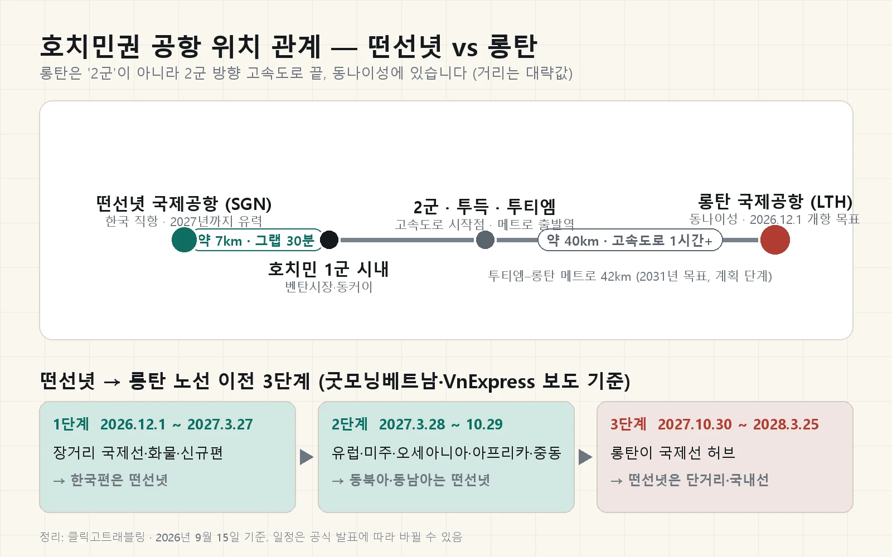

베트남 국제공항은 2026년 9월 기준으로 운영 중인 곳이 11곳이고, 여기에 호치민 동쪽 40km 동나이성에 짓는 롱탄 국제공항이 12월 1일 상업 운항을 시작하며 12번째로 더해집니다. 결론부터 말하면요, "호치민 2군에 새 공항이 생긴다"는 말은 절반만 맞아요. 공항 자체는 호치민 시내가 아니라 옆 동네 동나이성에 있고, 2군(지금의 투득) 방향 고속도로와 투티엠에서 출발하는 메트로 계획 때문에 그렇게 불릴 뿐입니다. 저도 호치민에 살면서 "2군 공항"이라는 말을 듣고 지도부터 찾아봤거든요. 그래서 공식 발표와 현지 매체를 대조해 어디에·언제·무엇이 옮겨가는지 한 번에 정리했습니다.

📌 이 글이 무엇을 근거로 쓰였는지
저는 <b>베트남 호치민에 살고 있어서 떤선녓 공항은 드나드는 입장</b>이지만, <b>롱탄 공항은 아직 개항 전이라 직접 이용한 적이 없습니다.</b> 그래서 롱탄 관련 내용은 베트남 정부 공식 발표·베트남항공 보도자료·현지 매체(VnExpress·굿모닝베트남·인사이드비나)를 교차 확인한 <b>조사 기반</b>이고, 떤선녓 시내 이동처럼 지금 확인 가능한 부분만 생활 감각을 반영했습니다. 개항 일정은 바뀔 수 있으니 출발 전 공식 안내를 한 번 더 확인하세요.

📌 3줄 요약 (2026년 9월 15일 기준)
· 롱탄 국제공항(코드 LTH)은 <b>호치민 시내 동쪽 약 40km, 동나이성</b>에 있고 <b>2026년 12월 1일 상업 운항</b> 시작이 공식 목표입니다(9~11월 시범 운영).

· 첫 단계로 옮겨가는 건 <b>장거리 국제선과 화물</b>이라, <b>한국 직항 같은 동북아 노선은 2027년까지 떤선녓에 남을 가능성이 큽니다.</b>

· 한국 직항이 꾸준한 베트남 국제공항은 <b>하노이·호치민·다낭·냐짱·푸꾸옥 5곳</b>이고, 나머지 6곳은 계절편·전세편 위주예요.

## 롱탄 신공항은 정말 호치민 2군에 생기나요?

롱탄 국제공항은 호치민 2군이 아니라 호치민 동쪽으로 약 40km 떨어진 동나이성 롱탄 지역에 짓고 있습니다. 위키백과와 VnExpress 기준으로 부지 면적은 1단계만 약 5,580헥타르로, 떤선녓 공항과는 비교가 안 되는 크기예요. 그런데도 "2군 공항"이라는 말이 도는 이유는 셋입니다.

첫째, 호치민에서 롱탄으로 가는 길이 2군(투득) 방향이에요. 호치민–롱탄–저우저이 고속도로가 투득에서 시작해 동나이로 빠져나갑니다. 둘째, 계획 중인 공항 메트로가 2군의 투티엠에서 출발해요. 베트남넷 2025년 12월 보도 기준으로 투티엠–롱탄 메트로는 길이 42km, 역 약 20개, 목표 소요 시간 40분, 공사 기간 2025~2031년으로 잡혀 있습니다. 셋째, 호치민이 2025년 행정 통합(빈즈엉·바리아붕따우 편입)으로 커지면서 동나이 경계까지 생활권이 이어져 보이는 것도 한몫해요.

정리하면 이렇습니다. **공항은 동나이성, 관문은 2군**(투득·투티엠)이에요. 호치민 시내 숙소에서 롱탄까지는 떤선녓(시내 7km)보다 훨씬 멀다는 걸 먼저 머리에 넣어두는 게 좋습니다.

## 롱탄 국제공항은 언제 여나요?

롱탄 국제공항의 상업 운항 시작일은 2026년 12월 1일이 공식 목표입니다. 굿모닝베트남미디어 2026년 7월 14일 보도와 VnExpress 7월 15일 보도가 같은 날짜를 확인했고, 베트남 총리도 3월 현장 점검에서 "2026년 4분기 상업 운항"을 못 박았어요. 그 전에 2025년 12월 19일 기술 개항 행사로 첫 항공기가 내렸고, 2026년 9·10·11월 세 차례 시범 운영을 거칩니다.

운영 준비에 한국 손이 닿아 있어요. 파이낸셜뉴스 2026년 4월 보도 기준으로 인천국제공항공사 컨소시엄이 롱탄 공항의 관리·운영·이전(ORAT) 업무 자문을 맡고 있습니다. 인천공항 쪽은 운영 준비 절차를 자문하는 역할이에요.

| 항목 | 롱탄 1단계 내용 (공식 발표·위키백과 기준) |
|---|---|
| 공항 코드 | LTH (ICAO VVLT) |
| 위치 | 동나이성 롱탄, 호치민 시내 동쪽 약 40km |
| 활주로 | 길이 4,000m·폭 60m, 1단계 2본(2번 활주로는 2026년 7월 완공 보도) |
| 터미널 | 연면적 약 40만 ㎡ 1동 |
| 연간 수용 | 여객 2,500만 명·화물 120만 톤 |
| 사업비 | 전체 336조 6,300억 동(약 128억 달러, VnExpress 기준) |
| 상업 운항 | 2026년 12월 1일 목표 (2025년 12월 19일 기술 개항) |
| 최종 계획 | 2단계 5,000만 명, 3단계 1억 명(2035년 이후) |

개항 일정은 이미 한 번 미뤄진 적이 있습니다. 위키백과 기준으로 원래 2025년 9월 개항 목표였다가 2026년 말로 조정됐어요. 그래서 12월 1일도 "공식 목표"로 읽고, 항공권을 잡을 때는 출발 공항 코드가 SGN(떤선녓)인지 LTH(롱탄)인지 꼭 확인하세요.

## 떤선녓에서 롱탄으로 어떤 노선이 옮겨가나요?

떤선녓에서 롱탄으로 옮겨가는 노선은 장거리 국제선과 화물이 먼저이고, 한국 같은 동북아 단거리 국제선은 마지막 단계까지 떤선녓에 남습니다. 흔한 오해가 하나 있는데, "롱탄이 열리면 호치민 국제선이 전부 옮겨간다"는 건 2028년 이후 얘기예요. 굿모닝베트남미디어가 정리한 3단계 이전 계획을 표로 묶어보면 이렇습니다.

| 단계 | 기간 | 롱탄으로 가는 것 | 떤선녓에 남는 것 |
|---|---|---|---|
| 1단계 | 2026년 12월 1일 ~ 2027년 3월 27일 | 이전 희망 항공사, 신규·증편·전세·화물편, 1,000km 넘는 장거리 국제선 | 기존 국제선 대부분(국제선 여객의 약 81%) |
| 2단계 | 2027년 3월 28일 ~ 10월 30일 | 유럽·미주·오세아니아·아프리카·중동·남아시아 노선 | 동북아 노선 중심, 동남아는 두 공항에 분배 |
| 3단계 | 2027년 10월 31일 ~ 2028년 3월 25일 | 롱탄이 국제선 허브 | 단거리 국제선·국내선 중심 |

한국 여행자에게 중요한 건 2단계 칸이에요. 인천–호치민은 동북아 노선이라 2027년 10월까지는 떤선녓 이용이 유력하고, 그 뒤에도 "단거리 국제선은 떤선녓"이라는 방향이 유지됩니다. 파이낸셜뉴스 보도 기준으로 2030년 이후 떤선녓은 국내선과 일부 전세편 국제선 위주로 바뀔 계획이라, 장기적으로는 한국 노선도 롱탄으로 갈 수 있어요. 다만 그 시점은 아직 공식 확정이 아닙니다.

⚠️ 환승 여행자가 놓치기 쉬운 것
이전 계획대로면 2027년 3월 말부터 <b>유럽·미주 등 장거리편은 롱탄, 한국·일본 등 동북아편은 떤선녓</b>으로 갈리고, 동남아편은 두 공항에 나뉩니다(굿모닝베트남 보도 기준 롱탄 약 55%·떤선녓 약 45%). 두 공항은 <b>약 40km</b> 떨어져 있어서, 예를 들어 유럽에서 호치민을 거쳐 한국으로 가는 일정이면 공항을 바꿔 타야 할 수 있어요. 항공권 예약 화면에서 도착 공항과 출발 공항 코드가 같은지 꼭 보세요.

## 롱탄 공항에서 호치민 시내까지 어떻게 가나요?

롱탄 공항에서 호치민 시내까지는 개항 초기엔 고속도로를 타는 버스와 차량이 사실상 유일한 수단이고, 소요 시간은 교통 상황을 빼고도 1시간이 넘습니다. 베트남넷 보도 기준으로 호치민–롱탄–저우저이 고속도로가 51번 국도 나들목에서 자주 막혀서, 8~10차로 확장 공사를 2026년 말 완공 목표로 진행 중이에요. 저도 떤선녓은 시내에서 그랩으로 30분 안팎이라 익숙한데, 롱탄은 완전히 다른 거리 감각이라 이 부분을 가장 꼼꼼히 찾아봤습니다.

버스는 호치민시가 13개 노선을 준비하고 있어요. VnExpress 2026년 4월 보도 기준으로 사이공 버스터미널, 떤선녓 공항, 동부 신터미널, 투티엠, 붕따우 등에서 출발하고 차량은 9인승부터 80인승까지 다양합니다. 2026년 3분기에 기존 4개 노선 조정과 급행 2개(사이공 버스터미널–롱탄, 떤선녓–롱탄)를 먼저 열고, 2027년에 5개, 2027년 4분기에 나머지를 채우는 일정이에요. 요금은 아직 공개되지 않았습니다. 급행 2개는 4월 보도상 3분기 목표라 9월 현재 실제 개통 여부는 출발 전 확인이 필요해요.

메트로는 기다려야 합니다. 투티엠–롱탄 메트로는 2031년 완공 목표이고, 총리 발표에도 수오이띠엔·비엔호아·롱탄을 잇는 도시철도가 언급됐지만 시점은 2030년 이후로 보는 게 안전해요. 호치민 지하철이 지금 어디까지 다니는지는 [베트남 지하철 총정리](/vietnam-metro-lines/)에서 정리해 뒀으니 참고하세요.

| 수단 | 개항 초기(2026년 12월~) | 이후 계획 |
|---|---|---|
| 그랩·택시 | 고속도로 이용, 1시간 이상 | 고속도로 확장 완공 시 단축 기대 |
| 공항버스 | 급행 2개 + 조정 4개 노선(2026년 3분기 목표) | 2027년 말 13개 노선 완성 목표 |
| 메트로 | 없음 | 투티엠–롱탄 42km, 2031년 목표 |
| 떤선녓 ↔ 롱탄 연결 | 약 40km 셔틀·버스 | 도시철도 연결 구상 |

## 떤선녓 국제공항은 지금 어떻게 바뀌었나요?

떤선녓 국제공항은 2025년 4월 19일 3터미널이 문을 열면서 연간 수용 인원이 3,000만 명에서 5,000만 명으로 늘었고, 3터미널은 국내선 전용입니다. 인사이드비나 보도 기준으로 터미널 면적 11만 2,500㎡, 피크 시간당 7,000명, 연간 2,000만 명 규모이고 사업비는 4억 2,440만 달러예요. 베트남항공 공식 보도자료에 따르면 베트남항공은 2025년 4월 19일부터 국내선을 3터미널로 옮기기 시작했고(푸꾸옥·락자·까마우 노선은 기존 터미널 잔류), 인사이드비나 보도 기준으로 비엣젯도 3터미널을 씁니다.

한국에서 가는 국제선은 3터미널이 아니라 기존 국제선 터미널을 그대로 써요. 헷갈리기 쉬운 게, 호치민에서 하노이·다낭으로 국내선을 갈아탈 때는 대개 3터미널로 이동해야 하고, 푸꾸옥처럼 항공사에 따라 기존 터미널을 쓰는 노선도 있으니 탑승권의 터미널 표기를 확인하세요. 터미널 사이가 걸어서 갈 거리는 아니니 환승 시간을 넉넉히 잡는 게 안전합니다.

시내 접근성은 여전히 떤선녓의 최대 장점이에요. 트립스토어 정리 기준으로 1군 시내까지 약 7km라 그랩으로 30분 안팎, 요금은 1만 원이 안 되는 수준입니다. 롱탄 개항 뒤에도 한국 직항이 당분간 여기서 뜨는 건 여행자 입장에선 오히려 다행이에요. 1군 도보 코스는 [호치민 지도 완벽정리](/ho-chi-minh-map-travel-course/)에 담아 뒀습니다.

## 베트남 국제공항 11곳, 어디에 있고 시내까지 얼마나 걸리나요?

베트남에서 국제선을 받는 공항은 위키백과 공항 목록 기준으로 11곳이고, 한국 직항이 꾸준히 있는 곳은 그중 5곳입니다. 트립스토어와 여러 정리 글을 나란히 놓고 제가 표로 묶어봤어요. 시내 거리는 정리 글마다 1~2km씩 다르니 "대략"으로 보시면 됩니다.

| 공항 | 코드 | 도시·지역 | 시내까지 | 한국 직항 |
|---|---|---|---|---|
| 노이바이 | HAN | 하노이 | 약 30km | 꾸준함 |
| 떤선녓 | SGN | 호치민 | 약 7km | 꾸준함 |
| 다낭 | DAD | 다낭·호이안·후에 | 약 3km | 꾸준함 |
| 깜라인 | CXR | 냐짱(나트랑) | 약 35km | 꾸준함 |
| 푸꾸옥 | PQC | 푸꾸옥섬 | 리조트별 상이 | 꾸준함 |
| 깟비 | HPH | 하이퐁 | 시내 인접 | 시기별 |
| 반돈 | VDO | 꽝닌(하롱베이) | 하롱 시내 약 50km | 시기별·전세 |
| 푸바이 | HUI | 후에 | 약 15km | 드묾 |
| 리엔크엉 | DLI | 달랏 | 약 30km | 시기별 |
| 빈 | VII | 응에안 | 시내 인접 | 드묾 |
| 껀터 | VCA | 껀터(메콩) | 시내 인접 | 드묾 |
| 롱탄(신설) | LTH | 동나이(호치민권) | 호치민 시내 약 40km | 2026년 12월 개항, 장거리 국제선부터 |

"한국 직항" 칸은 2026년 9월 기준 일반적인 편성 경향이고, 계절편·전세편은 항공사 스케줄에 따라 바뀝니다. 특히 달랏·하이퐁·반돈은 특정 시즌에만 뜨는 경우가 많아서 예약 전에 항공사 사이트에서 직접 확인하는 게 안전해요.

## 한국에서 갈 땐 어느 공항으로 들어가야 하나요?

목적지 도시에 따라 들어갈 공항은 거의 정해져 있고, 헷갈리는 건 "냐짱은 깜라인", "호이안·후에는 다낭", "하롱베이는 노이바이" 세 가지뿐입니다. 저도 처음엔 냐짱 공항이 따로 있는 줄 알았거든요. 목적지별로 정리하면 이렇습니다.

| 가고 싶은 곳 | 들어갈 공항 | 참고 |
|---|---|---|
| 하노이·사파·닌빈 | 노이바이(HAN) | 시내 30km, 86번 버스 저렴 |
| 하롱베이 | 노이바이(HAN) 또는 반돈(VDO) | 반돈은 하롱과 가깝지만 편수 적음 |
| 다낭·호이안·후에 | 다낭(DAD) | 시내 3km, 호이안까지 차로 40~50분 |
| 냐짱(나트랑) | 깜라인(CXR) | 시내 35km, 픽업 예약이 편함 |
| 호치민·무이네·붕따우 | 떤선녓(SGN) | 2027년까지 한국 직항 유력, 이후 롱탄 가능성 |
| 푸꾸옥 | 푸꾸옥(PQC) | 리조트 셔틀 확인 |
| 달랏 | 리엔크엉(DLI) | 직항은 시즌 한정, 보통 호치민 경유 |

다낭으로 들어가는 분은 공항이 시내와 붙어 있어 도착 첫날 일정을 넉넉히 잡을 수 있어요. 일정 조립 원칙은 [다낭 여행 코스 짜는 법](/danang-travel-course/)에서 이어서 보시면 됩니다.

## 롱탄이 열리면 호치민 여행은 뭐가 달라지나요?

한국에서 호치민으로 가는 여행자에게 2026년 12월 롱탄 개항이 당장 바꾸는 건 거의 없고, 진짜 변화는 2027년 3월 이후 장거리 노선이 옮겨가면서 시작됩니다. 정리하면 세 가지만 챙기면 돼요.

첫째, 항공권의 공항 코드입니다. 호치민 도착이 SGN인지 LTH인지 예약 화면에서 확인하세요. 2027년까지는 대부분 SGN일 겁니다. 둘째, 숙소 위치예요. 롱탄으로 들어온다면 1군보다 2군(투티엠·타오디엔) 쪽 숙소가 공항 동선상 유리해지고, 떤선녓이면 지금처럼 1군·3군이 편합니다. 셋째, 환승 일정입니다. 유럽·미주편과 한국편을 호치민에서 연결한다면 공항이 갈릴 수 있으니 최소 4~5시간, 가능하면 하루 여유를 두세요.

베트남 정부는 롱탄을 최종 1억 명 규모로 키워 싱가포르 창이공항과 경쟁하겠다는 목표를 밝혔습니다(VnExpress 2026년 7월 보도). 그 그림이 현실이 되는 건 2035년 이후 얘기라, 지금 당장은 "장거리 국제선의 새 관문" 정도로 이해하는 게 정확해요. 베트남 입국 준비물 전체는 [베트남 여행 준비물 체크리스트](/vietnam-travel-checklist/)에 정리해 뒀고, 떤선녓 3터미널 운영 안내는 [베트남항공 공식 보도자료](https://www.vietnamairlines.com/kr/ko/vietnam-airlines/press-room/press-release/2025/0417-VI-VNA-chinh-thuc-chuyen-sang-khai-thac-tai-nha-ga-T3-Tan-Son-Nhat)에서 확인할 수 있습니다.

## 자주 묻는 질문 (FAQ)

**Q. 호치민 2군에 새로 생기는 공항이 뭔가요?** 롱탄 국제공항(LTH)입니다. 다만 공항은 호치민 2군이 아니라 호치민 동쪽 약 40km 동나이성에 있고, 2군(투득) 방향 고속도로와 투티엠 출발 메트로 계획 때문에 "2군 공항"으로 불려요.

**Q. 롱탄 국제공항 개항일은 언제인가요?** 2026년 12월 1일 상업 운항 시작이 공식 목표이고, 9~11월에 시범 운영을 거치며 운영 준비 자문은 인천공항 컨소시엄이 맡고 있습니다. 2025년 12월 19일에 기술 개항 행사가 먼저 있었어요. 일정은 이미 한 차례 미뤄진 적이 있어 변동 가능성은 있습니다.

**Q. 인천에서 호치민 가는 비행기도 롱탄으로 바뀌나요?** 2027년까지는 떤선녓 이용이 유력합니다. 이전 계획상 2027년 3월까지는 장거리 국제선과 화물만 옮기고, 2027년 10월까지도 동북아 노선은 떤선녓 중심이에요(동남아 노선은 두 공항에 나뉨). 한국 노선의 롱탄 이전 시점은 아직 공식 확정이 아닙니다.

**Q. 롱탄 공항에서 호치민 시내까지 얼마나 걸리나요?** 고속도로로 1시간 이상 잡아야 하고, 정체가 있으면 더 걸립니다. 공항버스 13개 노선이 2026년 3분기부터 단계적으로 열릴 계획이고(급행 2개는 3분기 목표라 개통 여부 확인 필요), 투티엠–롱탄 메트로는 2031년 완공 목표라 개항 초기엔 없어요.

**Q. 베트남 국제공항은 총 몇 개인가요?** 2026년 9월 기준 운영 중인 국제공항은 11곳(노이바이·떤선녓·다낭·깜라인·푸꾸옥·깟비·반돈·푸바이·리엔크엉·빈·껀터)이고, 12월에 롱탄이 더해집니다. 한국 직항이 꾸준한 곳은 하노이·호치민·다낭·냐짱·푸꾸옥 5곳이에요.

**Q. 떤선녓 3터미널은 국제선도 쓰나요?** 아니요, 3터미널은 베트남항공·비엣젯 국내선 전용입니다. 한국발 국제선은 기존 국제선 터미널을 쓰고, 호치민에서 국내선으로 갈아탈 때만 3터미널로 이동하면 돼요. 다만 베트남항공 푸꾸옥·락자·까마우편처럼 기존 터미널을 쓰는 국내선도 있어 탑승권 터미널 표기 확인이 필요해요.

## 마무리

이거 하나만 기억하면 돼요. 롱탄 신공항은 "호치민 2군"이 아니라 동나이성 40km 밖에 생기고, 2026년 12월 1일 문을 열어도 한국 직항은 2027년까지 떤선녓에서 그대로 뜰 가능성이 큽니다. 그러니 당장 호치민 여행 계획을 바꿀 필요는 없고, 항공권의 공항 코드(SGN·LTH)만 습관처럼 확인하면 됩니다. 나머지 국제공항 10곳은 목적지 도시로 거의 정해지니, 냐짱은 깜라인·호이안은 다낭이라는 세 가지 예외만 챙기세요. 다음 글로는 [베트남 여행 준비물 체크리스트](/vietnam-travel-checklist/)를 이어서 보시면 준비가 끝납니다. ✈️

---

**관련 키워드** — #베트남국제공항 #롱탄국제공항 #롱탄공항개항 #롱탄공항위치 #호치민롱탄공항 #떤선녓국제공항 #떤선녓3터미널 #베트남공항이름 #노이바이국제공항 #깜라인국제공항 #베트남국제공항위치 #호치민공항이전
