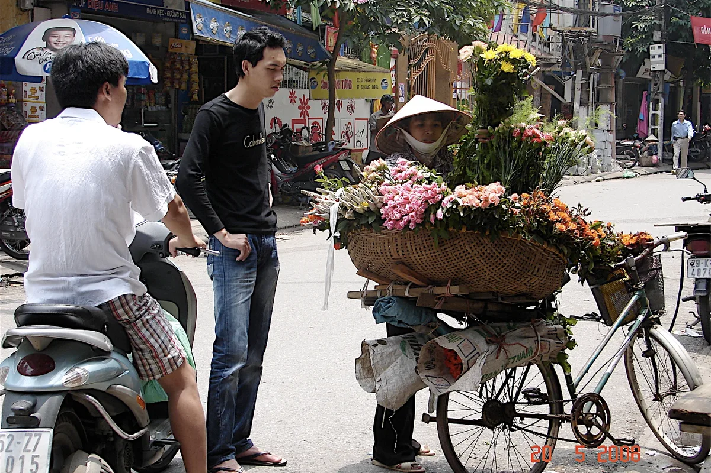

베트남 여행을 준비하며 자료를 찾다 보면 **베트남 직업** 풍경부터 눈에 들어옵니다. 헬멧 두 개를 들고 손님을 기다리는 오토바이 기사, 멜대를 지고 과일을 파는 상인, 관광객을 태우는 인력거까지 — 한국과 닮은 듯 완전히 다르더라고요. 결론부터 말하면요, **베트남의 거리는 그 자체가 거대한 일터**고, 그 풍경을 알고 가면 여행이 두 배로 재미있어집니다. 그래서 제가 특이한 거리의 직업부터 2026년 평균 월급, 요즘 뜨는 직종까지 직접 자료를 찾아 한 편으로 묶어봤습니다.

📌 3줄 요약
베트남 거리의 명물 직업은 <b>쎄옴(오토바이 택시)·시클로(인력거)·노점상</b>이고, 요즘은 그랩 기사가 쎄옴의 자리를 빠르게 대체하고 있습니다.

베트남 근로자 <b>평균 월급은 900만 동(2026년 1분기, 약 360달러 안팎)</b>이고 매년 오르는 추세입니다.

채용 시장에선 <b>영업직·IT·AI·반도체</b>가 뜨고 있으며, <b>한국어 구사자는 대졸 평균의 2배</b>를 받는 것으로 보도될 만큼 한국어가 강력한 스펙입니다.

## 거리에서 만나는 베트남의 특이한 직업들

베트남 여행에서 가장 먼저 마주치는 직업은 단연 **쎄옴**(xe ôm, 오토바이 택시) 기사입니다. 길가에 헬멧을 두 개 이상 들고 대기하는 오토바이가 보이면 그게 쎄옴이에요. 요금은 흥정제라 베트남어를 못 하면 이용이 쉽지 않은데, 그래서 요즘 여행자들은 대부분 앱으로 부르는 **그랩** 오토바이를 씁니다. 미리 정해진 요금만 내면 되니 바가지 걱정이 없거든요. 쎄옴 아저씨들의 자리를 앱이 대체해 가는, 직업의 세대교체가 거리에서 실시간으로 일어나는 중입니다.

*▲ 하노이의 꽃 노점상 — 사진 ⓒ Célestine M.C. Leroy, CC BY-SA 2.0 (Wikimedia Commons)*

💡 쎄옴 vs 그랩, 여행자의 선택 요령
베트남어가 되고 짧은 거리를 빨리 가야 한다면 쎄옴, 그 외엔 <b>요금이 미리 확정되는 그랩</b>이 정답입니다. 공항·야간 이동처럼 바가지 걱정이 큰 상황일수록 앱 호출이 마음 편해요.

**시클로**(인력거) 기사도 빼놓을 수 없습니다. 예전엔 서민의 발이었지만 지금은 주로 관광객 시내 투어용으로 남아 있어요. 그리고 베트남 거리의 진짜 주인공은 **노점상**입니다. 멜대에 과일을 이고 다니는 행상, 새벽 꽃시장에서 떼 온 꽃을 자전거에 싣고 파는 꽃장수, 쌀국수·반미를 파는 길거리 음식상까지. 길거리 음식이 한 끼 500~1,500원 수준으로 저렴한 것도 이 촘촘한 노점 경제 덕분입니다. 복권을 들고 카페를 도는 판매원처럼 한국에선 보기 힘든 직업도 거리에서 흔히 마주치게 됩니다.

## 숫자로 보는 베트남 직장인 — 평균 월급은 얼마일까

여기서 많이들 궁금해하는 게 "베트남 사람들은 얼마나 벌까"입니다. 베트남 내무부 발표 기준으로 **2026년 1분기 근로자 평균 월 소득은 900만 동**입니다. 달러로 약 360달러 안팎, 원화로는 약 50만 원 언저리예요(환율에 따라 달라집니다). 저도 환율로 직접 환산해 보고서야 길거리 쌀국수 한 그릇 가격이 왜 그렇게 느껴지는지 체감이 확 오더라고요. 급여를 받는 정규직만 보면 1,000만 동에 도달했고, 같은 발표 기준 전년 대비 6.6%나 오르는 가파른 상승세입니다.

노동 인구 구성도 표로 묶어보면 이렇습니다.

| 항목 | 수치 (보도 기준) |
|---|---|
| 노동 인구 | 약 5,300만 명 |
| 평균 월 소득 | 900만 동 (2026년 1분기) |
| 산업 구성 | 서비스업 41% · 산업/건설 33.7% · 농림어업 25.3% |
| 학위·자격증 소지 근로자 | 29.2% |

절대 금액만 보면 한국보다 낮지만, 물가와 상승 속도를 같이 봐야 그림이 맞습니다. 매년 월급이 6% 이상씩 오르는 나라의 활기가 거리의 그 부지런한 직업들에 그대로 배어 있어요.

## 요즘 뜨는 베트남 직업은 무엇일까

현지 채용 시장 보도를 여러 개 훑어보니 방향이 분명했습니다. 채용 규모 1위는 **영업직**이고, 베트남이 첨단 제조 허브로 크면서 **IT·인공지능·반도체** 일자리가 빠르게 늘고 있어요. 도시별 색깔도 뚜렷합니다. 호치민은 서비스·금융·기술의 중심이고, 하노이와 북부는 물류·IT에 박닌 같은 전자산업 클러스터가 붙어 성장 중이에요. 여행자가 두 도시에서 받는 인상이 다른 것도 이 산업 지형 차이와 무관하지 않습니다. 구직자의 70% 이상이 이직 의향이 있다는 현지 조사(2026년 보도 종합)가 있을 만큼 시장이 역동적이라는 점도 재미있는 부분이에요.

조금 더 거슬러 올라가면, 국내 언론(2017년 보도 기준)이 꼽았던 베트남 유망 직종 5가지는 IT 보안 전문가·의료 인력·법률 전문가·관광 접객업·심리상담사였습니다. 지금 보면 IT와 의료는 그대로 적중했고, 심리상담사처럼 당시엔 낯설던 직업이 실제로 자리를 잡아가고 있죠.

## 한국어가 무기가 되는 나라

한국 독자에게 가장 흥미로운 대목입니다. 베트남 국영 매체 보도에 따르면 **한국어학과 졸업생(1~5년차)의 평균 월급은 1,400만 동으로, 대졸 평균(749만 동)의 2배 수준**입니다. 졸업생 10명 중 7명이 통·번역 업무에 종사할 만큼 한국어 수요가 공급을 앞서고 있어요. 한국 기업의 진출이 만들어 낸 베트남 직업 지형인 셈이라, 여행 중에 한국어 잘하는 현지 직원을 만나는 게 우연이 아닌 겁니다.

고소득 쪽을 보면, 현지 교민 커뮤니티에선 금융·투자 분야 관리직이 월 7,000만 동 이상을 받는다는 이야기도 나옵니다(공식 통계가 아닌 전언이라 참고만 하세요). IT는 인력 부족이 심해 몸값이 계속 오르는 분야로 꼽히고요.

## 여행자에게 이 직업 이야기가 왜 유용할까

직업 지형을 알면 여행 선택이 쉬워집니다. 이동은 흥정이 필요한 쎄옴보다 **정찰제 그랩**이 마음 편하고, 노점에서는 소액 현금을 준비하면 거래가 부드럽습니다. 길거리 음식 노점은 현지인이 줄 서는 곳이 위생·맛 모두 검증된 곳일 확률이 높고요. 처음 가는 분들은 [처음 가는 해외여행 준비물 체크리스트](/overseas-travel-checklist-first-time/)부터 챙기고, 베트남의 사람과 문화가 더 궁금하다면 [베트남 남자 연예인 총정리](/vietnam-male-celebrities/)도 함께 보면 현지가 훨씬 입체적으로 보입니다. 평균 월급 같은 최신 수치는 [굿모닝베트남 보도](https://www.goodmorningvietnam.co.kr/news/article.html?no=81395)처럼 현지 발표를 다루는 기사로 확인하는 게 정확해요.

## 한눈에 정리

| 구분 | 내용 |
|---|---|
| 거리의 명물 직업 | 쎄옴 · 시클로 · 노점상 · 복권 판매원 |
| 세대교체 | 쎄옴 → 그랩(앱 호출) 기사 |
| 평균 월급 | 900만 동 (2026년 1분기, 약 360달러 안팎) |
| 뜨는 직종 | 영업 · IT · AI · 반도체 |
| 한국어 프리미엄 | 한국어과 졸업생 월급 = 대졸 평균의 2배 보도 |

## 자주 묻는 질문 (FAQ)

**Q. 베트남 평균 월급은 얼마인가요?** 베트남 내무부 발표 기준 2026년 1분기 근로자 평균 월 소득은 900만 동(약 360달러 안팎)이고, 정규직 평균은 1,000만 동 수준입니다. 환율과 발표 시점에 따라 환산액은 달라집니다.

**Q. 여행자가 쎄옴을 타도 되나요?** 가능하지만 요금이 흥정제라 베트남어가 서툴면 부담스럽습니다. 같은 오토바이라도 요금이 미리 확정되는 그랩 호출이 여행자에겐 훨씬 안전한 선택입니다.

**Q. 베트남에서 제일 잘 버는 직업은 뭔가요?** 보도·커뮤니티 종합으로는 금융·IT 관리직급이 상위로 꼽힙니다. 다만 공식 통계로 확정된 순위는 아니므로 참고 수준으로 보는 게 맞습니다.

**Q. 한국인이 베트남에서 일할 수 있나요?** 한국 기업 진출이 활발해 제조·IT·교육 분야 중심으로 기회가 있습니다. 외국인은 노동 허가가 필요하니 채용 조건과 비자 요건을 먼저 확인해야 합니다.

## 이미지 출처

- 대표 이미지 — 호치민 응우옌후에 교차로의 오토바이 행렬, 사진 ⓒ Chelsea Marie Hicks, CC BY 2.0 (Wikimedia Commons)
- 본문 이미지 — 하노이 꽃 노점상, 사진 ⓒ Célestine M.C. Leroy, CC BY-SA 2.0 (Wikimedia Commons)

---

마지막으로 이거 하나만 기억하면 돼요. **베트남의 거리는 거대한 일터고, 평균 월급 900만 동의 나라에서 베트남 직업 지도가 매년 6%씩 성장하며 다시 그려지는 중이다.** 이 배경을 알고 거리를 걸으면 쎄옴 기사도, 꽃 노점상도, 그랩 헬멧을 쓴 청년도 전부 다르게 보일 겁니다.

**관련 키워드** — #베트남직업 #베트남특이한직업 #베트남평균월급 #쎄옴 #시클로 #베트남노점 #그랩 #베트남취업 #베트남한국어 #베트남경제 #베트남여행정보
