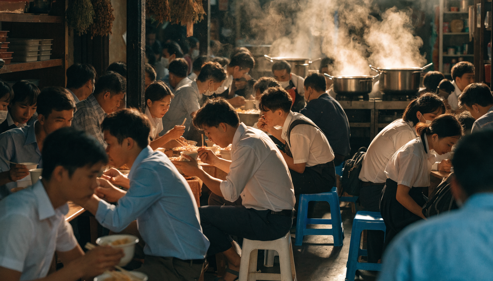

**베트남 맛집 찾는 법**을 검색하면 특정 식당 리스트만 쏟아지는데, 그 리스트의 함정은 가게가 문을 닫거나 맛이 변해도 글은 남는다는 거죠. 저도 자료를 모으다 보니 몇 년 지난 추천 글이 여전히 상위에 떠 있는 걸 여러 번 봤어요. 결론부터 말하면요, 필요한 건 식당 이름이 아니라 **거르는 방법**입니다. **① 구글맵으로 후보 수집 → ② 현지 어플로 교차 검증 → ③ 현장 신호로 최종 확인.** 이 3단계 필터는 다낭이든 호치민이든 하노이든 똑같이 통하고, 유행이 지나도 낡지 않아요. 단계별로 뜯어보겠습니다.

📌 3줄 요약
구글맵 평점은 출발점일 뿐입니다. <b>리뷰 수가 적거나, 값이 싸거나, 한국인 리뷰만 가득한 집</b>은 평점이 실제보다 후하게 보일 수 있어요.

현지인 검증은 <b>Foody(베트남 로컬 리뷰 앱)와 그랩푸드</b>로 합니다. 현지인 리뷰가 두터운 집이 진짜배기예요.

마지막은 현장 신호입니다. <b>점심시간에 교복·회사 유니폼 손님으로 붐비는 집</b>은 가격도 맛도 실패 확률이 낮다는 게 현지인들의 공통 조언이에요.

## 베트남 맛집, 왜 검색해도 못 찾나요?

**베트남의 진짜 로컬 가게 중엔 구글 지도에 아예 없는 집이 많기 때문입니다.** 노점과 골목 가게 중심의 외식 문화라 등록 자체가 안 된 곳이 흔하고, 반대로 검색에 잘 걸리는 집은 관광객 대상 마케팅이 잘 된 곳일 확률이 높아요. 그래서 "구글에서 본 유명한 집"과 "현지인이 줄 서는 집"이 자주 갈립니다.

한국어 블로그·SNS 추천도 절반만 믿는 게 안전합니다. 협찬 글을 가려내기 어렵고, 무엇보다 정보가 낡아요. 몇 년 전 추천 글의 가게가 지금은 주인이 바뀌었거나 없어졌을 수 있습니다. 그래서 이 글은 특정 가게 대신, 어떤 도시에서든 그 자리에서 바로 쓸 수 있는 필터링 방법을 정리합니다.

## 구글맵 평점, 그대로 믿으면 안 되는 이유 4가지

**평점 숫자보다 그 숫자가 만들어진 배경을 봐야 합니다.** 제가 자료를 비교하며 정리해보니 함정은 크게 네 가지더라고요.

| 함정 | 왜 문제인가 |
| --- | --- |
| 리뷰 수가 적다 | 몇십 개 수준이면 모수가 작아 평점 신뢰도가 낮음 |
| 값이 싸다 | 가격이 저렴하면 평가가 후해져 평점이 부풀 수 있음 |
| 한국인 리뷰가 대부분 | 현지인 검증 없이 관광 코스로 굳어진 집일 가능성 |
| 사진이 전부 전문가급 | 마케팅에 공들인 집이라는 신호일 수 있음(일반인 폰카 사진이 많은 집이 오히려 실사용 증거) |

그럼 구글맵은 버려야 하냐면, 전혀 아닙니다. 후보 수집 도구로는 여전히 최고예요. 요령은 이렇습니다. 필터에서 평점 4.0 이상+원하는 가격대를 걸어 후보를 추리고, **낮은 평점 리뷰부터** 읽어 반복되는 불만(위생·바가지·불친절)이 있는지 확인하고, 붐비는 시간대 그래프로 현지 점심·저녁에 실제로 사람이 몰리는지를 봅니다. 음식 이름을 베트남어(phở, bún chả)로 검색하면 관광객용이 아닌 로컬 가게가 더 많이 걸리는 것도 알아두면 좋아요.

## 현지인이 쓰는 어플로 교차 검증하세요

**베트남 로컬 리뷰의 본진은 Foody입니다.** 호치민·하노이·다낭을 포함한 주요 도시의 식당·카페·디저트 가게를 현지인 리뷰·평점·사진으로 확인할 수 있는 앱이고, 영어 지원도 되는 것으로 소개돼요. 구글맵에서 추린 후보를 Foody에서 검색해 현지인 리뷰가 두터운지 보는 것만으로 관광객용 가게가 상당수 걸러집니다. 예약·배달 기능까지 있어 현지인 사용 빈도가 높다는 점이 핵심이에요.

그랩(Grab)도 검증 도구가 됩니다. [그랩푸드 공식 페이지](https://www.grab.com/vn/en/food/)에서 보듯 베트남 전역에서 배달이 일상화돼 있어서, 그랩푸드에서 주문이 활발한 가게는 현지 수요가 실제로 있다는 뜻이거든요. 제가 어플들을 비교해 한 줄씩 정리하면 이렇습니다.

| 앱 | 역할 | 특징 |
| --- | --- | --- |
| 구글맵 | 후보 수집·동선 | 필터·붐비는 시간, 단 로컬 미등록 가게 존재 |
| Foody | 현지인 검증 | 베트남 로컬 리뷰·예약·배달, 영어 지원으로 알려짐 |
| 그랩(GrabFood) | 배달·수요 확인 | 주문 활발한 가게=현지 수요 증거 |

여기에 베트남 여행 어플을 다루는 글들이 공통으로 꼽는 팁 하나 — 이런 앱은 **한국에서 미리 설치·가입**해 두는 게 편합니다. 현지에서 유심 바꾸고 인증하려면 번거로워요.

💡 도구별 역할 분담
<b>구글맵=후보 수집과 동선 확인, Foody=현지인 검증, 그랩푸드=배달·수요 확인.</b> 하나로 다 하려 하지 말고 역할을 나누면 실패가 확 줄어요.

## 현장에서 확인하는 신호 — 교복과 유니폼을 보세요

**가게 앞까지 갔다면 마지막 필터는 손님 구성입니다.** 현지인들이 공통으로 말하는 신호가 있어요. 점심·저녁 시간에 **교복 입은 학생이나 회사 유니폼 차림 손님이 많은 집**은 가격이 합리적이고 맛도 검증됐을 확률이 높다는 겁니다. 매일 그 동네에서 먹는 사람들의 선택이니까요.

다른 신호들도 있습니다. 관광객보다 현지인 비율이 높은 집, 한자리에서 10년 넘게 장사한 오래된 가게(단골이 유지된다는 뜻), 시장 안이나 골목의 작은 가게들. 반대로 호객이 심하거나 메뉴판에 사진+영어만 잔뜩인 집은 관광객 전용일 가능성을 염두에 두세요. 여기서 많이들 헷갈리는데, 허름해 보이는 것과 맛없는 건 전혀 다른 얘기입니다. 베트남 외식 문화에선 낮은 플라스틱 의자의 골목 노포가 그 동네 터줏대감이라는 말이 있을 정도예요.

## 물어보는 게 가장 빠를 때도 있습니다

**숙소 직원, 그랩 기사, 시장 상인에게 물어보면 인터넷에 없는 답이 나옵니다.** "관광객 말고 본인이 가는 집"을 물어보는 게 포인트예요. 현지인들이 실제로 아끼는 가게는 리뷰 앱에도 안 올라온 경우가 많아서, 대화 한 번이 검색 한 시간을 이길 때가 있습니다.

이때 베트남어 한두 마디가 있으면 대화가 훨씬 부드럽습니다. 기본 인사와 숫자, 흥정 표현은 [여행 베트남어 표현 글](/travel-vietnamese-phrases/)에 발음까지 정리해뒀어요. 그리고 추천받은 가게 메뉴판 앞에서 당황하지 않으려면 [베트남 음식 이름 정리 글](/vietnam-food-names/)의 조합 공식(보=소, 가=닭, 느엉=구이)을 챙겨 가시고요.

## 도시별로 다른 건 없나요?

**방법은 같고, 검증 강도만 조절하면 됩니다.** 저도 도시별 자료를 훑다가 같은 방법이 왜 다낭에선 덜 통하는지 의아했는데, 이유는 리뷰 구성이더라고요. 다낭처럼 한국인 관광객 비중이 큰 도시일수록 "한국인 리뷰 쏠림" 함정이 강하게 작동해요. 그래서 다낭에선 Foody 교차 검증과 현장 신호의 비중을 높이는 게 좋습니다. 반대로 하노이·호치민의 로컬 구역은 구글맵 등록 자체가 덜 된 곳이 많아, 현장 신호와 물어보기가 더 큰 역할을 합니다.

뭘 시킬지가 고민이라면 음식 쪽 글들과 이어 보세요. 쌀국수 계열은 [베트남 쌀국수 종류와 주문법](/vietnam-rice-noodle-types/), 전체 음식 지도는 [베트남 음식 총정리](/vietnam-street-food-noodles/)에 있습니다. 맛집을 찾는 눈과 메뉴를 고르는 눈이 합쳐지면 베트남 식도락은 사실상 끝난 겁니다.

## 한눈에 정리 — 베트남 맛집 3단계 필터

**이 표 하나면 어느 도시에서든 바로 적용할 수 있습니다.**

| 단계 | 도구 | 확인할 것 |
| --- | --- | --- |
| ① 후보 수집 | 구글맵 | 평점 4.0+ 필터, 낮은 평점 리뷰 먼저, 폰카 사진 비율, 붐비는 시간, 베트남어로 검색 |
| ② 교차 검증 | Foody·그랩푸드 | 현지인 리뷰 두터운지, 배달 주문 활발한지 |
| ③ 현장 확인 | 눈과 대화 | 교복·유니폼 손님, 현지인 비율, 오래된 가게, 호객 여부 |

이거 하나만 기억하면 돼요. **평점은 출발점이고, 현지인의 발길이 결승점입니다.** 리스트를 외우는 여행자보다 거르는 법을 아는 여행자가 언제나 더 잘 먹습니다.

## 자주 묻는 질문 (FAQ)

**Q. 베트남에서 구글맵 평점은 믿을 만한가요?** 후보를 모으는 용도로는 유용하지만 그대로 믿기는 어렵습니다. 리뷰 수가 적으면 모수 부족으로 평점이 흔들리고, 값이 싼 집은 평가가 후해지는 경향이 있으며, 한국인 리뷰만 많은 집은 현지인 검증이 빠진 관광 코스일 수 있어요. 낮은 평점 리뷰를 먼저 읽고 현지 앱으로 교차 검증하는 걸 권합니다.

**Q. Foody는 어떤 앱인가요?** 베트남 현지인들이 쓰는 맛집 리뷰·배달·예약 앱입니다. 호치민·하노이·다낭 등 주요 도시의 식당·카페를 현지인 리뷰와 사진으로 확인할 수 있고, 영어 지원도 되는 것으로 알려져 있습니다. 구글맵에서 찾은 후보를 Foody에서 재확인하는 식으로 쓰면 관광객용 가게를 거르는 데 효과적입니다.

**Q. 현지인 맛집은 현장에서 어떻게 알아보나요?** 점심·저녁 시간대 손님 구성을 보세요. 교복 입은 학생이나 회사 유니폼 손님이 많고, 관광객보다 현지인이 많으며, 오래 장사한 흔적이 있는 집이면 실패 확률이 낮습니다. 호객이 심하고 영어 사진 메뉴판만 있는 집은 관광객 전용일 가능성을 염두에 두시고요.

**Q. 다낭 같은 관광 도시에서도 이 방법이 통하나요?** 통합니다. 다만 한국인 관광객이 많은 도시일수록 한국인 리뷰 쏠림 함정이 강해지니, Foody 교차 검증과 현장 신호 확인의 비중을 높이는 게 좋아요. 방법은 같고 검증 강도만 조절하면 됩니다.

**Q. 한국 블로그 추천과 구글맵 중 뭘 믿어야 하나요?** 둘 다 참고만 하고 최종 판단은 교차 검증으로 하세요. 블로그는 정보가 낡았을 수 있고 협찬 여부를 가리기 어렵습니다. 블로그에서 이름을 얻고, 구글맵 낮은 평점 리뷰와 Foody 현지인 리뷰로 현재 상태를 확인하는 순서가 안전합니다.

---

**관련 키워드** — #베트남맛집찾는법 #베트남맛집어플 #Foody #베트남구글맵 #구글맵평점 #다낭맛집찾기 #호치민맛집찾기 #하노이맛집 #그랩푸드 #베트남로컬맛집 #베트남여행앱 #현지인맛집
