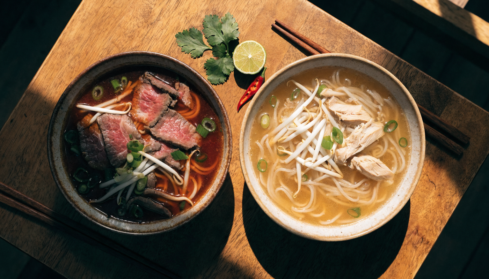

**베트남 쌀국수 종류**를 검색하면 이름만 줄줄이 나열되는데, 정작 현지 쌀국수 집 메뉴판 앞에서 필요한 건 목록이 아니라 "그래서 뭘 시켜야 하지?"의 답이죠. 저도 자료를 정리하면서 종류 나열 글은 많은데 **주문 기준으로 풀어주는 글**이 없어서 한참 헤맸어요. 결론부터 말하면요, 쌀국수 주문은 세 단계면 끝납니다. **① 국물이냐 비빔이냐 → ② 소고기(퍼보)냐 닭고기(퍼가)냐 → ③ 고기를 어떻게 익힐 거냐(따이·찐).** 이 순서대로 종류별 차이와 메뉴판에서 고르는 법, 지역별 별미까지 묶었습니다.

📌 3줄 요약
처음이라면 <b>퍼보(소고기·진한 국물)</b> 아니면 <b>퍼가(닭고기·맑은 국물)</b>입니다. 메뉴판에서 bò(보)=소, gà(가)=닭만 찾으면 돼요.

소고기를 시켰다면 고명 옵션이 있습니다. <b>따이(tái)=살짝 데친 생고기, 찐(chín)=푹 익힌 편육</b>. 익힌 고기가 편하면 찐을 고르세요.

국물이 싫으면 <b>분짜·분팃느엉(비빔·찍먹)</b>, 얼큰한 게 당기면 <b>분보후에</b>, 호이안·다낭에선 <b>까오러우·미꽝</b>이 그 동네 답입니다.

## 베트남 쌀국수, 퍼가 전부가 아닙니다

**쌀국수는 크게 국물형·비빔형·지역 별미형 세 갈래입니다.** 우리가 "베트남 쌀국수"로 아는 건 대부분 퍼(Phở)인데, 현지에선 퍼 못지않게 분(Bún) 계열 국수를 많이 먹어요. 세계 100대 국수 요리에 베트남 국수만 9종이 올랐을 만큼(테이스트아틀라스 선정 보도 기준) 지형이 넓습니다.

갈래부터 잡고 가면 이렇습니다.

| 갈래 | 대표 국수 | 특징 |
| --- | --- | --- |
| 국물형 | 퍼보·퍼가·분보후에·후띠에우 | 육수가 주인공, 우리가 아는 쌀국수 |
| 비빔·찍먹형 | 분짜·분팃느엉·미꽝 | 국물 없이 소스에 찍거나 비벼 먹음 |
| 지역 별미형 | 까오러우(호이안)·분짜까(다낭) | 그 동네 가야 제맛인 한정판 |

면 이름(퍼=납작, 분=둥글고 가늚) 같은 단어 문법은 [베트남 음식 이름 정리 글](/vietnam-food-names/)에 사전으로 정리해뒀으니, 이 글은 "뭘 시킬지" 결정에 집중합니다.

## 메뉴판에서 소고기·닭고기 쌀국수는 어떻게 고르나요?

**메뉴판에서 bò(보)가 보이면 소고기, gà(가)가 보이면 닭고기입니다.** 이 두 글자만 찾으면 절반은 끝나요. 퍼보(Phở bò)는 소뼈를 오래 우린 육수라 국물이 진하고 묵직하고, 퍼가(Phở gà)는 닭을 고아낸 맑고 담백한 국물입니다. 한국에서 먹던 쌀국수 맛을 기대한다면 퍼보, 개운한 해장 스타일이 좋다면 퍼가가 답이에요.

지역에 따라 같은 퍼보도 결이 다릅니다. 하노이식은 담백한 육수에 파·라임 정도만 곁들이는 반면, 호치민 등 남부식은 국물이 좀 더 달고 기름지고 해선장·핫소스를 함께 줘요. 북부에서 먹던 맛과 남부에서 먹는 맛이 달라도 주문이 잘못된 게 아니라 스타일 차이입니다.

## 퍼따이와 퍼찐 — 소고기 고명은 익힘까지 고를 수 있습니다

**퍼보를 시켰다면 한 단계 더 있습니다. 고기 익힘 옵션이에요.** 저도 자료에서 tái(따이)라는 단어를 처음 봤을 땐 이게 뭔가 했거든요. 따이는 얇게 썬 생소고기를 뜨거운 국물에 살짝 데쳐 올린 것, chín(찐)은 푹 삶은 편육형 고기, viên(비엔)은 소고기 완자입니다. 그러니까 "퍼 따이"는 설익은 고기의 부드러움을 즐기는 스타일, "퍼 찐"은 완전히 익힌 고기라 생고기가 부담스러운 분들의 안전 선택이에요.

여기서 많이들 헷갈리는데, 따이의 고기는 국물 온도로 익어가기 때문에 그릇이 나온 직후엔 붉은빛이 남아 있는 게 정상입니다. 이게 싫으면 처음부터 찐으로 시키면 됩니다. 아이와 함께라면 찐이나 퍼가가 무난하고, 현지식으로 즐기고 싶다면 따이에 라임을 짜 넣는 조합이 정석처럼 통합니다.

💡 메뉴판 3초 해독
Phở bò tái = 퍼(쌀국수)+보(소)+따이(데침) = <b>생고기 데침 소고기 쌀국수</b>. Phở gà = <b>닭고기 쌀국수</b>. 단어 두세 개가 곧 주문서입니다.

## 국물 없이 먹는 쌀국수 — 분짜·분팃느엉·미꽝

**국물이 부담스러운 날엔 비빔·찍먹 계열이 답입니다.** 하노이 대표 분짜(Bún chả)는 숯불에 구운 돼지고기와 완자를 새콤달콤한 느억맘 소스에 담가, 가는 면과 채소를 찍어 먹는 방식이에요. 오바마 전 미국 대통령이 하노이에서 먹고 가 더 유명해진 그 메뉴 맞습니다. 남부에는 같은 구성을 한 그릇에 부어 비벼 먹는 분팃느엉(Bún thịt nướng)이 있는데, 달짝지근한 숯불 고기 덕에 처음 먹는 사람도 대부분 좋아하는 안전 카드예요.

중부 다낭·꽝남의 미꽝(Mì Quảng)은 넓고 두꺼운 노란 면에 국물을 자작하게만 두르고 고명·땅콩을 얹어 비비듯 먹는 국수입니다. 국물 요리도 비빔 요리도 아닌 그 중간쯤의 별미라, 다낭 갔을 때 퍼만 먹고 오면 아까운 메뉴예요.

## 얼큰한 쌀국수가 당기면 — 분보후에

**한국인 입맛에 잘 맞는 얼큰 계열은 분보후에(Bún bò Huế)입니다.** 중부 옛 수도 후에에서 온 국수로, 소뼈에 돼지뼈를 더해 우린 육수에 레몬그라스와 고추, 느억맘으로 매콤한 맛을 낸 게 특징이에요. 면도 퍼보다 굵고 둥근 면을 써서 씹는 맛이 다릅니다. 진하고 칼칼한 국물이 한국인 입맛과 잘 맞는다는 평이 많은 메뉴예요.

주의할 건 맵기가 가게마다 들쭉날쭉하다는 점입니다. 고추기름이 위에 떠 있는 형태라, 덜 맵게 먹고 싶으면 기름층을 걷어내고 국물을 떠먹으면 조절이 돼요.

남부로 내려가면 후띠에우(Hủ tiếu)도 국물형의 강자입니다. 쌀가루에 타피오카 전분을 섞어 면이 투명하고 탄력 있는 게 특징이고, 돼지고기·새우 고명을 얹어 먹어요. 국물 있게 또는 국물 없이 비벼 먹는 방식 중에서 고를 수 있는 가게도 많아, 호치민에서 퍼가 물릴 때쯤 갈아타기 좋은 메뉴입니다.

## 여행지별로 뭘 시키면 되나요?

**도시가 정해져 있다면 그 동네 국수부터 시키는 게 정답입니다.** 제가 도시별로 묶어보니 이렇게 정리되더라고요.

| 여행지 | 시켜야 할 국수 | 이유 |
| --- | --- | --- |
| 하노이(북부) | 퍼보·퍼가, 분짜 | 퍼의 본고장 담백 스타일 + 분짜 원조 |
| 후에(중부) | 분보후에 | 이름부터 이 동네 국수 |
| 다낭(중부) | 미꽝, 분짜까 | 꽝남 별미 + 어묵·생선 국수(호불호 주의) |
| 호이안(중부) | 까오러우 | 쫄깃한 면의 호이안 한정판 별미 |
| 호치민(남부) | 후띠에우, 분팃느엉 | 남부식 투명 탄력 면 + 숯불 비빔 |

까오러우(Cao lầu)는 호이안 밖에선 제대로 만나기 어려운 지역 한정 국수라 호이안 일정이 있다면 꼭 넣어보세요. 다낭의 분짜까(Bún chả cá)는 어묵·생선 고명 국수인데 해산물 풍미가 독특한 만큼 호불호가 갈리는 편입니다. 국수 말고 반미·껌땀까지 아우르는 전국 음식 지도는 [베트남 음식 총정리 글](/vietnam-street-food-noodles/)에 있으니 같이 보시면 됩니다.

## 향신채가 걱정이라면 — 조절하며 먹는 법

**향신채는 빼달라고 하거나, 처음부터 조금씩 넣으며 먹으면 됩니다.** 현지 쌀국수는 숙주·라임·고추·허브 바구니가 따로 나오는 경우가 많아서, 국물 맛을 먼저 보고 취향대로 추가하는 게 현지 식사법이에요. 고수를 포함한 향신채가 안 맞으면 주문할 때 빼달라고 하면 되고, 그 표현("콩 쪼 라우 텀")과 발음은 [베트남 음식 이름 정리 글](/vietnam-food-names/)의 주문 회화 파트에 정리해뒀습니다.

현지에서 통용되는 먹는 순서도 참고할 만합니다. 고명 고기를 소스에 찍어 먼저 맛보고, 그다음 면과 국물에 숙주·향신채·라임을 넣어 마무리하는 식이에요. 물론 정답은 없으니 편한 대로 드시면 됩니다. 여행 전체 먹거리 그림은 [트리플 베트남 쌀국수 가이드](https://triple.guide/articles/9ffa1ed3-2a12-4179-95fe-e83cce7027d7) 같은 가이드도 참고가 돼요.

## 한눈에 정리 — 취향별 쌀국수 결정표

**이 표에서 내 취향 줄만 찾으면 주문 끝입니다.**

| 취향 | 시킬 것 | 메뉴판 표기 |
| --- | --- | --- |
| 익숙한 진한 국물 | 퍼보(익힌 고기=찐) | Phở bò chín |
| 개운하고 담백하게 | 퍼가 | Phở gà |
| 현지식 정석 | 퍼보 따이+라임 | Phở bò tái |
| 얼큰하고 묵직하게 | 분보후에 | Bún bò Huế |
| 국물 없이 달콤 숯불 | 분팃느엉·분짜 | Bún thịt nướng·Bún chả |
| 쫄깃한 별미 탐험 | 까오러우(호이안)·후띠에우 | Cao lầu·Hủ tiếu |
| 해산물 도전 | 분짜까(다낭) | Bún chả cá |

이거 하나만 기억하면 돼요. **보=소, 가=닭, 따이=덜 익힘, 찐=푹 익힘.** 이 네 단어면 베트남 어느 쌀국수 집에서도 원하는 그릇이 나옵니다. 음식 이름 전체의 조합 문법이 궁금해졌다면 [베트남 음식 이름 정리](/vietnam-food-names/)로 이어서 보세요.

## 자주 묻는 질문 (FAQ)

**Q. 베트남 쌀국수 처음인데 퍼보와 퍼가 중 뭐가 무난한가요?** 한국에서 먹던 쌀국수 맛을 기대한다면 퍼보(소고기)가 무난합니다. 국물이 진하고 익숙한 맛이에요. 기름지지 않고 개운한 쪽이 좋다면 맑은 닭 육수의 퍼가를 추천합니다. 둘 다 실패 확률이 낮은 국민 메뉴입니다.

**Q. 퍼따이와 퍼찐은 뭐가 다른가요?** 소고기 고명의 익힘 정도 차이입니다. 따이(tái)는 얇게 썬 생고기를 뜨거운 국물에 살짝 데친 것이라 처음엔 붉은빛이 돌고, 찐(chín)은 푹 삶은 편육이라 완전히 익어 나옵니다. 생고기가 부담스러우면 찐을 고르세요.

**Q. 분짜는 국물 쌀국수인가요?** 아닙니다. 숯불 돼지고기와 완자가 담긴 새콤달콤한 소스에 가는 면과 채소를 찍어 먹는 하노이식 찍먹 국수입니다. 국물을 마시는 요리가 아니라 소스에 적셔 먹는 방식이라, 뜨거운 국물이 부담스러운 날 좋은 선택이에요.

**Q. 호이안 까오러우는 다른 쌀국수와 뭐가 다른가요?** 우동처럼 굵고 쫄깃한 면에 국물을 거의 두르지 않고 구운 돼지고기·채소를 얹어 먹는 호이안 지역 한정 국수입니다. 일본 우동이 호이안식으로 변형됐다는 설이 전해질 만큼 면의 존재감이 커서, 호이안 밖에서는 제대로 맛보기 어려운 별미예요.

**Q. 향신료 냄새가 걱정되는데 쌀국수를 즐길 수 있을까요?** 충분히 가능합니다. 향신채 바구니가 따로 나오는 가게가 많아 국물 먼저 맛보고 조금씩 추가하면 되고, 주문할 때 향신채를 빼달라고 할 수도 있습니다. 퍼가처럼 맑고 순한 국물부터 시작하면 진입장벽이 더 낮아요.

---

**관련 키워드** — #베트남쌀국수종류 #퍼보퍼가 #퍼따이퍼찐 #분보후에 #분짜 #분팃느엉 #미꽝 #까오러우 #후띠에우 #베트남쌀국수주문 #다낭쌀국수 #하노이쌀국수
