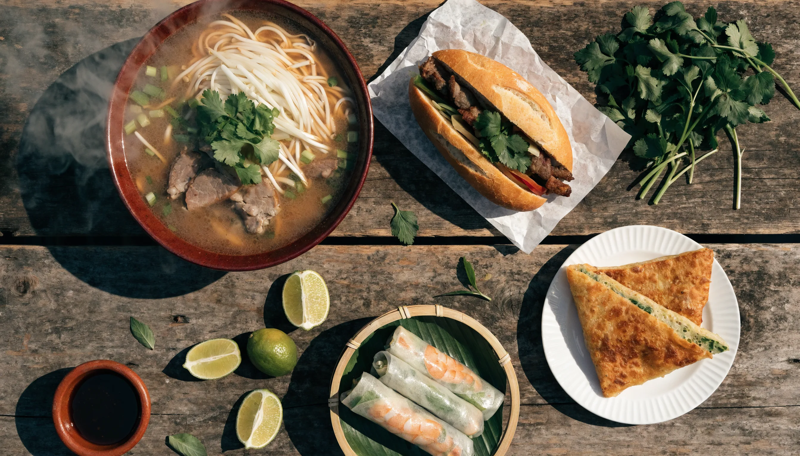

**베트남 음식**을 검색하면 "꼭 먹어야 할 18선" 같은 나열 글이 쏟아지는데, 막상 현지 식당 메뉴판 앞에 서면 여전히 막막하죠. 저도 그랬어요. 포, 분짜, 미꽝, 후띠에우… 이름은 다 다른데 "이게 다 같은 쌀국수 아니야?" 싶어서 아무거나 시켰다가 후회한 적이 있거든요. 결론부터 말하면요, 베트남 음식은 음식 이름을 외우는 게 아니라 **쌀국수 계통부터 잡으면** 갑자기 쉬워집니다. 국물이 있는지 없는지, 면이 넓은지 굵은지, 어느 지역 음식인지 — 이 세 가지만 알면 메뉴판에서 뭘 시킬지 바로 보여요. 그래서 제가 국수 계통과 길거리 음식, 지역별 지도, 가격·주문 팁까지 자료를 뒤져 한 편으로 묶어봤습니다.

📌 3줄 요약
베트남 쌀국수는 하나가 아닙니다. <b>포(맑은 국물)·분짜(국물 없는 비빔)·분보후에(맵고 굵은 면)·미꽝(자작한 강황면)·까오러우(호이안 전용)·후띠에우(남부 맑은 국물)</b>로 계통이 갈려요.

길거리 음식은 <b>반미·반쎄오·짜조·고이꾸온·껌땀·반베오</b>가 핵심. 반미는 아시아 길거리 음식 순위 4위에 오른 간판입니다.

같은 음식도 <b>하노이·후에·호이안·호치민</b> 지역마다 달라지니, 그 동네 대표 음식을 시키는 게 정석입니다.

## 베트남 음식이 헷갈리는 이유 — 국수부터 계통을 잡자

베트남 음식이 막막한 건 종류가 많아서가 아니라, **비슷해 보이는 쌀국수가 사실 전혀 다른 음식**이기 때문입니다. 여기서 많이들 헷갈리는데, 한국에서 '베트남 쌀국수 = 포(Phở)' 하나로 알고 가면 현지 메뉴판의 절반을 놓쳐요.

핵심 기준은 세 가지예요. 첫째 **국물의 양**(국물 요리냐, 국물 없는 비빔이냐, 자작하냐), 둘째 **면의 굵기와 색**(가는 흰 면이냐, 굵은 면이냐, 노란 강황면이냐), 셋째 **지역**입니다. 이 셋만 조합하면 포·분짜·미꽝·까오러우가 어떻게 다른지 한눈에 정리돼요.

저도 이 계통을 잡고 나니, 여행지에서 "여긴 후에니까 분보후에", "여긴 호이안이니까 까오러우" 하는 식으로 주문이 편해졌습니다. 아래에서 국수부터 하나씩 풀어볼게요.

## 베트남 쌀국수는 다 같은 게 아닌가요? — 국수 계통 완전정리

아니에요, 전혀 다릅니다. 대표 쌀국수 여섯 가지만 계통으로 잡아두면 됩니다. 흩어진 정보를 직접 표로 묶어봤어요.

| 국수 | 지역 | 국물 | 면 | 특징 |
| --- | --- | --- | --- | --- |
| 포(Phở) | 전국(북부 발상) | 맑은 소·닭 육수 | 납작한 가는 면 | 북부는 맑고 담백, 남부는 진하고 향채·숙주 곁들임 |
| 분짜(Bún chả) | 하노이 | 국물 없음(소스에 찍음) | 가는 쌀국수 | 숯불 돼지고기·완자를 새콤달콤 소스에 비벼 먹음 |
| 분보후에(Bún bò Huế) | 중부 후에 | 맵고 진한 소뼈 육수 | 굵고 둥근 면 | 얼큰한 국물, 선지·소고기, 포보다 강렬 |
| 미꽝(Mì Quảng) | 중부 호이안·다낭 | 자작하게 조금 | 넓은 강황 노란 면 | 땅콩·라이스크래커 얹고 비벼 먹는 반건면 |
| 까오러우(Cao lầu) | 호이안 전용 | 거의 없음 | 두껍고 쫄깃한 면 | 잿물·현지 우물물로 만들어 호이안에서만 제맛, 차슈 얹음 |
| 후띠에우(Hủ tiếu) | 남부 호치민·미토 | 맑고 살짝 단 돼지뼈 육수 | 쫄깃한 투명 면 | 새우·메추리알·간, 국물형/비빔형 선택 가능 |

포는 같은 이름이어도 북부(하노이)는 국물이 맑고 순수한 반면, 남부(호치민)는 육수가 진하고 숙주·향채·라임을 잔뜩 곁들여 먹습니다. 처음엔 저도 "같은 포인데 왜 이렇게 다르지" 했는데, 지역 차이라는 걸 알고 나니 오히려 두 번 즐기게 되더라고요.

💡 까오러우 vs 미꽝, 헷갈릴 때
둘 다 중부 음식이라 헷갈리는데, <b>까오러우</b>(Cao lầu)는 잿물로 만든 <b>두껍고 쫄깃한 면 + 국물 거의 없음 + 차슈</b>, <b>미꽝</b>(Mì Quảng)은 <b>얇은 강황 노란 면 + 국물 자작 + 새우·닭·돼지</b>입니다. 호이안에 갔다면 까오러우는 그 동네에서만 제맛이 나니 꼭 드세요.

## 꼭 먹어야 할 베트남 길거리 음식

국수 말고도 손에 들고 먹는 길거리 음식이 진짜 재미입니다. 대표 선수들만 추렸어요.

**반미**(Bánh mì)는 베트남 간판 길거리 음식입니다. 바삭한 바게트에 돼지고기·짜팃·채소·고수를 넣은 샌드위치인데, 테이스트아틀라스 아시아 길거리 음식 순위에서 **4위**에 오를 만큼 세계적으로 인정받았어요. 프랑스 식민 시절 바게트가 현지화된 결과라, 겉바속촉의 균형이 핵심입니다.

**반쎄오**(Bánh xèo)는 강황을 넣어 노랗게 부친 베트남식 부침개로, 새우·돼지고기·숙주를 넣고 반으로 접어 채소에 싸 먹습니다. **짜조/냄란**(Chả giò·Nem rán)은 라이스페이퍼에 싸 튀긴 스프링롤, **고이꾸온**(Gỏi cuốn)은 튀기지 않은 생 월남쌈이에요. 튀긴 것과 안 튀긴 것, 이 둘을 구분하면 주문이 쉬워집니다.

이 밖에 **껌땀**(Cơm tấm, 부서진 쌀밥에 숯불 돼지갈비를 얹은 남부 인기 덮밥), **반꾸온**(Bánh cuốn, 얇게 찐 쌀전병에 돼지고기·목이버섯), **반베오**(Bánh bèo, 새우가루 얹은 후에식 찐 쌀케이크), **쏘이**(Xôi, 찹쌀밥)까지 곁들이면 한 끼가 풍성해집니다.

## 지역마다 뭘 먹어야 하나요? — 베트남 음식 지역 지도

베트남은 남북으로 길어서 지역마다 대표 음식이 뚜렷하게 갈립니다. "그 동네 음식을 그 동네에서" 먹는 게 실패 없는 원칙이에요.

**하노이(북부)** — 포와 분짜, 그리고 강황 생선구이 짜까라봉(Chả cá)이 대표입니다. 전반적으로 간이 담백하고 맑은 국물을 즐겨요. 오바마 대통령이 먹어 유명해진 분짜가 이 동네 간판입니다.

**후에·다낭(중부)** — 맵고 진한 분보후에, 자작한 미꽝, 그리고 후에식 찐 쌀케이크(반베오·반봇록)가 몰려 있습니다. 중부는 매콤하고 강렬한 맛이 특징이라 한국인 입맛에 잘 맞아요. 호이안이라면 **까오러우**는 필수입니다.

**호치민(남부)** — 남부식 진한 포, 맑은 후띠에우, 껌땀, 그리고 간판 길거리 음식 반미가 강세입니다. 남부는 전반적으로 달큰하고 향채를 풍성하게 곁들이는 편이에요.

## 디저트와 음료 — 째, 그리고 맥주 한 잔

식사를 마쳤다면 디저트와 음료도 챙겨야 완성입니다. **째**(Chè)는 콩·젤리·타피오카 펄·코코넛 밀크를 얼음에 섞은 베트남식 빙수 겸 디저트로, 더운 날 길거리에서 한 컵이면 딱이에요.

음료로는 진한 연유커피(카페쓰어다)와 맥주가 두 축입니다. 특히 식사에 맥주를 곁들인다면 그 지역 로컬 맥주를 시키는 게 정석인데, 브랜드가 지역마다 다르다는 반전이 있어요. 이 부분은 [베트남 맥주 총정리](/vietnam-beer/)에 지역별 지도로 따로 정리해뒀으니 안주 고르고 맥주까지 세트로 보시면 됩니다.

## 가격·주문·위생 — 여행자를 위한 실전 팁

가장 궁금한 가격부터요. 현지 로컬 식당의 쌀국수 한 그릇은 대체로 **40,000~60,000동(약 2,000~3,000원)** 수준입니다. 관광지·에어컨 식당은 조금 더 비싸고, 길거리 노점은 더 쌉니다. 다만 가격은 지역·시점에 따라 바뀌니 참고 수준으로 보세요.

주문할 때 알아두면 편한 것도 있어요. 쌀국수는 보통 **소고기**(bò)·**닭고기**(gà)로 갈리고, 후띠에우처럼 **국물형·비빔형**(khô, 마른)을 고르는 경우도 있습니다. 테이블에 놓인 숙주·향채·라임·고추는 취향껏 넣어 먹는 무료 곁들임이에요.

⚠️ 위생 — 얼음과 생채소 체크
노점의 얼음과 씻은 생채소는 위생 편차가 있습니다. 장이 예민하다면 <b>얼음 없는 음료·뜨겁게 조리된 음식</b> 위주로 고르는 게 안전해요. 사람이 붐비는 가게일수록 재료 회전이 빨라 대체로 더 믿을 만합니다. 물은 반드시 생수(병물)로 드세요.

## 한눈에 정리 — 상황별 추천

| 상황 | 추천 |
| --- | --- |
| 처음이라 무난하게 | 포(Phở) — 소고기 또는 닭고기 |
| 국물 없이 든든하게 | 분짜(하노이)·껌땀(호치민) |
| 얼큰한 국물 | 분보후에(후에) |
| 그 지역에서만 먹는 것 | 까오러우(호이안)·미꽝(다낭·호이안) |
| 손에 들고 간단히 | 반미·고이꾸온·반쎄오 |
| 더울 때 디저트 | 째(Chè) |

## 자주 묻는 질문(FAQ)

**Q. 베트남 쌀국수 종류는 뭐가 있나요?** 대표적으로 포(맑은 국물), 분짜(국물 없는 비빔), 분보후에(맵고 굵은 면), 미꽝(자작한 강황면), 까오러우(호이안 전용 굵은 면), 후띠에우(남부 맑은 국물)가 있습니다. 국물 양·면 굵기·지역으로 구분하면 쉽습니다.

**Q. 베트남에서 꼭 먹어야 할 음식은 뭔가요?** 쌀국수 포, 샌드위치 반미(아시아 길거리 음식 4위), 하노이 분짜, 호이안 까오러우, 남부 껌땀은 놓치기 아깝습니다. 여기에 반쎄오·고이꾸온·째를 곁들이면 대표 음식은 거의 맛봅니다.

**Q. 반미랑 짜조, 고이꾸온은 뭐가 다른가요?** 반미는 바게트 샌드위치, 짜조(냄란)는 라이스페이퍼에 싸 튀긴 스프링롤, 고이꾸온은 튀기지 않은 생 월남쌈입니다. 튀김 여부와 재료로 구분하면 됩니다.

**Q. 베트남 쌀국수 한 그릇 가격은 얼마인가요?** 로컬 식당 기준 대체로 40,000~60,000동(약 2,000~3,000원)입니다. 관광지·냉방 식당은 더 비싸고 노점은 더 저렴합니다. 시점·지역에 따라 변동이 있습니다.

**Q. 길거리 음식 위생은 괜찮나요?** 사람이 붐벼 재료 회전이 빠른 가게가 대체로 안전합니다. 다만 노점 얼음과 생채소는 편차가 있으니, 장이 약하면 뜨겁게 조리된 음식과 병물 위주로 드시는 걸 권합니다.

자, 이거 하나만 기억하면 돼요. 베트남 음식은 이름을 다 외울 필요 없이 **국수 계통(국물·면·지역)부터 잡고, 그 동네 대표 음식을 시키면** 실패가 없습니다. 여행 준비물까지 챙기고 싶다면 [베트남 여행 준비물 체크리스트](/vietnam-travel-checklist/)도 함께 보세요. 지역별 대표 음식과 공식 정보는 [베트남 관광청](https://www.vietnamtourism.com/ko)에서도 확인할 수 있습니다.

---

**관련 키워드** — #베트남음식 #베트남쌀국수 #베트남길거리음식 #포 #분짜 #분보후에 #미꽝 #까오러우 #후띠에우 #반미 #반쎄오 #껌땀 #베트남음식추천 #베트남여행 #호이안음식
