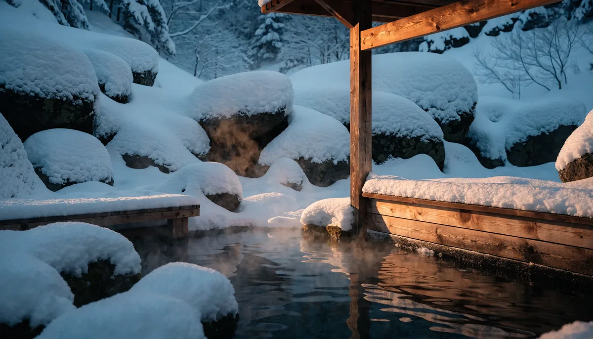

겨울 일본은 사계절 중에서도 색깔이 가장 또렷한 시즌입니다. 같은 일본인데도 홋카이도는 허리까지 쌓인 눈으로 새하얗고, 도쿄는 거리마다 일루미네이션이 반짝이며, 오키나와는 패딩 없이 걸어도 될 만큼 따뜻하거든요. 그래서 **겨울 일본 여행 코스**는 "어느 도시"보다 "어떤 겨울을 원하는가"를 먼저 정하는 게 핵심입니다. 이 글에서는 겨울 일본을 네 가지 테마로 나눠 도시별 일정과 경비, 방한 준비까지 실전 위주로 정리했습니다.

📌 3줄 요약
겨울 일본은 <b>눈(삿포로)·온천(나가노·하코네)·일루미네이션(도쿄)·따뜻한 남쪽(오키나와)</b> 4가지 테마로 나뉩니다.

설경을 원하면 <b>삿포로 3박4일</b>, 무난한 도시여행은 <b>오사카+교토</b>나 <b>도쿄</b>가 정석입니다.

경비는 3박4일 기준 <b>70~100만 원대</b>, 홋카이도는 방한 장비를 더 챙겨야 합니다.

## 겨울 일본, 테마부터 정하면 코스가 쉬워진다

겨울 일본 여행 코스를 짤 때 가장 흔한 실수가 "일단 항공권부터" 끊는 것입니다. 그런데 일본은 남북으로 길어서 같은 12~2월에도 지역별 날씨 차이가 극단적이에요. 홋카이도는 영하의 한겨울이고, 도쿄·교토는 한국 초겨울 수준, 오키나와는 평균 15~20도의 초봄 날씨입니다.

그래서 먼저 **내가 원하는 겨울의 그림**을 정해야 합니다. 눈밭에서 뒹굴고 싶은지, 노천 온천에 몸을 담그고 싶은지, 화려한 야경을 보고 싶은지, 아니면 추위를 피하고 싶은지에 따라 가야 할 곳이 완전히 갈리거든요. 테마만 정하면 도시와 일정은 자연스럽게 따라옵니다.

아래 표로 네 가지 테마와 대표 지역, 추천 대상을 정리했습니다. 본인에게 맞는 줄부터 찾아보세요.

| 테마 | 대표 지역 | 이런 분께 |
|---|---|---|
| ❄️ 눈·설경 | 삿포로·오타루·시라카와고 | 첫 설국 여행, 눈축제·스키 |
| ♨️ 온천 | 나가노·하코네·유후인 | 힐링·커플·휴양 |
| ✨ 일루미네이션 | 도쿄·오사카 | 도시 야경·쇼핑·맛집 |
| 🌴 따뜻한 남쪽 | 오키나와 | 추위 회피, 바다·리조트 |

## ❄️ 눈·설경 테마 — 삿포로 3박4일이 정석

겨울 일본의 대표 이미지는 역시 홋카이도의 눈입니다. 삿포로는 12월부터 2월까지 도시 전체가 새하얗게 덮여 진짜 설국으로 변해요. 인천에서 신치토세공항까지 약 3시간이면 닿습니다.

3박4일 동선은 이렇게 묶는 게 무난합니다. **1일차**는 오도리공원과 삿포로 TV타워에서 야경을 보고 스스키노 거리에서 징기스칸(양고기 구이)이나 미소 라멘으로 저녁을 먹습니다. **2일차**는 시로이코이비토파크와 홋카이도 신궁 같은 시내 명소를, **3일차**는 JR 쾌속으로 35분 거리의 **오타루**로 당일치기를 떠나 운하 가스등 야경과 오르골당·유리공방을 즐깁니다. **4일차**는 니조시장에서 털게·카이센동으로 마무리하고 공항으로 향하면 됩니다.

눈을 제대로 보고 싶다면 2월 초 **삿포로 눈축제**(오도리공원 일대 대형 눈조각) 시즌을 노리는 분이 많습니다. 다만 축제 정확한 날짜는 해마다 바뀌니, 일정을 맞추려면 그해 공식 발표를 꼭 확인하세요. 같은 홋카이도라도 후라노·비에이나 시라카와고(합장가옥 마을)까지 욕심내면 4일로는 빠듯하니, 첫 방문이라면 삿포로+오타루로 좁히는 편이 알찹니다.

## ♨️ 온천 테마 — 눈 보며 몸 녹이는 힐링

추위 속에서 김이 모락모락 나는 노천 온천에 몸을 담그는 건 겨울 일본만의 호사입니다. 온천 테마는 이동이 많지 않아 휴양·커플 여행으로 특히 잘 맞아요.

도쿄에서 가깝게 가려면 **하코네**가 1순위입니다. 신주쿠에서 1시간 반 거리라 도쿄 일정에 1박을 끼워넣기 좋고, 운이 좋으면 눈 덮인 후지산을 보며 온천을 즐길 수 있습니다. 본격적인 온천 마을 분위기를 원하면 야마가타의 **긴잔 온천**(400년 역사의 목조 료칸 거리)이나 오이타의 **유후인**도 설경과 잘 어울립니다.

겨울에만 볼 수 있는 독특한 풍경으로는 나가노의 **스노우 몽키 파크**(지고쿠다니 야엔공원)가 유명합니다. 눈 쌓인 계곡에서 야생 원숭이들이 온천에 몸을 담그고 쉬는 모습을 바로 앞에서 볼 수 있어요. 료칸·온천은 성수기에 빨리 차니, 인기 숙소는 두세 달 전에 예약하는 게 안전합니다.

## ✨ 일루미네이션 테마 — 도쿄·오사카 도시 겨울

눈도 추위도 부담스럽다면, 화려한 겨울 야경과 쇼핑·맛집이 있는 도시 여행이 답입니다. 도쿄와 오사카는 12월부터 도시 전체가 일루미네이션으로 물들어 낭만적인 분위기가 절정에 달합니다.

**도쿄 겨울 코스**는 서쪽(신주쿠·시부야)과 동쪽(아사쿠사·도쿄역)으로 나눠 도는 게 효율적입니다. 1일차는 신주쿠·시부야에서 백화점 겨울 세일과 일루미네이션을, 2일차는 아사쿠사·우에노에서 전통과 박물관을, 3일차는 오다이바·도쿄역 마루노우치의 야경을 묶습니다. 일본 입국·통관 정보는 [일본정부관광국(JNTO)](https://www.japan.travel/ko/kr/) 공식 사이트에서 미리 확인해 두면 좋습니다.

**오사카 겨울 코스**는 도톤보리·난바의 활기와 우메다 스카이빌딩 전망, 그리고 전철로 **교토 당일치기**를 묶는 게 정석입니다. 겨울 교토는 눈이 살짝 내려앉은 아라시야마 대나무숲과 기요미즈데라(청수사)가 특히 운치 있어요. 오사카 자유여행이 처음이라면 [오사카 자유여행 가이드](/osaka-free-travel-guide/)에서 동선과 교통패스를 먼저 확인해 보세요.

## 🌴 따뜻한 남쪽 테마 — 추위 피하는 오키나와

"겨울 일본인데 추운 건 싫다"는 분께는 오키나와가 정답입니다. 겨울에도 평균 15~20도 안팎이라 두꺼운 패딩 없이 다닐 수 있고, 항공권·숙소도 여름 성수기보다 저렴한 편이에요.

다만 겨울 오키나와는 해수욕은 어렵습니다. 대신 추라우미 수족관, 슈리성, 미국촌, 만좌모 같은 명소 관광과 드라이브, 그리고 따뜻한 리조트에서의 휴식이 중심이 됩니다. 바다를 보며 느긋하게 쉬고 싶은 휴양형 여행자에게 잘 맞아요.

겨울 햇살 아래 한적한 해변을 걷는 것만으로도 충분히 여행 기분이 납니다. 활동적인 일정보다는 "쉬러 가는 겨울 일본"을 원할 때 후보로 올려두세요.

## 도시별 겨울 여행 경비 비교

겨울은 일본 여행 성수기(특히 연말연시·설 연휴)와 겹쳐 항공권이 오르는 시기입니다. 아래는 3박4일 1인 기준 대략적인 경비로, 시즌과 예약 시점에 따라 크게 달라지니 참고용으로만 보세요.

| 도시 | 3박4일 경비(1인) | 비행시간(인천 기준) | 겨울 포인트 |
|---|---|---|---|
| 삿포로 | 80~100만 원대 | 약 3시간 | 눈축제·오타루·게요리 |
| 오사카+교토 | 70~80만 원대 | 약 1시간 40분~2시간 | 설경 교토 당일치기 |
| 도쿄 | 80~90만 원대 | 약 2시간 20분 | 일루미네이션·쇼핑 |
| 오키나와 | 70~90만 원대 | 약 2시간 30~40분 | 따뜻한 휴양 |

항공권은 출발일과 예약 시점에 따라 편차가 큽니다. 여러 날짜를 비교해 보려면 [스카이스캐너](https://www.skyscanner.co.kr/) 같은 비교 사이트에서 한 달 전체 최저가를 훑어보는 게 가장 빠릅니다. 연말연시를 피해 1월 중순~2월 평일로 잡으면 같은 코스도 훨씬 저렴해집니다.

## 겨울 일본 방한 준비물 체크리스트

겨울 일본은 지역에 따라 체감 온도가 크게 달라서, 어디를 가느냐에 따라 짐이 달라집니다. 홋카이도는 한국 한겨울보다 더 춥다고 보고 단단히 챙겨야 합니다.

🧳 지역별 방한 준비
<b>삿포로·홋카이도</b> — 두꺼운 패딩·발열내의·방수 부츠·장갑·모자·핫팩 필수. 눈길이 미끄러우니 신발 바닥 미끄럼 방지도 챙기세요.

<b>도쿄·교토·오사카</b> — 1월 평균 5도 안팎이라 코트나 경량 패딩에 목도리 정도면 충분합니다.

<b>오키나와</b> — 긴팔에 얇은 겉옷 한 장. 일교차 대비 가디건만 챙기면 됩니다.

공통적으로 챙기면 좋은 것은 휴대용 핫팩, 립밤·핸드크림(건조함 대비), 그리고 데이터용 eSIM 또는 유심입니다. 실내는 난방이 강한 편이라 **벗기 쉬운 레이어드(겹쳐 입기)**가 정답이에요. 두꺼운 옷 한 벌보다 얇은 옷 여러 겹이 온도 변화에 대응하기 좋습니다.

## 일정별로 고르는 추천 코스 요약

며칠을 쓸 수 있는지에 따라서도 코스가 달라집니다. 짧으면 한 도시에 집중하고, 길면 근교를 더하는 식으로 짜면 무리가 없습니다.

- **2박3일** — 오사카 또는 도쿄 한 도시 집중. 이동을 최소화하고 시내+근교 하나만.
- **3박4일** — 삿포로+오타루, 또는 오사카+교토 당일치기. 가장 무난한 겨울 코스입니다.
- **4박5일 이상** — 삿포로+후라노/비에이, 또는 도쿄+하코네 온천 1박처럼 테마를 둘 섞기 좋습니다.

겨울은 해가 짧아(보통 16~17시면 어두워짐) 하루에 무리하게 일정을 넣으면 동선이 꼬입니다. 오전에 야외 명소, 오후 늦게 실내·온천·야경으로 배치하면 추위와 어둠을 모두 피할 수 있어요. 가족과 함께라면 [부모님과 함께하는 일본 여행 코스](/parents-japan-travel-course/)의 여유로운 동선도 참고해 보세요.

## 자주 묻는 질문 (FAQ)

**Q. 겨울 일본 여행 코스, 어디가 가장 무난한가요?** 첫 겨울 일본이라면 오사카+교토 또는 도쿄를 추천합니다. 날씨가 한국 초겨울 수준이라 방한 부담이 적고, 도시 인프라가 좋아 동선 짜기가 쉽습니다. 설국을 제대로 원하면 삿포로 3박4일이 정석입니다.

**Q. 삿포로 눈축제는 언제 열리나요?** 보통 매년 2월 초에 오도리공원 일대에서 열립니다. 다만 정확한 날짜는 해마다 달라지므로, 일정을 축제에 맞추려면 그해 공식 발표를 반드시 확인하세요.

**Q. 겨울 일본 여행 경비는 얼마나 드나요?** 3박4일 1인 기준 대략 70~100만 원대입니다. 연말연시·설 연휴는 항공권이 크게 오르니, 1월 중순~2월 평일로 잡으면 같은 코스를 더 저렴하게 다녀올 수 있습니다.

**Q. 추위를 많이 타는데 겨울에도 따뜻한 일본 여행지가 있나요?** 오키나와가 대표적입니다. 겨울에도 평균 15~20도 안팎이라 두꺼운 옷 없이 다닐 수 있어요. 해수욕은 어렵지만 수족관·관광·리조트 휴식 위주로 즐기기 좋습니다.

## 마무리

겨울 일본 여행 코스의 출발점은 "어느 도시"가 아니라 "어떤 겨울을 보내고 싶은가"입니다. 눈을 원하면 삿포로, 힐링을 원하면 온천 마을, 도시 낭만을 원하면 도쿄·오사카, 추위를 피하고 싶으면 오키나와. 테마를 먼저 정하면 일정도 경비도 자연스럽게 정리됩니다. 거기에 방한 준비만 지역에 맞게 챙기면, 일본의 가장 특별한 계절을 알차게 즐길 수 있어요. 혼자 떠난다면 [혼자 일본 여행 코스](/solo-japan-travel-course/)도 함께 읽어보시고, 즐거운 겨울 여행 되시길 바랍니다. ⛄

---

**관련 키워드** — #겨울일본여행 #겨울일본여행코스 #삿포로여행 #삿포로눈축제 #오타루 #겨울교토 #도쿄일루미네이션 #일본온천여행 #겨울오키나와 #일본여행경비 #삿포로3박4일 #겨울여행지추천 #일본방한준비
